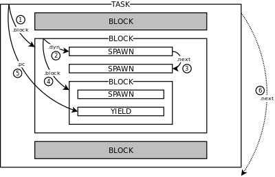

# The Programming Language Atmos

- <a href="#design">1.</a> DESIGN
    - <a href="#structured-deterministic-concurrency">1.1.</a> Structured Deterministic Concurrency
    - <a href="#event-signaling-mechanisms">1.2.</a> Event Signaling Mechanisms
    - <a href="#hierarchical-tags">1.3.</a> Hierarchical Tags
    - <a href="#integration-with-lua">1.4.</a> Integration with Lua
    - <a href="#complementary-concurrency-models">1.5.</a> Complementary Concurrency Models
- <a href="#execution">2.</a> EXECUTION
    - <a href="#environments">2.1.</a> Environments
- <a href="#lexicon">3.</a> LEXICON
    - <a href="#keywords">3.1.</a> Keywords
    - <a href="#symbols">3.2.</a> Symbols
    - <a href="#operators">3.3.</a> Operators
        - `==` `!=` `??` `!?`
        - `>` `<` `>=` `<=`
        - `+` `-` `*` `/` `%` `**`
        - `!` `||` `&&`
        - `#` `++` `?>` `!>`
        - `===` `=!=` `=>=` `=<=`
    - <a href="#identifiers">3.4.</a> Identifiers
        - `[A-Za-z_][A-Za-z0-9_]*`
    - <a href="#literals">3.5.</a> Literals
        - `nil` `true` `false`
        - `:X` `10` `"hello"`
        - `2h30min` `` `lua` ``
    - <a href="#comments">3.6.</a> Comments
        - `;; *` `;;; * ;;;`
- <a href="#types-values">4.</a> TYPES & VALUES
    - <a href="#table">4.1.</a> Table
        - `[]` `:X []`
    - <a href="#function">4.2.</a> Function
        - `func` `\{}`
    - <a href="#tasks">4.3.</a> Tasks
        - `task` `xtask` `tasks` `pub`
- <a href="#expressions">5.</a> EXPRESSIONS
    - <a href="#chunks">5.1.</a> Chunks
        - `;` `do` `escape` `defer` `test`
    - <a href="#declarations-and-assignments">5.2.</a> Declarations and Assignments
        - `val` `var` `pin` `where`
        - `func` `return`
        - `set`
    - <a href="#operations">5.3.</a> Operations
        - `??` `!?`
        - `#` `++`
        - `?>` `!>`
    - <a href="#indexing">5.4.</a> Indexing
        - `t.x` `t@1` `t@i` `t@#` `t@+`
    - <a href="#calls">5.5.</a> Calls
        - `f(*)` `-->` `->` `<-` `<--`
    - <a href="#conditionals">5.6.</a> Conditionals
        - `if` `ifs` `match`
    - <a href="#loop">5.7.</a> Loop
        - `loop` `break` `until` `while`
    - <a href="#exceptions">5.8.</a> Exceptions
        - `throw` `catch`
    - <a href="#task-operations">5.9.</a> Task Operations
        - `spawn` `await` `emit` `toggle`
        - `par` `watching`
    - <a href="#asynchronous-execution">5.10.</a> Asynchronous Execution
        - `async` `thread`
- <a href="#standard-libraries">6.</a> STANDARD LIBRARIES
    - <a href="#lua-standard-libraries">6.1.</a> Lua Standard Libraries
    - <a href="#atmos-standard-libraries">6.2.</a> Atmos Standard Libraries
- <a href="#syntax">7.</a> SYNTAX
    - <a href="#ambiguities">7.1.</a> Ambiguities

<!-- CONTENTS -->

<a name="design"/>

# 1. DESIGN

Atmos is a programming language that reconciles *[Structured Concurrency][sc]*
and *[Event-Driven Programming][events]*, extending classical structured
programming with two main functionalities:

- Structured Deterministic Concurrency:
    - A `task` primitive with deterministic scheduling provides predictable
      behavior and safe abortion.
    - A `tasks` container primitive holds attached tasks and controls their
      lifecycle.
    - A `pin` declaration attaches a task or tasks to its enclosing lexical
      scope.
    - Structured primitives (e.g., `par`) compose concurrent tasks with lexical
      scope.
- Event Signaling Mechanisms:
    - An `await` primitive suspends a task and waits for events.
    - An `emit` primitive signals events and awakes awaiting tasks.

Atmos also complements its core synchronous concurrency model with
    *[Functional Streams][streams]* (à la [ReactiveX][rx]) and
    [Multithreading Parallelism][threads] (via [LuaLanes][lanes]):

- Functional Streams:
    - Interoperability with tasks & events.
    - Safe finalization of stateful streams.
- Asynchronous Parallelism:
    - A `thread` primitive offloads computations to isolated OS threads.
    - Safe abortion and finalization for threads.

<!--
- Lexical Memory Management *(experimental)*:
    - A lexical policy to manage dynamic allocation automatically.
    - A set of strict escaping rules to preserve structured reasoning.
    - A reference-counter collector for deterministic reclamation.
-->

Atmos is inspired by [synchronous programming languages][sync] like [Céu][ceu]
and [Esterel][esterel].

Follows an extended list of functionalities in Atmos:

- Dynamic typing
- Statements as expressions
- Dynamic collections (tables)
- Deferred statements for finalization
- Exception handling (throw & catch)
- Seamless integration with Lua

Atmos is tightly connected with [Lua][lua]:
It mimics most of the semantics of Lua with respect to values, types,
declarations, and expressions.
In addition, it compiles to [Lua][lua] and relies on [lua-atmos][lua-atmos]
for its concurrency runtime.

Atmos is in **experimental stage**.

In the rest of this section, we introduce key aspects of Atmos:
*Structured Deterministic Concurrency*, *Event Signaling Mechanisms*,
*Hierarchical Tags*, *Integration with Lua*, and
*Complementary Concurrency Models* (*Functional Streams* and
*Asynchronous Parallelism*).

[sc]:           https://en.wikipedia.org/wiki/Structured_concurrency
[events]:       https://en.wikipedia.org/wiki/Event-driven_programming
[streams]:      https://en.wikipedia.org/wiki/Stream_(abstract_data_type)
[rx]:           https://en.wikipedia.org/wiki/ReactiveX
[sync]:         https://fsantanna.github.io/sc.html
[ceu]:          http://www.ceu-lang.org/
[esterel]:      https://en.wikipedia.org/wiki/Esterel
[lua]:          https://www.lua.org/
[threads]:      https://en.wikipedia.org/wiki/Thread_(computing)
[lanes]:        https://lualanes.github.io/lanes/
[lua-atmos]:    https://github.com/lua-atmos/atmos/
[syms]:         https://en.wikipedia.org/wiki/Symbol_(programming)

<a name="structured-deterministic-concurrency"/>

## 1.1. Structured Deterministic Concurrency

In structured concurrency, the life cycle of processes or tasks respect the
structure of the source code as hierarchical blocks.
In this sense, tasks in Atmos are treated in the same way as local variables of
structured programming:
When a [block](#blocks) of code terminates or goes out of scope, all of its
[local variables](#local-variables) become inaccessible to enclosing blocks.
In addition, all of its [pinned tasks](#local-variables) are aborted and
properly finalized by [deferred statements](#defer).

Tasks in Atmos are built on top of [Lua coroutines][lua-coroutines], which
adhere to a predictable "run-to-completion" semantics:
Unlike OS threads, tasks execute uninterruptedly up to explicit [await](#await)
operations.

The next example illustrates structured concurrency, abortion of tasks, and
deterministic scheduling.
The example uses a `par` to spawn two concurrent tasks and rejoin when `:any`
of them terminates:
    one task is just a 10-seconds timeout, and the other
    increments `n` every second, showing its value on termination:

<!-- exs/01-counter.atm -->

```
par :any {
    await 10s
} with {
    var n = 0
    defer {
        print("I counted ", n)    ;; invariably outputs 9
    }
    loop on 1s {
        set n = n + 1
    }
}
```

A [par](#parallel) is a structured mechanism that combines tasks in nested
blocks and rejoins as a whole when `:any` of them terminates (in this case),
automatically aborting the others.

The [loop on](#loop) in the second task iterates exactly 9 times before the
first task awakes and terminates the composition.
For this reason, the second task is aborted before it has the opportunity to
awake for the 10th time, but its `defer` statement still executes and outputs
`"I counted 9"`.

Since they are based on coroutines, tasks are expected to yield control
explicitly, which makes scheduling entirely deterministic.
In addition, tasks awake in the order they appear in the source code, which
makes the scheduling order predictable.
This rule allows us to infer that the example invariably outputs `9`, no matter
how many times we re-execute it.
Likewise, if the order of the two tasks inside the `par` were inverted, the
example would always output `10`.

[lua-coroutines]: https://www.lua.org/manual/5.4/manual.html#2.6

<a name="event-signaling-mechanisms"/>

## 1.2. Event Signaling Mechanisms

Tasks can communicate through events as follows:

- The [await](#await) statement suspends a task until it matches an event
  condition.
- The [emit](#emit) statement broadcasts an event to all awaiting
  tasks.



Tasks form a dynamic tree representing the structure of the program, as
illustrated in the figure.
This tree is traversed on every `emit` in a predictable way, since it
respects the lexical structure of the program:
A task has exactly one active block at a time, which is first traversed `(1)`.
The active block has a list of active tasks, which are traversed in sequence
`(2,3)`, and exactly one nested block, which is traversed after the nested
tasks `(4)`.
After the nested blocks and tasks are traversed, the outer task itself is
traversed at its single yielded execution point `(5)`.
Finally, the task next to the outer task is traversed in the same way `(6)`.
An `emit` statement traversal runs to completion before proceeding to the next
statement, just like a function call.

The next example illustrates event broadcasts and tasks traversal.
The example uses a `watching` statement to observe an event condition while
executing a nested task.
When the condition is satisfied, the nested task is aborted:

<!-- exs/02-ticks.atm -->

```
spawn {
    watching :done {
        par {
            loop on :tick {
                print "tick A"  ;; always awakes first
            }
        } with {
            loop on :tick {
                print "tick B"  ;; always awakes last
            }
        }
    }
    print "done"
}
emit(:tick)     ;; --> "tick A", "tick B"
emit(:tick)     ;; --> "tick A", "tick B"
emit(:done)     ;; --> "done"
print "end"     ;; --> "end"
```

The main body has an outermost `spawn` task, which awaits `:done`, and has two
nested tasks awaiting `:tick` events.
Then, the main body broadcasts three events in sequence.
The first two `:tick` events awake the nested tasks respecting the structure of
the program, printing `tick A` and `tick B` in this order.
The last event aborts the `watching` composition and prints `done`, before
terminating the main body.

<a name="bidimensional-stack-traces"/>

### 1.2.1. Bidimensional Stack Traces

`TODO`

<a name="hierarchical-tags"/>

## 1.3. Hierarchical Tags

Tags represent unique human-readable values, and are similar to Lua strings or
[*symbols* or *atoms*][syms] in other programming languages.
Any identifier prefixed with a colon (`:`) is a valid tag, which is guaranteed
to be unique in comparison to others (i.e., `:x == :x` and `:x != :y`).

Tags are syntactic values that only exist at compile time.
During runtime, they are converted to strings and become indistinguishable from
them (i.e., `:x == 'x'`).

Tags are typically used as keys in table (e.g., `:x`, `:y`), or as enumerations
representing states (e.g., `:pending`, `:done`).

<!-- exs/03-tags.atm -->

The next example uses tags as table keys:

```
val pos = []           ;; a new table
set pos@(:x) = 10
set pos.y = 20          ;; equivalent to pos@(:y)=20
print(pos.x, pos@(:y))  ;; -> 10, 20
```

Tags can also be used to "tag" tables, introducing the notion of lightweight
user types in Atmos.
The constructor `:Pos [x=10,y=20]` is equivalent to `[tag=:Pos,x=10,y=20]`.

Tags can describe type hierarchies by splitting identifiers with (`.`).
For instance, a tag such as `:T.A.x` is a subtype of `:T`, `:T.A`, and
`:T.A.x` at the same time, as verified by the
[equivalence operator](#equivalence) `??`:

```
print(:T.A.x ?? :T)         ;; --> true  (:T.A.x is a subtype of :T)
print(:T.A.x ?? :T.A)       ;; --> true
print(:T.A.x ?? :T.A.x)     ;; --> true
print(:T     ?? :T.A.x)     ;; --> false (:T is not a subtype of :T.A.x)
print(:T.A   ?? :T.B)       ;; --> false
```

The operator `??` also works with tagged tables.
Therefore, tags, tables, and `??` can be combined as follows:

```
val t = :T.A [ a=10 ]      ;; [ tag=:T.A, a=10 ]
print(t ?? :T)              ;; --> true
```

<a name="integration-with-lua"/>

## 1.4. Integration with Lua

`TODO`

- all types, libraries, coroutines, meta mechanisms
- except syntax for statements
- mix code, think of alternative syntax with available quotes

<a name="lua-vs-atmos-subtleties"/>

### 1.4.1. Lua vs Atmos Subtleties

While most differences between Lua and Atmos are clear, some subtleties are
worth mentioning:

- Statements `return` and `break`:
    - Lua: `return 10`, `break` (no parenthesis)
    - Atmos: `return (10)`, `break()` (parenthesis)
        - Atmos uses the same call syntax with parenthesis in all expressions
          that resemble statements or calls (`await`, `break`, `do`, `emit`,
          `escape`, `return`, `tasks`, `throw`, `until`, and `while`).
        - The reason is to enforce an uniform syntax across all expressions.
        - Some workarounds: `return 'ok'`, `return <- 10`
- Method call:
    - Lua: `o:f()` (single colon)
    - Atmos: `o::f()` (double colon)
        - The reason is to avoid ambiguity with the syntax of tags:
            - `f () :x ()` is `f():x()` or `f() ; :x()`?
- List of expressions:
    - Lua: `e1,e2,...` (no parenthesis)
    - Atmos: `(e1,e2,...)` (parenthesis)
        - A list of expressions in Atmos is an expression.
        - The reason is to simplify the grammar and to support lists in
          contexts such as `f <-- (1,2)`.
    - Nevertheless, Atmos does not use parenthesis for variables in the left of
      declarations and assignments.
- Table constructor:
    - Lua: `{ ... }` (braces)
    - Atmos: `[ ... ]` (brackets)
        - The reason is to avoid ambiguity with blocks:
            - `if f { ... }` is `if f{...} ...` or `if (f) { ... }`?
- Operators:
    - Lua: `~=` `and` `or` `not` `..` `^`
    - Atmos: `!=` `&&` `||` `!` `++` `**`
        - The reason is to avoid identifiers as operators and to use familiar
          and consistent alternatives.

<a name="complementary-concurrency-models"/>

## 1.5. Complementary Concurrency Models

`TODO`

<a name="functional-streams"/>

### 1.5.1. Functional Streams

`TODO`

<a name="asynchronous-parallelism"/>

### 1.5.2. Asynchronous Parallelism

`TODO`

<a name="execution"/>

# 2. EXECUTION

To execute Atmos, simply pass the program filename and arguments to the
interpreter, e.g.:

```
$ atmos hello.atm 1000
```

The arguments are passed to the [program main chunk](#chunks).

The `--help` flag shows all execution options:

```
$ atmos --help

Usage: atmos [-h] [-t] [-v] <input> [<args>] ...

The Programming Language Atmos.

Arguments:
   input                 Input program.
   args                  Program arguments.

Options:
   -h, --help            Show this help message and exit.
   -t, --test            Enable test blocks.
   -v, --version         Show version.

For more information, please visit our website:

    https://github.com/atmos-lang/atmos/

```

<a name="environments"/>

## 2.1. Environments

`TODO`

<a name="lexicon"/>

# 3. LEXICON

<a name="keywords"/>

## 3.1. Keywords

The following keywords are reserved in Atmos:

```
    await               ;; await event
    break               ;; loop break
    catch               ;; catch exception
    defer               ;; defer block
    do                  ;; do block
    else                ;; else block
    emit                ;; emit event
    escape              ;; escape block
    false               ;; false value
    func                ;; function                         (10)
    if                  ;; if block
    ifs                 ;; ifs block
    in                  ;; in iterator
    it                  ;; implicit parameter
    loop                ;; loop block
    match               ;; match block
    nil                 ;; nil value
    on                  ;; on event clause
    par                 ;; par block
    pin                 ;; pin declaration                  (20)
    pub                 ;; public variable
    return              ;; escape prototype
    set                 ;; assign expression
    spawn               ;; spawn coroutine
    task                ;; task prototype
    tasks               ;; task pool
    test                ;; test block
    throw               ;; throw error
    toggle              ;; toggle task
    true                ;; true value                       (30)
    until               ;; until loop condition
    val                 ;; constant declaration
    var                 ;; variable declaration
    watching            ;; watching block
    where               ;; where block
    while               ;; while loop condition
    with                ;; with block                       (37)
```

<!--
    skip                ;; loop skip
-->

<a name="symbols"/>

## 3.2. Symbols

The following symbols are designated in Atmos:

```
    {   }           ;; block delimiters
    (   )           ;; expression delimiters
    [   ]           ;; table constructor delimiters
    @               ;; table indexing
    \               ;; lambda declaration
    =               ;; assignment separator
    =>              ;; if/ifs/match clauses
    <-- <- -> -->   ;; pipe calls
    ;               ;; sequence separator
    '   "   `       ;; string/native delimiters
    ,               ;; argument/constructor separator
    :               ;; tag prefix
    ::              ;; method call
    .               ;; field discriminator
    ...             ;; variadic parameters/arguments
```

<a name="operators"/>

## 3.3. Operators

The following operators are supported in Atmos:

```
    ==   !=  ??   !?                ;; equivalence
    >    <    >=   <=               ;; relational
    +    -    *    /    %    **     ;; arithmetic
    !    ||   &&                    ;; logical
    #                               ;; length
    ++                              ;; concatenation
    ?>   !>                         ;; membership
    ===  =!=  =>=  =<=              ;; structural comparison
```

Operators are used in [operation](#operations) expressions.

<a name="identifiers"/>

## 3.4. Identifiers

Atmos uses identifiers to refer to [variables](#declarations-and-assignments),
[functions](#function), and [fields](#table):

A variable identifier starts with a letter or underscore (`_`) and is followed
by letters, digits, or underscores:

```
ID : [A-Za-z_][A-Za-z0-9_]*     ;; letter/underscore/digit
```

Examples:

```
x
my_value
y10
```

<a name="literals"/>

## 3.5. Literals

Atmos provides literals for all [value types](#types--values):
    `nil`, `boolean`, `number`, and `string`.

It also provides literals for [tag](#TODO), clock durations, and
[native](#TODO) expressions, which only exist at compile time.

```
NIL  : nil
BOOL : true | false
TAG  : :[A-Za-z0-9_\.]+     ;; colon + leter/digit/under/dot
NUM  : [0-9][0-9A-Za-z\.]*  ;; digit/letter/dot
CLK  : ([0-9\.]+(day|h|min|s|ms|us))+ ;; clock duration expression
STR  : '.*' | ".*"          ;; string expression
NAT  : `.*`                 ;; native expression
```

The literals for `nil`, `boolean` and `number` follow the same
[lexical conventions of Lua][lua-lexical].

The literal `nil` is the single value of the `nil` type.

The literals `true` and `false` are the only values of the `boolean` type.

A `tag` literal starts with a colon (`:`) and is followed by letters,
digits, and dots (`.`).

A `number` literal starts with a digit and is followed by digits, letters, and
dots (`.`).

A `clock` duration literal is a straight sequence of numbers and time units
(e.g. `1min30s`), which is converted into a number in microseconds.

A `string` literal is a sequence of characters enclosed by an odd number
of matching double (`"`) or single (`'`) quotes.
Atmos supports multi-line strings when using multiple quote delimiters.

`TODO: single/multi-line differences, quoting, etc`

A `native` literal is a sequence of characters enclosed by an odd number
of matching back quotes (`` ` ``).
Atmos supports multi-line native literals when using multiple quote delimiters.
Native literals are used in expressions and are interpreted as plain Lua
expressions.

Examples:

<!-- exs/lex-01-literals.atm -->

```
nil                 ;; nil literal
false               ;; boolean literal
:X.Y                ;; tag literal
"""Hello!"""        ;; string literal
1.25                ;; number literal
`x:f {"lua"}`       ;; native literal
```

[lua-lexical]: https://www.lua.org/manual/5.4/manual.html#3.1

<a name="comments"/>

## 3.6. Comments

Atmos provides single-line and multi-line comments.

Single-line comments start with double semi-colons (`;;`) and run until the end
of the line.

Multi-line comments are enclosed by three of more matching semi-colons.

Examples:

<!-- exs/lex-02-comments.atm -->

```
;; a comment        ;; single-line comment

;;;                 ;; multi-line comment
;; a
;; comment
;;;
```

<a name="types-values"/>

# 4. TYPES & VALUES

Atmos supports and mimics the semantics of the standard [Lua types][lua-types]:
    `nil`, `boolean`, `number`, `string`,
    `function`, `userdata`, `thread`, and `table`.

Atmos also provides three new types related to tasks:
    `task`, `xtask`, and `tasks`.

Atmos differentiates between *value* and *reference* types:

- Value types are built from the [basic literals](#literals):
    `nil`, `boolean`, `number`, and `string`.
- Reference types are built from constructors:
    `function`, `userdata`, `thread`, `table`, `task`, `xtask`, and `tasks`.

[lua-types]: https://www.lua.org/manual/5.4/manual.html#2.1

<a name="table"/>

## 4.1. Table

The `table` reference type represents [Lua tables][lua-types] with indexes of
any type.

A table constructor `[ * ]` receives a list `*` of key-value assignments:

```
Table : `[´ Key_Val* `]´
Key_Val : At `=´ Expr           ;; computed key
        | ID `=´ Expr           ;; string key
        | Expr                  ;; positional index
```

The `At` (`@`) keys follow the same [indexing rules](#indexing).

Like [table constructors in Lua][lua-table], it accepts assignments in three
formats:

- `@(e1)=e2` maps key/index `e1` to value `e2`
- `id=e` maps string `id` to `e` (same as `@("id")=e`)
- `e` maps numeric index `i` to `e` (same as `@(i)=e`), where `i` starts at `1`
  and increments after each assignment

A table is also a vector if it contains numeric indexes starting from `1` with
no [holes][lua-sequences].

[lua-sequences]: https://www.lua.org/manual/5.4/manual.html#3.4.7

Examples:

<!-- exs/val-03-table.atm -->

```
val k = "idx"
val t = [      ;; all 3 formats:
    @k = 10,   ;; same as [ @(k)=10, @("v")="x", @(1)=20, @(2)=30 ]
    v = "x",
    20, 30
]
print(type(t))              ;; --> 'table'
print(t.idx, t@("v"), t@2)  ;; --> 10, x, 30
```

<!-- exs/val-02-vector.atm -->

```
val vs = [1, 2, 3]      ;; a vector of numbers
print(vs@2)             ;; --> 2
print(vs ?? :table)     ;; --> true
set vs@(#vs+1) = 4      ;; [1, 2, 3, 4]
```

[lua-table]: https://www.lua.org/manual/5.4/manual.html#3.4.9

<a name="user-types"/>

### 4.1.1. User Types

A table constructor may also be prefixed with a [tag](#literals) to represent
an user type:

```
User : TAG Table
```

The tag is assigned to key `"tag"`, i.e., `:X [ * ]` is equivalent to
`[ tag=:X, * ]`

Examples:

<!-- exs/val-04-users.atm -->

```
val p = :Pos [         ;; a tagged table:
    x = 10,             ;; same as [ @("tag")="Pos", @("x")=10, @("y")=20 ]
    y = 20,
]
print(p ?? :table)      ;; --> true
print(p ?? :Pos)        ;; --> true
```

See [Ambiguities](#ambiguities):
    `:X` ⏎ `[]` reads as two statements `:X ; []` (not constructor `:X []`).

<a name="function"/>

## 4.2. Function

The `function` reference type represents [Lua functions][lua-function].

The basic constructor creates an anonymous function with a list of parameters
and an execution block:

```
Func : `func´ `(´ ID* [`...´] `)´ Block
```

The parameters is a list of [identifiers](#identifiers) with an optional
variadic symbol `...` at the end.
The parameters are immutable as if they were `val`
[declarations](#local-variables).
The [block](#blocks) is a sequence of expressions.

Examples:

<!-- exs/val-05-function.atm -->

```
val f = func (x, y) {     ;; function to add arguments
    x + y
}
print(type(f))      ;; --> 'function'
print(f(1,2))       ;; --> 3
```

Atmos also provides conventional [prototype declarations](#prototypes) for
functions and [tasks](#tasks).

<a name="lambda"/>

### 4.2.1. Lambda

Atmos also supports an alternative lambda notation to create functions:

```
Lambda : `\` [ID | `(` ID* `)´] Block
```

There are three variations of lambdas:

- `\(<ids>) { <body> }`:
    equivalent to `func (<ids>) { <body> }`
- `\<id> { <body> }`:
    equivalent to `\(<id>) { <body> }`
- `\{ <body> }`:
    equivalent to `\(it) { <body> }`

Note that the lambda notation is also used in [conditionals](#conditionals) to
communicate values across blocks.

Examples:

<!-- exs/val-05-function.atm -->

```
val g = \{ it + 1 }     ;; function to increment argument
print(g ?? :function)   ;; --> true
print(g(f(1,2)))        ;; --> 4
```

See [Ambiguities](#ambiguities):
    `\-` reads as `\(a,b){ a - b }` (not `\(a){ -a }`).

[lua-function]: https://www.lua.org/manual/5.4/manual.html#3.4.11

<a name="tasks"/>

## 4.3. Tasks

Tasks have three associated reference types:
    a `task` prototype,
    an `xtask` instance, and
    a `tasks` pool.

```
Task  : `task´ `(´ ID* [`...´] `)´ Block
Tasks : `tasks´ `(´ [Expr] `)´

Spawn : `spawn` [At] Expr `(´ Expr* `)`
      | `spawn` Block

XTask : `task´
```

A `task` prototype specifies an execution body and follows the same rules of
[function constructors](#function).

The `tasks` constructor creates pool of tasks, which groups related tasks as
a collection.
The optional numeric argument specifies that it holds at most `n` tasks.
If the limit is omitted, the pool is unbounded.
If the pool becomes full, further spawns fail and return `nil`.

A `spawn` receives a task prototype or a [block](#blocks), and starts it as a
task instance:

- The format `spawn @ts T(...)` receives an optional pool to hold the task, a
  task prototype, and a list of arguments to pass to the body about to start.
  The operation returns a reference to spawned task instance.
- The format `spawn { ... }` starts a block as transparent task with no
  associated reference.

A `task` expression evaluates to the currently running (non-transparent) task
instance:

Examples:

<!-- exs/val-06-tasks.atm -->

```
val T = task (n) {          ;; task to await n seconds
    print(task ?? :xtask)   ;; --> true
    await(n * 1s)
    print "timeout"
}
print(T ?? :task)           ;; --> true
pin t1 = spawn T(1)         ;; fires an instance
print(t1 ?? :xtask)         ;; --> true

pin ts = tasks(2)           ;; `ts` holds at most 2 task instances
print(ts ?? :tasks)         ;; --> true

val t2 = spawn @ts T(2)     ;; `t2` lives in `ts`
print(t2 ?? :xtask)         ;; --> true

spawn @ts T(3)              ;; #ts==2
spawn @ts T(4)              ;; spawn fails

spawn {                     ;; fires a transparent task
    await(15s)
    print "timeout"
}
```

A task or pool is always lexically attached to an enclosing task or block,
which on termination, automatically aborts its owned tasks and pools.
A [pin](#local-variables) assignment, which is mandatory for pools, attaches
the reference to the declaration block.
By default, an unassigned `spawn` attaches the new task to the enclosing task.

A transparent task has no own identity and is owned by its enclosing
non-transparent task.
It is automatically pinned to the enclosing block and cannot be assigned.
In addition, it delegates [pub](#pub) and [emit](#emit) operations to its
owner.
Note that other compound constructs of Atmos, including
[par and watching](#parallel), also rely on transparent tasks internally.

Examples:

<!-- exs/val-07-abort.atm -->

```
task T (i) {
    defer {
        print("aborted " ++ i)
    }
    await(false)
}
do {
    pin ts = tasks()
    spawn T(1)
    spawn @ts T(2)
    spawn {
        defer {
            print("aborted 3")
        }
        await(false)
    }
}                       ;; --> aborted 3,2,1
```

See [Ambiguities](#ambiguities):
    `task` ⏎ `(x)` reads as two statements `task ; (x)` (not prototype `task(x)`).

<a name="pub"/>

### 4.3.1. Pub

A task has a single public field `pub`, which can be accessed both internally
and externally:

```
Pub : `pub`
    | Expr `.´ `pub´
```

Internally, it can be accessed through the special variable `pub`.
Externally, it can be accessed through `t.pub`, where `t` is a reference to the
task.

Examples:

<!-- exs/val-08-pub.atm -->

```
task T (n) {
    set pub = n
    spawn {
        set pub = n*2   ;; refers to owner's `pub`
    }
    print(pub)          ;; --> 20
}
pin t = spawn T(10)
print(t.pub)            ;; --> 20
```

<a name="expressions"/>

# 5. EXPRESSIONS

Atmos is an expression-based language in which all statements are expressions
that evaluate to a final value.
Therefore, we use the terms statement and expression interchangeably.

All [identifiers](#identifiers), [literals](#literals) and
[values](#types--values) are also valid expressions.

<a name="chunks"/>

## 5.1. Chunks

Like in Lua, a sequence of expressions in Atmos is called a
[chunk][lua-chunks], which is their unit of compilation.
A program in Atmos is a chunk, and a block is also a chunk but enclosed by
braces (`{` and `}`):

```
Chunk : { Expr [`;´] }
Prog  : Chunk
Block : `{´ Chunk `}´
```

Each expression in a sequence may be separated by an optional semicolon (`;`).
A sequence of expressions evaluate to its last expression.

A program collects all command-line arguments into the variadic symbol
[`...`](#TODO).

<!-- exs/exp-01-program.atm -->

```
print(1) ; print(2)     ;; --> 1 \n 2
print(...)              ;; --> a, b, c
print(3)                ;; --> 3
```

`TODO: program as a task`

[lua-chunks]: https://www.lua.org/manual/5.4/manual.html#3.3.2

<a name="blocks"/>

### 5.1.1. Blocks

A block delimits a lexical scope for
[local variable declarations](#local-variables).

When a block aborts or terminates, all [defer statements](#defer) execute, and
all [pin declarations](#local-variables) abort.

Blocks appear in compound statements, such as [if](#if), [loop](#loop), and
many others.

A block can also be created through an explicitly `do`:

```
Do : `do´ [TAG] Block
   | `do´ `(´ Expr `)´
```

The optional [tag](#literals) identifies the block such that it can match
[escape](#escape) statements.

The `do` keyword may also be used as a call to execute a simple expression as a
statement.

Examples:

<!-- exs/exp-02-blocks.atm -->

```
val v = do {            ;; block prints `:ok` and evals to `1`
    print(:ok)
    1                   ;; `v` receives 1
}

do {
    val a = 1           ;; `a` is only visible in the block
    <...>
}
a                       ;; `a` is now a global

do {
    pin t = spawn T()   ;; attaches task T to enclosing block
    <...>
}                       ;; aborts t

do(10)                  ;; innocuous `10`
```

<a name="escape"/>

#### 5.1.1.1. Escape

An `escape` immediately aborts the deepest enclosing block matching the given
tag:

```
Escape : `escape´ `(´ Expr* `)´
```

The first argument to escape is the [tag](#literals) or
[tagged table](#user-types) to check.
The whole block being escaped evaluates to the other arguments.
If there is only a single argument, then the block evaluates to it.

The block tags are checked with the [equivalence operator](#equivalence) `??`,
which also allows to compare them with tagged tables.

The program raises an error if no enclosing blocks match the escape expression.

Examples:

<!-- exs/exp-03-escape.atm -->

```
val v = do :X {
    escape(:X [x=10])
    print('never executes')
}
print(v.x)  ;; --> 10
```

```
val a,b =
    do :X {
        do :Y {
            escape(:X, 'a', 'b')
        }
    }
print(a, b) ;; --> a, b
```

```
do :X {
    do :Y {
        escape(:Z)  ;; error: no matching :Z block
    }
}
```

- `TODO`
    - may cross ... , but not function bodies
    - bug as "dynamic scope" (also return, break/until/while)

<a name="defer"/>

### 5.1.2. Defer

A `defer` block executes when its enclosing block terminates or aborts:

```
Defer : `defer´ Block
```

Deferred blocks execute in reverse order in which they appear in the source
code.

Examples:

<!-- exs/exp-04-defer.atm -->

```
do {
    print(1)
    defer {
        print(2)    ;; last to execute
    }
    defer {
        print(3)
    }
    print(4)
}                   ;; --> 1, 4, 3, 2
```

<a name="test"/>

### 5.1.3. Test

A `test` block behaves like a normal block, but is only included in the program
when [executing](#execution) it with the flag `--test`:

```
Test : `test´ Block
```

Examples:

<!-- exs/exp-05-test.atm -->

```
func add (x,y) {
    x + y
}
test {
    assert(add(10,20) == 30)
    assert(add(-10,10) == 0)
    print("All tests passed...")
}
```

<a name="declarations-and-assignments"/>

## 5.2. Declarations and Assignments

Atmos mimics the semantics of Lua [global][lua-globals] and [local][lua-locals]
variables.

[lua-globals]: https://www.lua.org/manual/5.4/manual.html#2.2
[lua-locals]: https://www.lua.org/manual/5.4/manual.html#3.3.7

<a name="local-variables"/>

### 5.2.1. Local Variables

Locals in Atmos must be declared before use, and are only visible inside the
[block](#blocks) in which they are declared:

```
Local : (`val´ | `var` | `pin`) ID* [`=´ Expr]
```

A declaration first specifies one of `val`, `var` or `pin` variable modifier.
A `val` is immutable, while a `var` is mutable.
A `pin` variable only applies to tasks or pools, which are automatically
aborted when the enclosing block terminates or aborts.

A declaration may specify a list of identifiers, which supports multiple
declarations with the same modifier.

The optional initialization expression, which may evaluate to multiple values,
assigns an initial value to the variable(s).

Note that the `val` immutable modifier rejects re-assignments to its name, but
does not prevent assignments to fields of
[reference types](#types--values).

Examples:

<!-- exs/exp-05-locals.atm -->

```
do {
    val a, b, c = (1, 2, 3)
    print(a, b, c)      ;; 1, 2, 3
}

do {
    var x = 10
    set x = 20
    print(x)            ;; --> 20
}
print(x)                ;; --> nil (`x` is global)

do {
    pin t = spawn T()
}                       ;; `t` is aborted

do {
    val y = 10
    set y = 20          ;; ERROR: `y` is immutable
}
```

<a name="where"/>

#### 5.2.1.1. Where

An expression can be suffixed with a `where` clause to define contextual
locals:

```
Expr : Expr `where´ `{´ Decl* `}´
Decl : ID* `=´ Expr
```

A `where` initializes a list of immutable locals, which are only visible within
the prefix expression and the clause itself.

Examples:

```
val x = (2 * z) where {
    y = 10
    z = y+1
}
print(x)    ;; --> 22
```

<a name="prototypes"/>

### 5.2.2. Prototypes

Atmos supports declarations for [functions](#function) and [tasks](#tasks):

```
Proto : [`val´] (`func´|`task`) ID `(´ ID* [`...´] `)´ Block
      | (`func´|`task`) ID {`.´ ID} [`::´ ID] `(´ ID* [`...´] `)´ Block
```

The optional `val` modifier makes the declaration local only.

The first format supports functions and tasks:

- `func f (<pars>) { <body> }`:
    equivalent to `set f = func (<pars>) { <body> }`
- `val func f (<pars>) { <body> }`:
    equivalent to `val f = func (<pars>) { <body> }`

The second format supports two other variations based on
[Lua functions][lua-function]:

- `task t.x.y.f (<pars>) { <body> }`:
    equivalent to `set t.x.y.f = task (<pars>) { <body> }`
- `func o::f (<pars>) { <body> }` (only for `func`):
    equivalent to `set o.f = func (self, <pars>) { <body> }`

Examples:

<!-- exs/exp-06-function.atm -->

```
func add (x, y) {
    x + y
}
print(add(1,2))     ;; --> 3

val task T (x) {
    await :X
    x
}
```

```
val o = [ v=1 ]
func o::inc () {
    set self.v = self.v + 1
}
o::inc()
print(o.v)          ;; --> 2
```

<a name="return"/>

#### 5.2.2.1. Return

A `return` immediately terminates the enclosing function, aborting all active
blocks:

```
Return : `return´ `(´ Expr* `)´
```

The list of return expressions becomes the final result of the corresponding
call.

Examples:

<!-- exs/exp-07-return.atm -->

```
func f () {
    print(1)    ;; --> 1
    return(2)
    print(3)    ;; never executes
}
print(f())      ;; --> 2
```

<a name="set"/>

### 5.2.3. Set

The `set` statement assigns, to the list of locations in the left of `=`, the
expression in the right of `=`:

```
Set : `set´ Expr* `=´ Expr
```

The only valid locations are
    [mutable `var` variables](#declarations),
    [indexes](#indexing), and
    [native expressions](#TODO).

Examples:

<!-- exs/exp-08-set.atm -->

```
var x
set x = 20              ;; OK

val y = [10]
set y@1 = 20            ;; OK
set y = 0               ;; ERROR: cannot reassign `y`

set `z` = 10            ;; OK
```

<a name="operations"/>

## 5.3. Operations

Atmos provides the [operators](#operators) as follows:

- equivalence: `==` `!=` `??` `!?`
- relational: `>` `<` `>=` `<=`
- arithmetic: `+` `-` `*` `/` `%` `**`
- logical: `!` `||` `&&`
- length: `#`
- concatenation: `++`
- membership: `?>` `!>`
- structural comparison: `===` `=!=` `=>=` `=<=`

Unary operators (`-`, `!` and `#`) use prefix notation, while binary operators
(all others, including binary `-`) use infix notation:

```
Expr : OP Expr          ;; unary operation
     | Expr OP Expr     ;; binary operation
```

<!--
For binary operations, the first operand and operator must be at the same line.
x                   ;; ERR: `x`,`+` not at same line
 + y
-->

Atmos supports and mimics the semantics of standard
[Lua operators][lua-operators]:
    (`==` `!=`),
    (`>` `<` `>=` `<=`),
    (`+` `-` `*` `/` `%` `**`),
    (`!` `||` `&&`),
    (`#`), and
    (`++`).
Note that some operators have a [different syntax](#lua-vs-atmos-subtleties) in
Lua.

Next, we decribe the operations that Atmos modifies or introduces:
    (`??` `!?`), (`#`), (`++`), (`?>` `!>`), and (`===` `=!=` `=>=` `=<=`).

Examples:

<!-- exs/exp-08-operations.atm -->

```
-(1 + 10)           ;; --> -11
!(true && false)    ;; --> true
#([1,2,3])          ;; --> 3
```

[lua-operators]: https://www.lua.org/manual/5.4/manual.html#3.4

<a name="equivalence"/>

### 5.3.1. Equivalence

The operators `??` and `!?` ("is" and "is not") check the equivalence between
their operands.
If any of the following conditions are met, then `a ?? b` is true:

- `a == b` (e.g., `10 ?? 10`)
- `type(a) == b` (e.g., `[] ?? :table`)
- `b` is "dot prefix" of `a` (e.g., `'x.y.z' ?? 'x.y'`)
- `b` is "dot prefix" of `a.tag` (e.g., `:X.Y [] ?? :X`)

The operator `!?` is the negation of `??`.

Examples:

<!-- exs/exp-09-equivalence.atm -->

```
\{} ?? :function    ;; --> true
nil ?? nil          ;; --> true
:X [] ?? :X.Y       ;; --> false
[] ?? []            ;; --> false
```

<a name="length"/>

### 5.3.2. Length

The operator `#` ("length") evaluates the number of elements in the given
collection.

Atmos preserves the semantics of the [Lua length operator][lua-length], and
adds support for the [tasks type](#tasks).

[lua-length]: https://www.lua.org/manual/5.4/manual.html#3.4.7

Examples:

<!-- exs/exp-11-length.atm -->

```
#([1,2,3])      ;; --> 3

pin ts = tasks()
spawn @ts T(...)
spawn @ts T(...)
print(#ts)      ;; --> 2
```

<a name="concatenation"/>

### 5.3.3. Concatenation

The operator `++` ("concat") concatenates its operands into a new value.

For strings, numbers, and values with the `__concat` metamethod, `a ++ b`
behaves the same as [`a .. b`][lua-concat] in Lua.

<!-- `__` -->

Otherwise, `a ++ b` creates a table with key-values resulting from
[iterations](#loop) over `a` and `b`, favoring `b` in case of duplicate keys.
If the iterations return numeric indexes starting from `1` with no holes, they
are treated as [vector](#table) values and are put in sequence in the resulting
table.

[lua-concat]: https://www.lua.org/manual/5.4/manual.html#3.4.6

Examples:

<!-- exs/exp-11-concatenation.atm -->

```
'abc' ++ 'def'            ;; abcdef
[1,2] ++ [3,4]            ;; [1,2,3,4]
[x=10] ++ [x=1,y=2]       ;; [x=1, y=2]
```

```
task T () { await(false) }
pin xs = tasks()
pin ys = tasks()
val x = spawn @xs T()
val y = spawn @ys T()
val ts = xs ++ ys           ;; [x, y]
print(#ts, x?>ts, y?>ts)    ;; 2, true, true
```

<a name="membership"/>

### 5.3.4. Membership

The operators `?>` and `!>` ("in" and "not in") check the membership of the
left operand in the right operand.

The expression `a ?> b` compares `a` against each key-value `k`-`v` resulting
from an [iteration](#loop) over `b`.
If `a` is equal to `v` or is equal to a non-numeric `k`, then `a ?> b` is true.

The operator `!>` is the negation of `?>`.

Examples:

<!-- exs/exp-10-membership.atm -->

```
10 ?> [10,20,30]       ;; true
 1 ?> [10,20,30]       ;; false
:x ?> [x=10,y=20]      ;; true
```

<a name="structural-comparison"/>

### 5.3.5. Structural Comparison

Atmos also provides operations to compare values *structurally*, inspecting
the actual contents of tables recursively.
They split into deep *ordering* (`=>=` `=<=`) and deep *equality* (`===`
`=!=`).

<a name="deep-ordering"/>

#### 5.3.5.1. Deep Ordering

The operators `=>=` and `=<=` ("sup" and "sub") check if one operand is
structurally more or less general than the other.

They are especially useful to check containment between two tables, i.e., if
one table holds all fields and values of the other.

To check the result of `a =>= b`, the following tests are made in order:

1. if `type(a) != type(b)`, then `a =>= b` is `false` (e.g., `10 =>= nil`)
2. if the [Lua metatables][lua-metatables] of `a` and `b` differ, then
   `a =>= b` is `false`
3. if `a == b`, then `a =>= b` is `true` (e.g., `10 =>= 10`)
4. if `a` and `b` are strings, then `a =>= b` is `true` if `a` is a "dot
   prefix" of `b` (e.g., `'x' =>= 'x.y'`)
5. if `a` and `b` are tables, then `a =>= b` is `true` if every pair `ka=va` in
   `a` satisfies `va =>= b[ka]`
6. otherwise `a =>= b` is `false` (e.g., `10 =>= 20`)

The operator `=<=` is the reverse of `=>=`, i.e., `a =<= b` is equivalent to
`b =>= a`.

Examples:

<!-- exs/exp-09-deep-ordering.atm -->

```
10      =>= 10      ;; --> true
10      =>= 20      ;; --> false (scalars compare by equality)
:x      =>= :x.y    ;; --> true  (:x supertypes :x.y)
[]      =>= [1,2,3] ;; --> true  (looser table supertypes richer)
[1,2,3] =<= []      ;; --> true  (reverse of the above)
```

<a name="deep-equality"/>

#### 5.3.5.2. Deep Equality

The operators `===` and `=!=` ("deep equal" and "not deep equal") check if
their operands have or not structural equality.
Therefore, tables are not only compared by reference, but also by their stored
values.

To check if `a === b` is true, both `a =>= b` and `a =<= b` must be true.

The operator `=!=` is the negation of `===`.

Examples:

<!-- exs/exp-09-deep-equality.atm -->

```
[1,2,3] === [1,2,3]       ;; --> true
\{} =!= []                ;; --> true (different types)
[v=[]] =!= [v=[]]         ;; --> false
[@([])=1] === [@([])=1]   ;; --> false (keys are not `==`)
\{} === \{}               ;; --> false (func refs are not `==`)
```

[lua-metatables]: https://www.lua.org/manual/5.4/manual.html#2.4

<a name="indexing"/>

## 5.4. Indexing

Atmos uses the at (`@`) or dot (`.`) notations to index [tables](#table):

```
Expr : Expr At                  ;; t@(e)  t@1  t@i
     | Expr `@´ (`#´ | `+´)     ;; t@#  t@+
     | Expr `.´ ID              ;; t.x

At   : `@´ `(´ Expr `)´         ;; t@(e)
     | `@´ (NUM | ID)           ;; t@1  t@i
```

The at notation uses parenthesis (instead of brackets) to provide the index
expression.
It is possible to omit the parenthesis to index literal numbers and
identifiers.
The dot notation is a syntactic sugar to index string keys: `t.x` expands to
`t@("x")`.
Finally, the tip markers `#` and `+` refer to the last (`#t`) and append
(`#t+1`) indexes, respectively.

The same `At` rules apply to [table constructors](#table),
[spawn pools](#tasks), and [emit targets](#emit).

Atmos mimics the semantics of [Lua indexing][lua-indexing] for tables.

Examples:

<!-- exs/exp-12-indexing.atm -->

```
val t = [ x=1 ]
print(t@('x'))      ;; --> 1
print(t@(:x))       ;; --> 1
print(t.x)          ;; --> 1
print(t.y)          ;; --> nil
```

```
val v = [ 1 ]
set v@1 = 10        ;; [ 10 ]
set v@+ = 20        ;; [ 10, 20 ]
print(v@#)          ;; --> 20
print(v@1)          ;; --> 10
print(v@+)          ;; --> nil
```

<!-- exs/exp-13-ppp.atm -->

[lua-indexing]: https://www.lua.org/manual/5.4/manual.html#3.2

<a name="calls"/>

## 5.5. Calls

Atmos supports many formats to call functions:

```
Expr : Expr `(´ Expr* `)´
     | Expr Expr ;; single constructor argument
                 ;; (STR | TAG | `[´ | `\` | CLK | NAT)
```

A call expects an expression of type [func](#function) and an optional list of
expressions as arguments enclosed by parenthesis.

Like in [Lua calls][lua-call], if there is a single
[constructor](#types--values) argument, then the parenthesis are optional.
This is valid for strings, tags, tables, lambdas, clocks, and native literals.

The many call formats are also valid for the statements as follows:
`await`, `break`, `do`, `emit`, `escape`, `return`, `tasks`, `throw`, `until`,
and `while`.

Examples:

<!-- exs/exp-14-calls.atm -->

```
print(1,2,3)    ;; --> 1 2 3
print "Hello"   ;; --> Hello
print :ok       ;; --> ok
type []         ;; :table
```

See [Ambiguities](#ambiguities):
    `f` ⏎ `(x)` reads as two statements `f ; (x)` (not `f(x)`); and
    `f :X []` reads as `f(:X [])` (not `f(:X) []`).

[lua-call]: https://www.lua.org/manual/5.4/manual.html#3.4.10

<a name="pipes"/>

### 5.5.1. Pipes

Atmos supports yet another format for function calls:

```
Expr : Expr (`<--´ | `<-´ | `->´ | `-->´ ) Expr
```

The pipe operators `<-` and `<--` pass the argument in the right to the
function in the left.
The pipe operators `->` and `-->` pass the argument in the left  to the
function in the right.

Single pipe operators `<-` and `->` have higher
[precedence](#precedence-and-associativity) than double pipe operators
`<--` and `-->`.

If the receiving function is already a call, then the pipe operator inserts
the extra argument into the call either as first (`->` and `-->`) or last (`<-`
and `<--`).


Examples:

<!-- exs/exp-15-pipes.atm -->

```
f <-- 10 -> g   ;; equivalent to `f(g(10))`
t -> f(10)      ;; equivalent to `f(t,10)`
```

See [Ambiguities](#ambiguities):
    `x<-y` reads as the pipe `y(x)` (not `x < (-y)`).

<a name="parenthesis"/>

### 5.5.2. Parenthesis

Expressions can be enclosed by parenthesis:

```
Expr : `(´ Expr+ `)´
```

In Atmos, parenthesis have three uses:

- group an operation to increase its precedence
- group comma-separated expressions to create a multi-valued expression
- revert a multi-valued expression into a single value

Examples:

<!-- exs/exp-16-parenthesis.atm -->

```
f ('1' ++ '2')      ;; instead of (f '1') ++ '2'
(1,2,3)             ;; multi-valued (1,2,3)
((1,2,3))           ;; single value 1
```

<a name="precedence-and-associativity"/>

### 5.5.3. Precedence and Associativity

Operations in Atmos can be combined in expressions with the following
precedence priority (from higher to lower):

1. primary:
    - literal:      `nil` `true` `...` `:X` `'x'` `5s` (etc)
    - identifier:   `x`
    - constructor:  `[]` `\{}`
    - command:      `do` `set` `if` `await` (etc)
    - declaration:  `func` `val` (etc)
    - parenthesis:  `()`
2. suffix:
    - call:         `f()` `o::m()` `f ""` `f []` `f \{}` `f @clk`
    - index:        `t@i` `t@(e)`
    - field:        `t.x`
    - tag:          `:X()` `:X []`
3. inner pipe:
    - single pipe:  `v->f` `f<-v`
4. prefix:
    - unary:        `-x` `!v` `#t`
5. infix:
    - binary        `x*y` `r++s` `a or b`
6. outer pipe:
    - double pipe:  `v-->f` `f<--v`
7. outer where:
    - where:        `v where {...}`

Prefix operations are right associative, all others are left associative.
Note that all binary operators at the same level have the same precedence.
Therefore, operators at the same level require parenthesis for disambiguation.

Examples:

<!-- exs/exp-17-precedence.atm -->

```
#f(10).x        ;; # ((f(10)) .x)
x + 10 - 1      ;; ERROR: requires parenthesis
- x + y         ;; (-x) + y
x || y || z     ;; (x || y) || z
f :X []         ;; f(:X [])
```

<a name="conditionals"/>

## 5.6. Conditionals

In a conditional context, [nil](#types--values) and [false](#types--values)
are interpreted as "falsy", and all other values from all other types as
"truthy".

<a name="if"/>

### 5.6.1. If

An `if` tests a condition expression and executes one of the two possible
branches:

```
If  : `if´ Expr (Block | `=>´ Lambda) [`else´ Block]
    | `if´ Expr `=>´ Expr [`=>´ Expr]
```

If the condition is truthy, the `if` executes the first branch.
Otherwise, it executes the `else` branch, which defaults to `nil` if absent.

The branches can be either [blocks](#blocks) or simple expressions prefixed by
the arrow symbol `=>`.
The `else` branch is optional.
The truthy block can use the [lambda notation](#lambda) to capture the value
of the condition satisfied.

Examples:

<!-- exs/exp-18-if.atm -->

```
val max = if x>y => x => y      ;; max value between `x` and `y`

if f() => \{                    ;; f() is assigned to it
    print("f() evaluates to " ++ it)
} else {
    print("f() evaluates to 'false'")
}
```

<a name="ifs"/>

### 5.6.2. Ifs

An `ifs` tests multiple conditions in sequence, until one is satisfied,
executing its associated branch:

```
Ifs : `ifs´ `{´ {Case} [Else] `}´
Case :  Expr  `=>´ (Expr | Block | Lambda)
Else : `else´ `=>´ (Expr | Block)
```

If no condition is met, the `ifs` executes the optional `else` branch, which
defaults to `nil`.

Like in an [if](#if), branches can be blocks, simple `=>` expressions or
lambdas.

Examples:

<!-- exs/exp-19-ifs.atm -->

```
val max = ifs {     ;; exclusive max value between `x` and `y`
    x > y => x
    x < y => y
    else  => throw(:error, "values are equal")
}
```

<a name="match"/>

### 5.6.3. Match

A `match` tests a head expression against a series of values, until one is
satisfied, executing its associated branch:

```
Match : `match´ Expr `{´ {Case} [Else] `}´
Case :  (Lambda | Expr)  `=>´ (Expr | Block | Lambda)
Else : `else´ `=>´ (Expr | Block | Lambda)
```

If no case succeeds, the `match` executes the optional `else` branch, which
defaults to `nil`.

The tests use `h ?? i`, where `h` is the head expression and `i` corresponds to
each case expression.
In addition, a case can be a [lambda constructor](#lambda), which receives the
head expression and returns the test result.

Like in an [if](#if), branches can be blocks, simple `=>` expressions or
lambdas.

Examples:

<!-- exs/exp-20-match.atm -->

```
match f() {
    :table   => print("f() is a table")
    "hello"  => print("f() == hello")
    \{it>10} => print("f() > 10")
    else     => \{ print("f() is", it) }
}
```

<a name="loop"/>

## 5.7. Loop

Atmos supports loops and iterators as follows:

```
Loop : `loop´ Block                 ;; infinite
     | `loop´ ID Block              ;; numeric infinite
     | `loop´ ID* `in´ Expr Block   ;; data iterator
     | `loop´ ID? `on´ Patt Block   ;; event loop
```

A `loop` executes a block of code continuously until a termination condition is
met.
Atmos supports four loop variations:

1. An *infinite loop* with an empty header, which only terminates from
   [break](#breaks) conditions.
2. A *numeric infinite loop* with a variable that ranges from `0` upwards.
3. An *iterator loop* (`in`) with multiple variables that range according to
   an iterator expression.
4. An *event loop* (`on`), which awaits an [event pattern](#await) at each
   iteration, with an optional variable to capture the event.

The following iterator expression types with predefined behaviors are
supported:

- `:table`:
    ranges over vector indexes and values, and than over key-values of a table
- `:tasks`:
    ranges over the indexes and tasks of a task pool
- `:function`:
    ranges over calls to the given function, until it returns `nil`
- `(:number,:number)`:
    ranges from the first number up to the second number inclusive
- `:number`:
    equivalent to `(1,x)` where `x` is the given number
- `:nil`:
    equivalent to `(1,math.maxinteger)`
- `__call`:
    the value contains a `__call` metamethod; behaves like `:function`
- `__pairs`:
    the value contains a `__pairs` metamethod;
    ranges over calls to it, until it returns `nil`

A loop evaluates to `nil` as a whole, unless a [break](#breaks) condition
occurs.

Examples:

<!-- exs/exp-21-loop.atm -->

```
loop {
    await 1s
    print("1 more second elapsed...")
}
```

```
loop i {
    print(i)        ;; --> 1, 2, ...
}
```

```
val x = loop i in (1,3) {
    print(i)        ;; --> 1, 2, 3
}
print(x)            ;; --> nil
```

```
loop i,v in [10,20,30] {
    print(i,v)      ;; --> (1,10), (2,20), (3,30)
}
```

```
val f = func (s,e) {
    var nxt = s
    \{
        val cur = nxt
        set nxt = nxt + 1
        if cur>=e => nil => cur
    }
}
loop v in f(5,8) {
    print(v)        ;; --> 5, 6, 7
}
```

<!-- exs/exp-29-every.atm -->

```
loop on 1s {
    print("1 more second has elapsed")
}
```

```
loop e on :X {      ;; <-- (`emit :X [v=10]`)
    print(e.v)      ;; --> 10
}
```

<a name="breaks"/>

### 5.7.1. Breaks

An `break` immediately escapes the deepest enclosing loop:

```
Break : `break´ `(´ Expr* `)´
      | `until´ `(´ Expr+ `)´
      | `while´ `(´ Expr+ `)´
```

<!--
Skip  : `skip´ `(´ `)´
The block may also contain a `skip()` statement to jump back to the next loop
step.
var i = 0
loop {                  ;; infinite loop
    set i = i + 1
    if (i % 2) == 0 {
        skip()          ;; jump back
    }
    print(i)          ;; --> 1,3,5,...
}
-->

The loop as a whole evaluates to the values passed to `break`.

In addition to `break`, Atmos provides `until` and `while` clauses to escape
loops on specific conditions:

1. A `break(...)` escapes the loop with the values `...`.
2. An `until(<cnd>,...)` is equivalent to `if <cnd> { break(... || <cnd>) }`.
3. A `while(<cnd>,...)` is equivalent to `if not <cnd> { break(...) }`.

Examples:

<!-- exs/exp-22-breaks.atm -->

```
var i = 0
loop {
    set i = i + 1
    print(i)        ;; --> 1,2,...,10
    if i == 10 {
        break()
    }
}
```

```
val x = loop {
    <...>
    until(f())      ;; escapes when f()
    <...>
}
print(x)            ;; value of f()
```

<a name="exceptions"/>

## 5.8. Exceptions

An exception `throw` aborts all active enclosing blocks in the stack up to a
matching `catch` clause:

```
Throw : `throw´ `(´ Expr* `)´
Catch : `catch´ Expr Block
```

A `catch` executes its body as a normal block but tries to match an occurring
exception with the given expression.
If no exceptions occur, it evaluates to `true` plus the values of its body.
If it catches an exception, it evaluates to `false` plus the values of the
matching `throw`.
Otherwise, it propagates the exception upwards in the execution stack and never
returns.

A `catch` accepts the following exception matching expressions:

- `true`: catches any throw
- `false`: ignores any throw
- `:function`: passes the throw values to the function, which matches if
    returns `true`, replacing the throw values with additional arguments
- otherwise: catches if the first throw value matches with `??`

If a `throw` is not caught, the whole program aborts with a
[stack trace](#TODO) debug message.

Examples:

<!-- exs/exp-23-exceptions.atm -->

```
val ok, v = catch :X {
    42
}
print(ok, v)        ;; --> true, 42
```

```
val ok, x = catch :X {
    throw(:X [v=10, msg="error"])
    print("unreachable")
}
print(ok, x.msg)    ;; --> false, error
```

```
func f () {
    throw :X.Y
}
val x =
    catch :X {
        catch :X.Z {
            defer {
                print "ok"
            }
            f()
        }
    }               ;; --> ok (from defer)
print(x)            ;; --> false
```

```
val ok, v = catch \{(true,42)} {    ;; catches any error, transforms into 42
    throw :X
}
print(ok, v)                        ;; --> false, 42
```

```
throw :X

;;; error stack trace
==> ERROR:
 |  atmos:9 (call)
 v  test.atm:1 (throw) <- atmos:9 (task)
==> X
;;;
```

<a name="task-operations"/>

## 5.9. Task Operations

The [task](#tasks) and [pool of tasks](#tasks) primitives support a number of
operations.

<a name="abort"/>

### 5.9.1. Abort

An `abort` receives a [task](#tasks) or a [tasks](#tasks) value, and immediately
aborts it:

```
Abort : `abort´ `(´ Expr `)´
```

All nested tasks are also aborted.
All nested [deferred](#defer) statements execute.

Examples:

<!-- exs/exp-24-abort.atm -->

```
task T () {
    defer {
        print("aborted")
    }
    await(false)
}
do {
    pin t = spawn T()
    abort(t)            ;; --> aborted
}
```

<a name="await"/>

### 5.9.2. Await

An `await` suspends a [task](#tasks) until a matching [emit](#emit) occurs:

```
Await : `await´ `(´ Patt `)´
      | `await´ Patt            ;; restricted to tags, time, T(...)
Patt  : [`:any´|`:all´] Expr [(`until´|`while´) Expr]
      | (`until´|`while´) Expr
```

When awaking, an `await` evaluates to its matching event value.

For the first format, a task awakes when an `emit(e)` matches the given await
pattern `Patt` as follows:

| Group     | Pattern       | matches       | returns   |
|-----------|---------------|---------------|-----------|
| Boolean   | `true`        | any event     | `e`       |
|           | `false`       | never         | —         |
| Value     | `:T [...]`    | `pat =>= e`   | `e`       |
|           | `x`           | `e ?? x`      | `e`       |
| Time      | `AsBms`       | timeout       | overrun   |
|           | `:clock`      | clock tick    | delta     |
| Tasks     | `t`           | `t` end       | `v,t`     |
|           | `T(...)`      | task end      | `v,t`     |
|           | `:any ts`     | any pool end  | `v,t,ts`  |
|           | `:all ts`     | all pool end  | `ts`      |
| Stream    | `s`           | `s` ends      | `v,t`     |
| Condition | `[p] until c` | [p] until `c` | `e / res` |
|           | `[p] while c` | [p] while `c` | `e`       |
| Logical   | `!p`          | not `p`       | `e`       |
|           | `p1 && p2`    | all subs      | `e`       |
|           | `p1 \|\| p2`  | any sub       | `e`       |
| Meta      | `meta`        | via `__atmos` | `e / res` |

Note that some patterns may modify the final result:

- Time: difference between the time elapsed and expected
- Tasks: task result, terminating task, and task pool
- Condition, Meta: function result (defaults to `e` if `true`)

A call in a pattern (e.g., `await T()`) [spawns](#spawn) the given task and
awaits its termination, evaluating to the task final value.
To await the result of a call, wrap it in parentheses (e.g., `await ((f()))`).

A pattern is evaluated eagerly, once, when the await starts, including the
arguments of a spawned call.
However, the `until`/`while` predicate is lazy, re-evaluating its condition on
each event.

Examples:

<!-- exs/exp-26-await.atm -->

```
await(false)                   ;; never awakes
await :Key [:escape]           ;; awakes on a :Key :escape event
await 1h10min30s               ;; awakes after the given time
await until it && (it@1 > 10)  ;; awakes if event index 1 > 10
await(:X && :Y)                ;; awakes after both :X and :Y occur in any order
await(!:X)                     ;; awakes on any non-:X event
await(:X until it.n==3)        ;; awaits :X until its field n equals 3
```

```
spawn {
    val e = await(true)
    print(e)                ;; --> OK
}
emit :OK
```

```
task T (v) {
    v * 2
}
val v = await T(10)
print(v)                ;; --> 20
```

```
pin ts = tasks()
spawn @ts T()
spawn @ts T()
val e = await(:any ts)  ;; awaits any task to terminate
await(:all ts)          ;; awaits all tasks (pool drains)
```

See [Ambiguities](#ambiguities):
    `await :X || :Y` reads as `(await :X) || :Y` (not `await(:X || :Y)`).

<a name="emit"/>

### 5.9.3. Emit

An `emit` broadcasts an event that can awake [awaiting](#await) tasks:

```
Emit : `emit´ [At] `(´ Expr `)´
```

It takes the event to broadcast as its single argument, which is matched
against [await patterns](#await) in suspended tasks.

The optional target between brackets determines the scope of the broadcast:

- `:task` (default): current task
- `:parent`: parent task
- `:global`: all tasks
- `t: task`: the given task
- `n: number`: `n`th level up in the task hierarchy (`0` = current task)

Examples:

<!-- exs/exp-27-emit.atm -->

```
task T () {
    val x = spawn X()
    val e = <...>
    emit @(:global) (e) ;; global broadcast
    emit @(:task) (e)   ;; restricted to `T`
    emit @x (e)         ;; restricted to `x`
}
```

<a name="toggle"/>

### 5.9.4. Toggle

A `toggle` configures a task or block to either consider or disregard further
[emit](#emit) operations:

```
Toggle : `toggle´ Expr `(´ Expr `)´ [`with´ Patt {`,´ Patt}]
       | `toggle´ `on´ TAG [`with´ Patt {`,´ Patt}] Block
```

By default, tasks and blocks are toggled on, thus reacting to all events.

In the first format for tasks, a toggle expects the task and a
[boolean](#types--values), which is handled as follows:

- `true`: the task considers further broadcasts
- `false`: the task disregards further emits and never awakes

In the second format for blocks, a toggle spawns and awaits a block as a
[transparent task](#transparent-task).
It also specifies a [tag](#literals) to toggle the block when matching an
[emit](#emit).
The emit must be in the format `emit(<tag> [<boolean>])`, which sets the
toggle state.

An optional `with` filter clause specifies [await patterns](#await), which
keep the task/block responsive when matching any.

Examples:

<!-- exs/exp-28-toggle.atm -->

```
task T () {
    await :X
    print :ok
}
pin t = spawn T()
toggle t(false)
emit :X         ;; event ignored
toggle t(true)
emit :X         ;; --> ok
```

```
spawn {
    toggle on :T {
        loop {
            val e = await(:E)
            print(e@1)          ;; --> 1 3
        }
    }
}
emit :E [1]
emit :T [false]
emit :E [2]
emit :T [true]
emit :E [3]
```

```
spawn {
    toggle on :Ok with :Draw {
        par {
            loop on :Tick {
                print :tick     ;; ignored during :Ok=false
            }
        } with {
            loop on :Draw {
                print :draw     ;; responsive during :Ok=false
            }
        }
    }
}
emit(:Ok [false])
emit(:Tick)         ;; (nop)
emit(:Draw)         ;; --> draw
```

See [Ambiguities](#ambiguities):
    `with :a until c, :b` reads as `with :a (until c, :b)` (not `with (:a until c), :b`).

<a name="parallel"/>

### 5.9.5. Parallel

The parallel statement spawns multiple [transparent tasks](#tasks) until they
rejoin according to its optional suffix tag:

```
Par : `par´ [`:all´ | `:any´] Block { `with´ Block }
```

A `par` never rejoins, even if all tasks terminate.

A `par :all` rejoins only after all tasks terminate.
It evaluates to the first return value of each terminating task.

A `par :any` rejoins as soon as any task terminates, aborting the others.
It evaluates to the return values of the terminating task.

Examples:

<!-- exs/exp-31-parallels.atm -->

```
par {
    loop on 1s {
        print("1 second has elapsed")
    }
} with {
    loop on 1min {
        print("1 minute has elapsed")
    }
} with {
    loop on 1h {
        print("1 hour has elapsed")
    }
}
print("never reached")
```

```
val v = par :any {
    await 1s
} with {
    await :X
    print(":X occurred before 1 second")
    :ok
}
print(v)        ;; --> ok
```

```
val x,y = par :all {
    await :X
} with {
    await :Y
}
print(x, y)     ;; --> X, Y
```

<a name="watching"/>

#### 5.9.5.1. Watching

A `watching` spawns and awaits a block as a [transparent task](#tasks) until an
[await pattern](#await) is satisfied, which aborts the block:

```
Watching : `watching´ Patt Block
```

A `watching <e> { <body> }` is equivalent to a `par :any` as follows:

```
par :any {
    await <e>
} with {
    <body>
}
```

Examples:

<!-- exs/exp-30-watching.atm -->

```
watching 1s {
    loop on :X {
        print("one more :X occurred before 1 second")
    }
}
```

<a name="asynchronous-execution"/>

## 5.10. Asynchronous Execution

<a name="async"/>

### 5.10.1. Async

`TODO: not implemented`

<a name="thread"/>

### 5.10.2. Thread

A `thread` executes a block in a real OS thread, allowing CPU-intensive
computations to run in parallel with the Atmos scheduler:

```
Thread : `thread` Block
```

The calling task suspends until the thread completes.
A thread has access to serialized copies of values in the enclosing scope.
The whole thread evaluates to the final value of the block.

Threads are isolated and cannot use Atmos standard primitives like `await`,
`emit`, or `spawn`.

Examples:

```
val v = thread {
    ;; non-awaiting heavy computation
    var sum = 0
    loop i in 1000000 {
        set sum = sum + i
    }
    sum
}
print(v)
```

<a name="standard-libraries"/>

# 6. STANDARD LIBRARIES

In addition to the [standard Lua libraries][lua-libraries], Atmos also provides
the following modules:

`TODO: between, to*, remove/insert (vector)`

- `X`
    - `X.tostring(v)` -- deep string representation of `v`
    - `X.print(...)`  -- `print` using `X.tostring` on each argument
    - `X.copy(v)`     -- deep copy of `v`

[lua-libraries]: https://www.lua.org/manual/5.4/manual.html#6

<a name="lua-standard-libraries"/>

## 6.1. Lua Standard Libraries

All libraries are extracted as is from the [Lua manual][lua-libraries]:

<a name="basic-functionshttpswwwluaorgmanual54manualhtml61"/>

### 6.1.1. [Basic Functions](https://www.lua.org/manual/5.4/manual.html#6.1)

Core functions for fundamental operations.

- [`assert(v [, message])`](https://www.lua.org/manual/5.4/manual.html#pdf-assert) - raises an error if its argument is false
- [`collectgarbage([opt [, arg]])`](https://www.lua.org/manual/5.4/manual.html#pdf-collectgarbage) - controls the automatic garbage collector
- [`dofile([filename])`](https://www.lua.org/manual/5.4/manual.html#pdf-dofile) - executes a Lua file
- [`error(message [, level])`](https://www.lua.org/manual/5.4/manual.html#pdf-error) - raises an error with a message
- [`getmetatable(object)`](https://www.lua.org/manual/5.4/manual.html#pdf-getmetatable) - returns the metatable of an object
- [`ipairs(t)`](https://www.lua.org/manual/5.4/manual.html#pdf-ipairs) - returns an iterator for integer keys
- [`load(chunk [, chunkname [, mode [, env]]])`](https://www.lua.org/manual/5.4/manual.html#pdf-load) - loads a chunk of code
- [`loadfile([filename [, mode [, env]]])`](https://www.lua.org/manual/5.4/manual.html#pdf-loadfile) - loads a file as a chunk
- [`next(table [, index])`](https://www.lua.org/manual/5.4/manual.html#pdf-next) - returns the next key-value pair
- [`pairs(t)`](https://www.lua.org/manual/5.4/manual.html#pdf-pairs) - returns an iterator over all key-value pairs
- [`pcall(f [, arg1, ...])`](https://www.lua.org/manual/5.4/manual.html#pdf-pcall) - calls a function in protected mode
- [`print(...)`](https://www.lua.org/manual/5.4/manual.html#pdf-print) - prints its arguments
- [`rawequal(v1, v2)`](https://www.lua.org/manual/5.4/manual.html#pdf-rawequal) - compares two values without metatables
- [`rawget(table, index)`](https://www.lua.org/manual/5.4/manual.html#pdf-rawget) - gets a value from table without metatables
- [`rawlen(v)`](https://www.lua.org/manual/5.4/manual.html#pdf-rawlen) - returns the length of a value without metatables
- [`rawset(table, index, value)`](https://www.lua.org/manual/5.4/manual.html#pdf-rawset) - sets a value in table without metatables
- [`require(modname)`](https://www.lua.org/manual/5.4/manual.html#pdf-require) - loads a module
- [`select(index, ...)`](https://www.lua.org/manual/5.4/manual.html#pdf-select) - selects from variadic arguments
- [`setmetatable(table, metatable)`](https://www.lua.org/manual/5.4/manual.html#pdf-setmetatable) - sets the metatable of a table
- [`tonumber(e [, base])`](https://www.lua.org/manual/5.4/manual.html#pdf-tonumber) - converts a value to a number
- [`tostring(v)`](https://www.lua.org/manual/5.4/manual.html#pdf-tostring) - converts a value to a string
- [`type(v)`](https://www.lua.org/manual/5.4/manual.html#pdf-type) - returns the type of a value
- [`warn(msg1, ...)`](https://www.lua.org/manual/5.4/manual.html#pdf-warn) - issues a warning
- [`xpcall(f, msgh [, arg1, ...])`](https://www.lua.org/manual/5.4/manual.html#pdf-xpcall) - calls a function with custom error handling

<a name="coroutine-manipulationhttpswwwluaorgmanual54manualhtml62"/>

### 6.1.2. [Coroutine Manipulation](https://www.lua.org/manual/5.4/manual.html#6.2)

Functions for creating and manipulating coroutines.

- [`coroutine.close(co)`](https://www.lua.org/manual/5.4/manual.html#pdf-coroutine.close) - closes a coroutine
- [`coroutine.create(f)`](https://www.lua.org/manual/5.4/manual.html#pdf-coroutine.create) - creates a new coroutine
- [`coroutine.isyieldable()`](https://www.lua.org/manual/5.4/manual.html#pdf-coroutine.isyieldable) - checks if the current coroutine can yield
- [`coroutine.resume(co [, val1, ...])`](https://www.lua.org/manual/5.4/manual.html#pdf-coroutine.resume) - resumes a coroutine
- [`coroutine.running()`](https://www.lua.org/manual/5.4/manual.html#pdf-coroutine.running) - returns the running coroutine
- [`coroutine.status(co)`](https://www.lua.org/manual/5.4/manual.html#pdf-coroutine.status) - returns the status of a coroutine
- [`coroutine.wrap(f)`](https://www.lua.org/manual/5.4/manual.html#pdf-coroutine.wrap) - wraps a function to create a coroutine
- [`coroutine.yield(...)`](https://www.lua.org/manual/5.4/manual.html#pdf-coroutine.yield) - suspends execution of the coroutine

<a name="moduleshttpswwwluaorgmanual54manualhtml63"/>

### 6.1.3. [Modules](https://www.lua.org/manual/5.4/manual.html#6.3)

Functions for managing Lua modules and packages.

- [`package.config`](https://www.lua.org/manual/5.4/manual.html#pdf-package.config) - package configuration string
- [`package.cpath`](https://www.lua.org/manual/5.4/manual.html#pdf-package.cpath) - path for native libraries
- [`package.loaded`](https://www.lua.org/manual/5.4/manual.html#pdf-package.loaded) - table of loaded modules
- [`package.loadlib(libname, funcname)`](https://www.lua.org/manual/5.4/manual.html#pdf-package.loadlib) - loads a C library function
- [`package.path`](https://www.lua.org/manual/5.4/manual.html#pdf-package.path) - path for Lua libraries
- [`package.preload`](https://www.lua.org/manual/5.4/manual.html#pdf-package.preload) - table of module preloaders
- [`package.searchers`](https://www.lua.org/manual/5.4/manual.html#pdf-package.searchers) - table of module searcher functions
- [`package.searchpath(name, path)`](https://www.lua.org/manual/5.4/manual.html#pdf-package.searchpath) - searches for a module

<a name="string-manipulationhttpswwwluaorgmanual54manualhtml64"/>

### 6.1.4. [String Manipulation](https://www.lua.org/manual/5.4/manual.html#6.4)

Functions for working with strings, including pattern matching and formatting.

- [`string.byte(s [, i [, j]])`](https://www.lua.org/manual/5.4/manual.html#pdf-string.byte) - returns byte values of characters
- [`string.char(...)`](https://www.lua.org/manual/5.4/manual.html#pdf-string.char) - creates a string from byte values
- [`string.dump(function [, strip])`](https://www.lua.org/manual/5.4/manual.html#pdf-string.dump) - serializes a function
- [`string.find(s, pattern [, init [, plain]])`](https://www.lua.org/manual/5.4/manual.html#pdf-string.find) - finds a pattern in a string
- [`string.format(formatstring, ...)`](https://www.lua.org/manual/5.4/manual.html#pdf-string.format) - formats a string
- [`string.gmatch(s, pattern)`](https://www.lua.org/manual/5.4/manual.html#pdf-string.gmatch) - returns an iterator over matches
- [`string.gsub(s, pattern, repl [, n])`](https://www.lua.org/manual/5.4/manual.html#pdf-string.gsub) - replaces pattern matches
- [`string.len(s)`](https://www.lua.org/manual/5.4/manual.html#pdf-string.len) - returns the length of a string
- [`string.lower(s)`](https://www.lua.org/manual/5.4/manual.html#pdf-string.lower) - converts a string to lowercase
- [`string.match(s, pattern [, init])`](https://www.lua.org/manual/5.4/manual.html#pdf-string.match) - matches a pattern in a string
- [`string.pack(fmt, ...)`](https://www.lua.org/manual/5.4/manual.html#pdf-string.pack) - packs values into a binary string
- [`string.packsize(fmt)`](https://www.lua.org/manual/5.4/manual.html#pdf-string.packsize) - returns the size of packed data
- [`string.rep(s, n [, sep])`](https://www.lua.org/manual/5.4/manual.html#pdf-string.rep) - repeats a string
- [`string.reverse(s)`](https://www.lua.org/manual/5.4/manual.html#pdf-string.reverse) - reverses a string
- [`string.sub(s, i [, j])`](https://www.lua.org/manual/5.4/manual.html#pdf-string.sub) - extracts a substring
- [`string.unpack(fmt, s [, pos])`](https://www.lua.org/manual/5.4/manual.html#pdf-string.unpack) - unpacks values from a binary string
- [`string.upper(s)`](https://www.lua.org/manual/5.4/manual.html#pdf-string.upper) - converts a string to uppercase

<a name="utf8-supporthttpswwwluaorgmanual54manualhtml65"/>

### 6.1.5. [UTF-8 Support](https://www.lua.org/manual/5.4/manual.html#6.5)

Functions for handling UTF-8 encoded strings.

- [`utf8.char(...)`](https://www.lua.org/manual/5.4/manual.html#pdf-utf8.char) - creates a UTF-8 string from codepoints
- [`utf8.charpattern`](https://www.lua.org/manual/5.4/manual.html#pdf-utf8.charpattern) - pattern to match a single UTF-8 character
- [`utf8.codes(s)`](https://www.lua.org/manual/5.4/manual.html#pdf-utf8.codes) - returns an iterator over UTF-8 codepoints
- [`utf8.codepoint(s [, i [, j]])`](https://www.lua.org/manual/5.4/manual.html#pdf-utf8.codepoint) - returns codepoints of characters
- [`utf8.len(s [, i [, j]])`](https://www.lua.org/manual/5.4/manual.html#pdf-utf8.len) - returns the number of UTF-8 characters
- [`utf8.offset(s, n [, i])`](https://www.lua.org/manual/5.4/manual.html#pdf-utf8.offset) - returns byte offset of the n-th character

<a name="table-manipulationhttpswwwluaorgmanual54manualhtml66"/>

### 6.1.6. [Table Manipulation](https://www.lua.org/manual/5.4/manual.html#6.6)

Functions for working with tables as arrays and sequences.

- [`table.concat(list [, sep [, i [, j]]])`](https://www.lua.org/manual/5.4/manual.html#pdf-table.concat) - concatenates table elements into a string
- [`table.insert(list, [pos,] value)`](https://www.lua.org/manual/5.4/manual.html#pdf-table.insert) - inserts a value into a table
- [`table.move(a1, f, e, t [, a2])`](https://www.lua.org/manual/5.4/manual.html#pdf-table.move) - moves elements between tables
- [`table.pack(...)`](https://www.lua.org/manual/5.4/manual.html#pdf-table.pack) - packs arguments into a table
- [`table.remove(list [, pos])`](https://www.lua.org/manual/5.4/manual.html#pdf-table.remove) - removes an element from a table
- [`table.sort(list [, comp])`](https://www.lua.org/manual/5.4/manual.html#pdf-table.sort) - sorts a table in place
- [`table.unpack(list [, i [, j]])`](https://www.lua.org/manual/5.4/manual.html#pdf-table.unpack) - unpacks a table into values

<a name="mathematical-functionshttpswwwluaorgmanual54manualhtml67"/>

### 6.1.7. [Mathematical Functions](https://www.lua.org/manual/5.4/manual.html#6.7)

Trigonometric, exponential, logarithmic, and other mathematical operations.

- [`math.abs(x)`](https://www.lua.org/manual/5.4/manual.html#pdf-math.abs) - returns the absolute value
- [`math.acos(x)`](https://www.lua.org/manual/5.4/manual.html#pdf-math.acos) - returns the arc cosine
- [`math.asin(x)`](https://www.lua.org/manual/5.4/manual.html#pdf-math.asin) - returns the arc sine
- [`math.atan(y [, x])`](https://www.lua.org/manual/5.4/manual.html#pdf-math.atan) - returns the arc tangent
- [`math.ceil(x)`](https://www.lua.org/manual/5.4/manual.html#pdf-math.ceil) - rounds up to the nearest integer
- [`math.cos(x)`](https://www.lua.org/manual/5.4/manual.html#pdf-math.cos) - returns the cosine
- [`math.deg(x)`](https://www.lua.org/manual/5.4/manual.html#pdf-math.deg) - converts radians to degrees
- [`math.exp(x)`](https://www.lua.org/manual/5.4/manual.html#pdf-math.exp) - returns e raised to power x
- [`math.floor(x)`](https://www.lua.org/manual/5.4/manual.html#pdf-math.floor) - rounds down to the nearest integer
- [`math.fmod(x, y)`](https://www.lua.org/manual/5.4/manual.html#pdf-math.fmod) - returns the remainder of division
- [`math.huge`](https://www.lua.org/manual/5.4/manual.html#pdf-math.huge) - the value of infinity
- [`math.log(x [, base])`](https://www.lua.org/manual/5.4/manual.html#pdf-math.log) - returns the logarithm
- [`math.max(...)`](https://www.lua.org/manual/5.4/manual.html#pdf-math.max) - returns the maximum value
- [`math.maxinteger`](https://www.lua.org/manual/5.4/manual.html#pdf-math.maxinteger) - the maximum integer
- [`math.min(...)`](https://www.lua.org/manual/5.4/manual.html#pdf-math.min) - returns the minimum value
- [`math.mininteger`](https://www.lua.org/manual/5.4/manual.html#pdf-math.mininteger) - the minimum integer
- [`math.pi`](https://www.lua.org/manual/5.4/manual.html#pdf-math.pi) - the value of pi
- [`math.rad(x)`](https://www.lua.org/manual/5.4/manual.html#pdf-math.rad) - converts degrees to radians
- [`math.random([m [, n]])`](https://www.lua.org/manual/5.4/manual.html#pdf-math.random) - returns a random number
- [`math.randomseed(x)`](https://www.lua.org/manual/5.4/manual.html#pdf-math.randomseed) - sets the random seed
- [`math.sin(x)`](https://www.lua.org/manual/5.4/manual.html#pdf-math.sin) - returns the sine
- [`math.sqrt(x)`](https://www.lua.org/manual/5.4/manual.html#pdf-math.sqrt) - returns the square root
- [`math.tan(x)`](https://www.lua.org/manual/5.4/manual.html#pdf-math.tan) - returns the tangent
- [`math.tointeger(x)`](https://www.lua.org/manual/5.4/manual.html#pdf-math.tointeger) - converts to integer if possible
- [`math.type(x)`](https://www.lua.org/manual/5.4/manual.html#pdf-math.type) - returns the type of a number
- [`math.ult(m, n)`](https://www.lua.org/manual/5.4/manual.html#pdf-math.ult) - unsigned integer less-than comparison

<a name="input-and-output-facilitieshttpswwwluaorgmanual54manualhtml68"/>

### 6.1.8. [Input and Output Facilities](https://www.lua.org/manual/5.4/manual.html#6.8)

Functions for file and stream I/O operations.

- [`io.close([file])`](https://www.lua.org/manual/5.4/manual.html#pdf-io.close) - closes a file
- [`io.flush()`](https://www.lua.org/manual/5.4/manual.html#pdf-io.flush) - flushes the output
- [`io.input([file])`](https://www.lua.org/manual/5.4/manual.html#pdf-io.input) - sets or gets the input file
- [`io.lines([filename, ...])`](https://www.lua.org/manual/5.4/manual.html#pdf-io.lines) - returns an iterator over file lines
- [`io.open(filename, mode)`](https://www.lua.org/manual/5.4/manual.html#pdf-io.open) - opens a file
- [`io.output([file])`](https://www.lua.org/manual/5.4/manual.html#pdf-io.output) - sets or gets the output file
- [`io.popen(prog [, mode])`](https://www.lua.org/manual/5.4/manual.html#pdf-io.popen) - opens a process
- [`io.read(...)`](https://www.lua.org/manual/5.4/manual.html#pdf-io.read) - reads from the default input file
- [`io.stderr`](https://www.lua.org/manual/5.4/manual.html#pdf-io.stderr) - the standard error file
- [`io.stdin`](https://www.lua.org/manual/5.4/manual.html#pdf-io.stdin) - the standard input file
- [`io.stdout`](https://www.lua.org/manual/5.4/manual.html#pdf-io.stdout) - the standard output file
- [`io.tmpfile()`](https://www.lua.org/manual/5.4/manual.html#pdf-io.tmpfile) - returns a handle for a temporary file
- [`io.type(obj)`](https://www.lua.org/manual/5.4/manual.html#pdf-io.type) - returns the type of a file object
- [`io.write(...)`](https://www.lua.org/manual/5.4/manual.html#pdf-io.write) - writes to the default output file

<a name="operating-system-facilitieshttpswwwluaorgmanual54manualhtml69"/>

### 6.1.9. [Operating System Facilities](https://www.lua.org/manual/5.4/manual.html#6.9)

Functions for interacting with the operating system.

- [`os.clock()`](https://www.lua.org/manual/5.4/manual.html#pdf-os.clock) - returns CPU time in seconds
- [`os.date([format [, time]])`](https://www.lua.org/manual/5.4/manual.html#pdf-os.date) - formats a date/time
- [`os.difftime(t2, t1)`](https://www.lua.org/manual/5.4/manual.html#pdf-os.difftime) - returns the difference between two times
- [`os.execute([command])`](https://www.lua.org/manual/5.4/manual.html#pdf-os.execute) - executes a system command
- [`os.exit([code [, close]])`](https://www.lua.org/manual/5.4/manual.html#pdf-os.exit) - terminates the program
- [`os.getenv(varname)`](https://www.lua.org/manual/5.4/manual.html#pdf-os.getenv) - gets an environment variable
- [`os.remove(filename)`](https://www.lua.org/manual/5.4/manual.html#pdf-os.remove) - deletes a file
- [`os.rename(oldname, newname)`](https://www.lua.org/manual/5.4/manual.html#pdf-os.rename) - renames a file
- [`os.setlocale(locale [, category])`](https://www.lua.org/manual/5.4/manual.html#pdf-os.setlocale) - sets the locale
- [`os.time([table])`](https://www.lua.org/manual/5.4/manual.html#pdf-os.time) - returns the current time in seconds
- [`os.tmpname()`](https://www.lua.org/manual/5.4/manual.html#pdf-os.tmpname) - returns a temporary filename

<a name="the-debug-libraryhttpswwwluaorgmanual54manualhtml610"/>

### 6.1.10. [The Debug Library](https://www.lua.org/manual/5.4/manual.html#6.10)

Functions for debugging and introspection.

- [`debug.debug()`](https://www.lua.org/manual/5.4/manual.html#pdf-debug.debug) - enters an interactive debugger
- [`debug.gethook([thread])`](https://www.lua.org/manual/5.4/manual.html#pdf-debug.gethook) - returns hook function and mask
- [`debug.getinfo([thread,] f [, what])`](https://www.lua.org/manual/5.4/manual.html#pdf-debug.getinfo) - returns information about a function
- [`debug.getlocal([thread,] f, local)`](https://www.lua.org/manual/5.4/manual.html#pdf-debug.getlocal) - gets a local variable
- [`debug.getmetatable(v)`](https://www.lua.org/manual/5.4/manual.html#pdf-debug.getmetatable) - gets the metatable bypassing `__metatable`
- [`debug.getregistry()`](https://www.lua.org/manual/5.4/manual.html#pdf-debug.getregistry) - returns the registry table
- [`debug.getupvalue(f, up)`](https://www.lua.org/manual/5.4/manual.html#pdf-debug.getupvalue) - gets an upvalue of a function
- [`debug.getuservalue(u [, n])`](https://www.lua.org/manual/5.4/manual.html#pdf-debug.getuservalue) - gets the user value of a userdata
- [`debug.sethook([thread,] hook [, mask [, count]])`](https://www.lua.org/manual/5.4/manual.html#pdf-debug.sethook) - sets a debug hook
- [`debug.setlocal([thread,] level, local, value)`](https://www.lua.org/manual/5.4/manual.html#pdf-debug.setlocal) - sets a local variable
- [`debug.setmetatable(v, table)`](https://www.lua.org/manual/5.4/manual.html#pdf-debug.setmetatable) - sets the metatable
- [`debug.setupvalue(f, up, v)`](https://www.lua.org/manual/5.4/manual.html#pdf-debug.setupvalue) - sets an upvalue
- [`debug.setuservalue(udata, value [, n])`](https://www.lua.org/manual/5.4/manual.html#pdf-debug.setuservalue) - sets the user value of a userdata
- [`debug.traceback([thread] [, message [, level]])`](https://www.lua.org/manual/5.4/manual.html#pdf-debug.traceback) - returns a stack traceback
- [`debug.upvalueid(f, up)`](https://www.lua.org/manual/5.4/manual.html#pdf-debug.upvalueid) - gets the unique ID of an upvalue
- [`debug.upvaluejoin(f1, up1, f2, up2)`](https://www.lua.org/manual/5.4/manual.html#pdf-debug.upvaluejoin) - joins two upvalues

<a name="atmos-standard-libraries"/>

## 6.2. Atmos Standard Libraries

`TODO`

<a name="syntax"/>

# 7. SYNTAX

We use a BNF-like notation to describe the syntax of expressions in Atmos.
As an extension, we use `X*` to mean `{ X ',' }`, but with the leading `,`
being optional; and a `X+` variation with at least one `X`.

```
Prog  : { Expr [`;´] }
Block : `{´ Prog `}´
Expr  : `do´[TAG]  Block                            ;; explicit block
      | `do´ `(´ Expr `)´                           ;; expression as statement
      | `escape´ `(´ Expr* `)´                      ;; escape from block
      | `defer´ Block                               ;; defer statements
      | `test´ Block                                ;; test block

      | (`val´ | `var` | `pin`) ID* [`=´ Expr]      ;; local declarations
      | Expr `where´ `{´ (ID* `=´ Expr)* `}´        ;; where clause
      | (`func´|`task´) ID {`.´ ID} [`::´ ID]       ;; declaration (`::´ func only)
               `(´ ID* [`...´] `)´
               Block
      | `return´ `(´ Expr* `)´                      ;; return from function

      | `set´ Expr* `=´ Expr                        ;; assignment

      | `nil´ | `false´ | `true´                    ;; literals
      | TAG | NUM | STR | CLK | NAT
      | ID | `pub´                                  ;;  identifiers

      | [TAG] `[´ Key_Val* `]´                      ;; table
            Key_Val : At `=´ Expr
                    | ID `=´ Expr
                    | Expr

      | (`func´|`task´) `(´ ID* [`...´] `)´ Block   ;; anon function/task
      | `\` [ID | `(` ID* `)´] Block                ;; lambda notation

      | `task´                                      ;; running task
      | `tasks´ `(´ [Expr] `)´                      ;; tasks pool
      | `abort´ `(´ Expr `)´                        ;; abortion

      | OP Expr                                     ;; pre ops
      | Expr OP Expr                                ;; bin ops
      | `(´ Expr+ `)´                               ;; parenthesis

      | Expr `.´ ID                                 ;; table field
      | Expr At                                     ;; index t@(e) t@1 t@i
      | Expr `@´ (`#´ | `+´)                        ;; tip index t@# t@+

      | Expr `(´ Expr* `)´                          ;; call
      | Expr Expr                                   ;; single-constructor call
      | Expr (`<--` | `<-` | `->` | `-->` ) Expr    ;; pipe calls

      | `if´ Expr (Block | `=>´ Lambda)             ;; if block
            [`else´ Block]
      | `if´ Expr `=>´ Expr [`=>´ Expr]             ;; if expr

      | `ifs´ `{´ {Case} [Else] `}´                 ;; ifs
            Case :  Expr  `=>´ (Expr | Block | Lambda)
            Else : `else´ `=>´ (Expr | Block)

      | `match´ Expr `{´ {Case} [Else] `}´          ;; match
            Case :  (Lambda | Expr)  `=>´ (Expr | Block | Lambda)
            Else : `else´ `=>´ (Expr | Block | Lambda)

      | `loop´ Block                                ;; infinite loop
      | `loop´ ID Block                             ;; numeric infinite loop
      | `loop´ ID* `in´ Expr Block                  ;; iterator loop
      | `loop´ ID? `on´ Patt Block                  ;; event loop

      | `break´ `(´ Expr* `)´                       ;; loop break
      | `until´ `(´ Expr+ `)´
      | `while´ `(´ Expr+ `)´

      | `throw´ `(´ Expr* `)´                       ;; throw exception
      | `catch´ Expr Block                          ;; catch exception

      | `spawn` [At] Expr `(´ Expr* `)`             ;; spawn task
      | `spawn´ Block                               ;; spawn block

      | `await´ (Patt | `(´ Patt `)´)               ;; await pattern
      | `emit´ [At] `(´ Expr* `)´                   ;; emit event

      | `toggle´ Expr `(´ Expr `)´ [`with´ Patt {`,´ Patt}] ;; toggle task
      | `toggle´ `on´ TAG [`with´ Patt {`,´ Patt}] Block    ;; toggle block

      | `par´ [ `:all´ | `:any´ ]                   ;; parallel
            Block { `with´ Block }
      | `watching´ Patt Block                       ;; watching pattern block

      | `thread´ Block                              ;; OS thread

At    : `@´ (`(´ Expr `)´ | NUM | ID)   ;; @-qualifier (index/key/pool/target)

Patt  : [`:any´|`:all´] Expr [(`until´|`while´) Expr]   ;; await pattern
      | (`until´|`while´) Expr

ID    : [A-Za-z_][A-Za-z0-9_]*      ;; variable identifier
TAG   : :[A-Za-z0-9_\.]+            ;; tag
NUM   : [0-9][0-9A-Za-z\.]*         ;; number
STR   : '.*' | ".*"                 ;; string
CLK   : ([0-9\.]+(us|ms|s|min|h|day))+  ;; duration
NAT   : `.*`                        ;; native expression
```

<a name="ambiguities"/>

## 7.1. Ambiguities

Every program has a single parse, but a few constructs resolve in a way that
may surprise a naive reading:

| #                 | case                  | what it is              | what it is **not**       |
|-------------------|-----------------------|-------------------------|--------------------------|
| [await](#await)   | `await :X \|\| :Y`    | `(await :X) \|\| :Y`    | `await(:X \|\| :Y)`      |
| [table](#table)   | `:X` ⏎ `[]`           | `:X ; []`               | `:X []`                  |
| [calls](#calls)   | `f` ⏎ `(x)`           | `f ; (x)`               | `f(x)`                   |
| [calls](#calls)   | `f :X []`             | `f(:X [])`              | `f(:X) []`               |
| [pipes](#pipes)   | `x<-y`                | `y(x)`                  | `x < (-y)`               |
| [tasks](#tasks)   | `task` ⏎ `(x)`        | `task ; (x)`            | `task(x)`                |
| [toggle](#toggle) | `with :a until c, :b` | `with :a (until c, :b)` | `with (:a until c), :b`  |
| [lambda](#lambda) | `\-`                  | `\(a,b){ a - b }`       | `\(a){ -a }`             |
