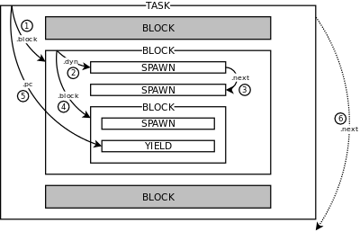

# The Programming Language Atmos (v0.1)

- <a href="#design">1.</a> DESIGN
    - <a href="#structured-deterministic-concurrency">1.1.</a> Structured Deterministic Concurrency
    - <a href="#event-signaling-mechanisms">1.2.</a> Event Signaling Mechanisms
    - <a href="#integration-with-lua">1.3.</a> Integration with Lua
- <a href="#execution">2.</a> EXECUTION
- <a href="#lexicon">3.</a> LEXICON
    - <a href="#keywords">3.1.</a> Keywords
    - <a href="#symbols">3.2.</a> Symbols
    - <a href="#operators">3.3.</a> Operators
        - comparison: `==` `!=` `??` `!?`
        - arithmetic: `+` `-` `*` `/` `%`
        - comparison: `>` `<` `>=` `<=`
        - logical: `!` `||` `&&`
        - membership: `?>` `<?` `!>` `<!`
        - concatenation: `++`
        - size: `#`
    - <a href="#identifiers">3.4.</a> Identifiers
        - `[A-Za-z_][A-Za-z0-9_]*`
    - <a href="#literals">3.5.</a> Literals
        - nil: `nil`
        - boolean: `true` `false`
        - tag: `:[A-Za-z0-9\.\_]+`
        - number: `[0-9][0-9A-Za-z\.]*`
        - string: `'.*'` `".*"`
        - clock: `@(H:)?(M:)?(S:)?(\.ms)?`
        - native: `` `.*` ``
    - <a href="#comments">3.6.</a> Comments
        - single-line: `;; *`
        - multi-line:  `;;; * ;;;`
- <a href="#types-constructors">4.</a> TYPES & CONSTRUCTORS
    - <a href="#clocks">4.1.</a> Clocks
    - <a href="#vectors">4.2.</a> Vectors
        - `#{ * }`
    - <a href="#tables">4.3.</a> Tables
        - User Types
        - `@{ * }` `:X @{ * }`
    - <a href="#functions">4.4.</a> Functions
        - function: `func (*) { * }`
        - lambda: `\(*) { * }`
    - <a href="#tasks">4.5.</a> Tasks
        - `task`
    - <a href="#task-pools">4.6.</a> Task Pools
        - `tasks`
- <a href="#expressions">5.</a> EXPRESSIONS
    - <a href="#program-sequences-and-blocks">5.1.</a> Program, Sequences and Blocks
        - `;` `do` `escape` `drop` `group` `test` `defer`
    - <a href="#declarations-and-assignments">5.2.</a> Declarations and Assignments
        - `val` `var` `set`
    - <a href="#tag-enumerations-and-tuple-templates">5.3.</a> Tag Enumerations and Tuple Templates
        - `enum` `data`
    - <a href="#calls-operations-and-indexing">5.4.</a> Calls, Operations and Indexing
        - `-x` `x+y` `f(*)` `-->`
        - `t[*]` `t.x` `t.pub` `t.(:X)` `t[=]`
        - `where` `thus`
    - <a href="#standard-operators">5.5.</a> Standard Operators
        - length: `#`
        - equality: `==` `/=` `===` `=/=`
        - relational: `>` `>=` `<=` `<`
        - arithmetic: `+` `-` `*` `/`
        - logical: `and` `or` `not`
        - equivalence: `is?` `is-not?`
        - belongs-to: `in?` `in-not?`
        - vector concatenation: `++` `<++`
    - <a href="#conditionals-and-pattern-matching">5.6.</a> Conditionals and Pattern Matching
        - `if` `ifs`
    - <a href="#loops-and-iterators">5.7.</a> Loops and Iterators
        - `loop` `loop in`
    - <a href="#exceptions">5.8.</a> Exceptions
        - `error` `catch`
    - <a href="#coroutine-operations">5.9.</a> Coroutine Operations
        - `coroutine` `status` `resume` `yield` `resume-yield-all` <!--`abort`-->
    - <a href="#task-operations">5.10.</a> Task Operations
        - `pub` `spawn` `tasks` `status` `await` `broadcast` `toggle`
        - `spawn {}` `every` `par` `par-and` `par-or` `watching` `toggle {}`
- <a href="#standard-libraries">6.</a> STANDARD LIBRARIES
    - <a href="#basic-library">6.1.</a> Basic Library
        - `assert` `copy` `create-resume` `next`
        - `print` `println` `sup?` `tag` `tuple` `type`
        - `dynamic?` `static?` `string?`
    - <a href="#type-conversions-library">6.2.</a> Type Conversions Library
        - `to.boolean` `to.char` `to.dict` `to.iter` `to.number`
        - `to.pointer` `to.string` `to.tag` `to.tuple` `to.vector`
    - <a href="#math-library">6.3.</a> Math Library
        - `math.between` `math.ceil` `math.cos` `math.floor` `math.max`
        - `math.min` `math.PI` `math.round` `math.sin`
    - <a href="#random-numbers-library">6.4.</a> Random Numbers Library
        - `random.next` `random.seed`
- <a href="#syntax">7.</a> SYNTAX

<!-- CONTENTS -->

<a name="design"/>

# 1. DESIGN

Atmos is a programming language reconciles *[Structured Concurrency][sc]* with
*[Event-Driven Programming][events]*, extending classical structured
programming with two main functionalities:

- Structured Deterministic Concurrency:
    - A `task` primitive with deterministic scheduling provides predictable
      behavior and safe abortion.
    - A `tasks` container primitive holds attached tasks and control their
      lifecycle.
    - A `pin` declaration attaches a task or tasks to its enclosing lexical
      scope.
    - Structured primitives compose concurrent tasks with lexical scope (e.g.,
      `watching`, `every`, `par_or`).
- Event Signaling Mechanisms:
    - An `await` primitive suspends a task and wait for events.
    - An `emit` primitive broadcasts events and awake awaiting tasks.
<!--
- Lexical Memory Management *(experimental)*:
    - A lexical policy to manage dynamic allocation automatically.
    - A set of strict escaping rules to preserve structured reasoning.
    - A reference-counter collector for deterministic reclamation.
-->

Atmos is inspired by [synchronous programming languages][sync] like [Ceu][ceu]
and [Esterel][esterel].

Follows an extended list of functionalities in Atmos:

- Dynamic typing
- Statements as expressions
- Dynamic collections (tables and vectors)
- Deferred statements for finalization
- Exception handling (throw & catch)
- Seamless integration with Lua

Atmos is tightly connected integrated with [Lua][lua]:
It mimics most of the semantics of Lua with respect to values, types, and
expressions.
In addition, it compiles to [Lua][lua] and relies on [lua-atmos][lua-atmos]
for its concurrency runtime.

Atmos is in **experimental stage**.

In the rest of this section, we introduce key aspects of Atmos:
*Structured Deterministic Concurrency*, *Event Signaling Mechanisms*,
*Hierarchical Tags*, and *Integration with Lua*.

[sc]:           https://en.wikipedia.org/wiki/Structured_concurrency
[events]:       https://en.wikipedia.org/wiki/Event-driven_programming
[sync]:         https://fsantanna.github.io/sc.html
[ceu]:          http://www.ceu-lang.org/
[esterel]:      https://en.wikipedia.org/wiki/Esterel
[lua]:          https://www.lua.org/
[lua-atmos]:    https://github.com/lua-atmos/atmos/
[syms]:         https://en.wikipedia.org/wiki/Symbol_(programming)

<a name="structured-deterministic-concurrency"/>

## 1.1. Structured Deterministic Concurrency

In structured concurrency, the life cycle of processes or tasks respect the
structure of the source code as hierarchical blocks.
In this sense, tasks in Atmos are treated in the same way as local variables of
structured programming:
When a [block](#blocks) of code terminates or goes out of scope, all of its
[local variables](#declarations) become inaccessible to enclosing blocks.
In addition, all of its [pinned tasks](#active-values) are aborted and properly
finalized by [deferred statements](#defer).

Tasks in Atmos are built on top of [coroutines](#active-values), which adhere
to a predictable "run-to-completion" semantics:
Unlike OS threads, coroutines and tasks execute uninterruptedly up to explicit
[yield](#yield) or [await](#awaits) operations.

The next example illustrates structured concurrency, abortion of tasks, and
deterministic scheduling.
The example uses a `par_or` to spawn two concurrent tasks:
    one that terminates after 10 seconds, and
    another one that increments `n` every second, showing its value on
    termination:

<!-- exs/01-counter.atm -->

```
par_or {
    await @10
} with {
    var n = 0
    defer {
        print("I counted ", n)    ;; invariably outputs 9
    }
    every @1 {
        set n = n + 1
    }
}
```

The [`par_or`](parallel-blocks) is a structured mechanism that combines tasks
in nested blocks and rejoins as a whole when one of them terminates,
automatically aborting the others.

The [`every`](every-block) loop in the second task iterates exactly 9 times
before the first task awakes and terminates the composition.
For this reason, the second task is aborted before it has the opportunity to
awake for the 10th time, but its `defer` statement still executes and outputs
`"I counted 9"`.

Since they are based on coroutines, tasks are expected to yield control
explicitly, which makes scheduling entirely deterministic.
In addition, tasks awake in the order they appear in the source code, which
makes the scheduling order predictable.
This rule allows us to infer that the example invariably outputs `9`, no matter
how many times we re-execute it.
Likewise, if the order of the two tasks inside the `par_or` were inverted, the
example would always output `10`.

<a name="event-signaling-mechanisms"/>

## 1.2. Event Signaling Mechanisms

Tasks can communicate through events as follows:

- The [`await`](#awaits) statement suspends a task until it matches an event
  condition.
- The [`emit`](#emit) statement broadcasts an event to all awaiting
  tasks.



Active tasks form a dynamic tree representing the structure of the program, as
illustrated in the figure.
This tree is traversed on every `emit` in a predictable way, since it
respects the lexical structure of the program:
A task has exactly one active block at a time, which is first traversed `(1)`.
The active block has a list of active tasks, which are traversed in sequence
`(2,3)`, and exactly one nested block, which is traversed after the nested
tasks `(4)`.
After the nested blocks and tasks are traversed, the outer task itself is
traversed at its single yielded execution point `(5)`.
Finally, the task next to the outer task is traversed in the same way `(6)`.
An `emit` statement traversal runs to completion before proceeding to the next
statement, just like a function call.

The next example illustrates event broadcasts and tasks traversal.
The example uses a `watching` statement to observe an event condition while
executing a nested task.
When the condition is satisfied, the nested task is aborted:

<!-- exs/02-ticks.atm -->

```
spawn {
    watching :done {
        par {
            every :tick {
                print "tick A"  ;; always awakes first
            }
        } with {
            every :tick {
                print "tick B"  ;; always awakes last
            }
        }
    }
    print "done"
}
emit(:tick)     ;; --> "tick A", "tick B"
emit(:tick)     ;; --> "tick A", "tick B"
emit(:done)     ;; --> "done"
print "end"     ;; --> "end"
```

The main body has an outermost `spawn` task, which awaits `:done`, and has two
nested tasks awaiting `:tick` events.
Then, the main body broadcasts three events in sequence.
The first two `:tick` events awake the nested tasks respecting the structure of
the program, printing `tick A` and `tick B` in this order.
The last event aborts the `watching` composition and prints `done`, before
terminating the main body.

<a name="hierarchical-tags"/>

### 1.2.1. Hierarchical Tags

Tags represent unique human-readable values, and are similar to Lua strings or
[*symbols* or *atoms*][syms] in other programming languages.
Any identifier prefixed with a colon (`:`) is a valid tag, which is guaranteed
to be unique in comparison to others (i.e., `:x == :x` and `:x != :y`).

Tags are syntactic values that only exist at compile time.
During runtime, they are converted to strings and become indistinguishable from
them (i.e., `:x == 'x'`).

Tags are typically used as keys in table (e.g., `:x`, `:y`), or as enumerations
representing states (e.g., `:pending`, `:done`).

<!-- exs/03-tags.atm -->

The next example uses tags as table keys:

```
val pos = @{}           ;; a new table
set pos[:x] = 10
set pos.y   = 20        ;; equivalent to pos[:y]=20
print(pos.x, pos[:y])   ;; -> 10, 20
```

Tags can also be used to "tag" tables, introducing the notion of lightweight
user types in Atmos.
The constructor `:Pos @{x=10,y=20}` is equivalent to `@{tag=:Pos,x=10,y=20}`.

Tags can describe type hierarchies by splitting identifiers with (`.`).
For instance, a tag such as `:T.A.x` is a subtype of `:T`, `:T.A`, and
`:T.A.x` at the same time, as verified by the match operator `??`:

```
print(:T.A.x ?? :T)         ;; --> true  (:T.A.x is a subtype of :T)
print(:T.A.x ?? :T.A)       ;; --> true
print(:T.A.x ?? :T.A.x)     ;; --> true
print(:T     ?? :T.A.x)     ;; --> false (:T is not a subtype of :T.A.x)
print(:T.A   ?? :T.B)       ;; --> false
```

The match operator `??` also works with tagged tables.
Therefore, tags, tables, and `??` can be combined as follows:

```
val t = :T.A @{ a=10 }      ;; @{ tag=:T.A, a=10 }
print(t ?? :T)              ;; --> true
```

<a name="integration-with-lua"/>

## 1.3. Integration with Lua

`TODO`

<!--
The compiler of Atmos converts an input program into an output in C, which is
further compiled to a final executable file.
For this reason, Atmos has source-level compatibility with C, allowing it to
embed native expressions in programs.

- gcc
- :pre
- $x.Tag
- tag,char,boolean,number C types
- C errors
-->

<a name="execution"/>

# 2. EXECUTION

`TODO`

<a name="lexicon"/>

# 3. LEXICON

<a name="keywords"/>

## 3.1. Keywords

The following keywords are reserved in Atmos:

```
    await               ;; await event
    break               ;; loop break
    catch               ;; catch exception
    defer               ;; defer block
    do                  ;; do block                         (10)
    else                ;; else block
    emit                ;; emit event
    escape              ;; escape block
    every               ;; every block
    false               ;; false value
    func                ;; function prototype
    if                  ;; if block                         (20)
    ifs                 ;; ifs block
    in                  ;; in keyword
    it                  ;; implicit parameter
    loop                ;; loop block
    match               ;; match block
    nil                 ;; nil value                        (30)
    par                 ;; par block
    par_and             ;; par-and block
    par_or              ;; par-or block
    pin                 ;; pin declaration
    pub                 ;; public variable
    return              ;; escape prototype
    set                 ;; assign expression                (40)
    spawn               ;; spawn coroutine
    task                ;; task prototype
    tasks               ;; task pool
    throw               ;; throw error
    toggle              ;; toggle coroutine/block
    true                ;; true value
    until               ;; until loop condition
    val                 ;; constant declaration             (50)
    var                 ;; variable declaration
    watching            ;; watching block
    where               ;; where block
    while               ;; while loop condition
    with                ;; with block
```

<!--
    skip                ;; loop skip
    test                ;; test block
-->

<a name="symbols"/>

## 3.2. Symbols

The following symbols are designated in Atmos:

```
    {   }           ;; block/operators delimeters
    (   )           ;; expression delimeters
    [   ]           ;; index/constructor delimeters
    #{              ;; vector constructor delimeter
    @{              ;; dictionary constructor delimeter
    \               ;; lambda declaration
    =               ;; assignment separator
    =>              ;; if/ifs/match clauses
    <-- <- -> -->   ;; pipe calls
    ;               ;; sequence separator
    '   "   `       ;; string/native delimiters
    ,               ;; argument/constructor separator
    :               ;; tag prefix
    ::              ;; method call
    .               ;; field discriminator
    ...             ;; variable arguments
```

<a name="operators"/>

## 3.3. Operators

The following operators are supported in Atmos:

```
    ==   !=   ??   !?           ;; comparison
    +    -    *    /    %       ;; arithmetic
    >    <    >=   <=           ;; comparison
    !    ||   &&                ;; logical
    ?>   <?   !>   <!           ;; membership
    ++                          ;; concatenation
    #                           ;; size
```

<a name="identifiers"/>

## 3.4. Identifiers

Atmos uses identifiers to refer to [variables](#TODO), [functions](#TODO),
and [fields](#TODO):

A variable identifier starts with a letter or underscore (`_`) and is followed
by letters, digits, or underscores:

```
ID : [A-Za-z_][A-Za-z0-9_]*     ;; letter/underscore/digit
```

Examples:

```
x
my_value
y10
```

<a name="literals"/>

## 3.5. Literals

Atmos provides literals for all [value types](#TODO):
    `nil`, `boolean`, `number`, `string`, and `clock`.

It also provides literals for [tag](#TODO) and [native](#TODO) expressions,
which only exist at compile time.

The literals for `nil`, `boolean` and `number` follow the same
[lexical conventions of Lua](lua-lexical).

The literal `nil` is the single value of the `nil` type.

The literals `true` and `false` are the only values of the `boolean` type.

A [tag](#TODO) literal starts with a colon (`:`) and is followed by letters,
digits, and dots (`.`).

A `string` literal is a sequence of characters enclosed by an odd number
of matching double (`"`) or single (`'`) quotes.
Atmos supports multi-line strings when using multiple quote delimiters.

A `number` literal starts with a digit and is followed by digits, letters, and
dots (`.`).

A `clock` literal starts with an *at sign* (`@`) and is followed by the format
`HH:MM:SS.sss` representing hours, minutes, seconds, and milliseconds.
Each time segment accepts numbers or embedded identifiers as expressions.
At runtime, identifiers evaluate to the corresponding variable value.
Clock literals are interpreted as a table in the format
`@{h=HH,min=MM,s=SS,ms=sss}`.

A [native](#TODO) literal is a sequence of characters enclosed by an odd number
of matching back quotes (`` ` ``).
Atmos supports multi-line native literals when using multiple quote delimiters.
Native literals are used in expressions and are interpreted as plain Lua
expressions.

Examples:

<!-- exs/04-literals.atm -->

```
nil                 ;; nil literal
false               ;; boolean literal
:X.Y                ;; tag literal
"""Hello!"""        ;; string literal
1.25                ;; number literal
`x:f {"lua"}`       ;; native literal
```

[lua-lexical]: https://www.lua.org/manual/5.4/manual.html#3.1

<a name="comments"/>

## 3.6. Comments

Atmos provides single-line and multi-line comments.

Single-line comments start with double semi-colons (`;;`) and run until the end
of the line.

Multi-line comments are enclosed by three of more matching semi-colons.

Examples:

<!-- exs/05-comments.atm -->

```
;; a comment        ;; single-line comment

;;;                 ;; multi-line comment
;; a
;; comment
;;;
```

<a name="types-constructors"/>

# 4. TYPES & CONSTRUCTORS

Atmos supports and mimics the semantics of the standard [Lua types](lua-types):
    `nil`, `boolean`, `number`, `string`,
    `function`, `userdata`, `thread`, and `table`.

In addition, Atmos also supports the types as follows:
    `clock`, `vector`, `task`, and `tasks`.
Although these types are internally represented as Lua tables, they receive
special treatment from the language.

Atmos differentiates between *value* and *reference* types:

- Value types are built from the [basic literals](#TODO):
    `nil`, `boolean`, `number`, `string`, and `clock`.
- Reference types are built from constructors:
    `function`, `userdata`, thread, `table`, `vector`, `task`, and `tasks`.

[lua-types]: https://www.lua.org/manual/5.4/manual.html#2.1

<a name="clocks"/>

## 4.1. Clocks

The clock value type represents clock tables in the [format](#TODO)
`@{h=HH,min=MM,s=SS,ms=sss}`.

Examples:

<!-- exs/06-clocks.atm -->

```
val clk = @1:15:40.2    ;; a clock declaration
print(clk.s)            ;; --> 40
print(clk ?? :clock)    ;; --> true
```

<a name="vectors"/>

## 4.2. Vectors

The vector reference type represents tables with numerical indexes starting at
`0`.

A vector constructor `#{ * }` receives a list of expressions `*` and assigns
each expression to incrementing indexes starting at `0`.

Examples:

<!-- exs/07-vectors.atm -->

```
val vs = #{1, 2, 3}     ;; a vector of numbers (similar to @{ [0]=1, [1]=2, [2]=3 })
print(vs[1])            ;; --> 2
print(vs ?? :vector)    ;; --> true
```

<a name="tables"/>

## 4.3. Tables

The table reference type represents [Lua tables](lua-types) with indexes of any
type.

A table constructor `@{ * }` receives a list `*` of key-value assignments.
Like [table constructors in Lua](lua-table), it accepts assignments in three
formats:

- `[e1]=e2` maps `e1` to `e2`
- `id=e` maps string `id` to `e` (same as `["id"]=e`)
- `e` maps numeric index `i` to `e` (same as `[i]=e`), where `i` starts at `1`
  and increments after each assignment

A table constructor may also be prefixed with a tag, which is assigned to key
`"tag"`, i.e., `:X @{ * }` is equivalent to `@{ tag=:X, * }`.

Examples:

<!-- exs/08-tables.atm -->

```
val k = "idx"
val t = @{      ;; all 3 formats:
    [k] = 10,   ;; same as @{ [k]=10, ["v"]="x", [1]=20, [2]=30 }
    v = "x",
    20, 30
}
print(t ?? :table)          ;; --> true
print(t.idx, t["v"], t[2])  ;; --> 10, x, 30
```

[lua-table]: https://www.lua.org/manual/5.4/manual.html#3.4.9

<a name="user-types"/>

### 4.3.1. User Types

Tables can be associated associated with [tags](#TODO) that represent user
types.

Examples:

<!-- exs/09-user.atm -->

```
val p = :Pos @{         ;; a tagged table:
    x = 10,             ;; same as @{ ["tag"]="Pos", ["x"]=10, ["y"]=20 }
    y = 20,
}
print(p ?? :table)      ;; --> true
print(p ?? :Pos)        ;; --> true
```

<a name="functions"/>

## 4.4. Functions

The function reference type represents [Lua functions](lua-function).

The basic constructor creates an anonymous function with a list of parameters
and an execution body, as follows:

```
func (<pars>) {
    <body>
}
```

The list of parameters `<pars>` is an optional list of
variable [identifiers](#TODO) with a leading variadic parameter `...`.
The parameters are immutable as if they were `val` [declarations](#TODO).
The function body `<body>` is a [sequence](#TODO) of expressions.

Atmos also supports alternative formats to create functions, as follows:

- Function syntax:
    - `func t.f (<pars>) { <body> }`:
        equivalent to `set t.f = func (<pars>) { <body> }`
    - `func o::f (<pars>) { <body> }`:
        equivalent to `set o.f = func (self, <pars>) { <body> }`

- Lambda syntax:
    - `\(<pars>) { <body> }`:
        equivalent to `func (<pars>) { <body> }`
    - `\<id> { <body> }`:
        equivalent to `\(<id>) { <body> }`
    - `\ { <body> }`:
        equivalent to `\(it) { <body> }`

Note that the lambda notation is also used in
    [conditionals](#conditionals) and [every statements](#TODO)
to communicate values across blocks.

Examples:

<!-- exs/10-functions.atm -->

```
func f (x, y) {         ;; function to add arguments
    x + y
}
val g = \{ it + 1 }     ;; function to increment argument
print(g(f(1,2)))        ;; --> 4
```

[lua-function]: https://www.lua.org/manual/5.4/manual.html#3.4.11

<a name="tasks"/>

## 4.5. Tasks

The task reference type represents [tasks](#TODO).

A task constructor `task(f)` receives a [function](#TODO) and instantiates a
task.

Examples:

<!-- exs/11-tasks.atm -->

```
func T (...) { ... }    ;; a task prototype
print(T ?? :function)   ;; --> true
val t = task(T)         ;; an instantiated task
print(t ?? :task)       ;; --> true
```

<a name="task-pools"/>

## 4.6. Task Pools

The task pool reference type represents a [pool of tasks](#TODO).

A task pool constructor `tasks([n])` creates a pool that holds at most `n`
tasks.
If `n` is omitted, the pool is unbounded.

A task pool must be assigned to a `pin` [declaration](#TODO).

Examples:

<!-- exs/12-pools.atm -->

```
pin ts = tasks()        ;; a pool of tasks
print(ts ?? :tasks)     ;; --> true
```

<!--
<a name="active-values"/>

### 4.6.1. Active Values

After they suspend, coroutines and tasks retain their execution state and can
be resumed later from their previous suspension point.

Coroutines and tasks have 4 possible status:

- `yielded`: idle and ready to be resumed
- `toggled`: ignoring resumes (only for tasks)
- `resumed`: currently executing
- `terminated`: terminated and unable to resume

The main difference between coroutines and tasks is how they resume execution:

- A coroutine resumes explicitly from a [resume operation](#resume).
- A task resumes implicitly from a [broadcast operation](#broadcast).

Like other [dynamic values](#dynamic-values), coroutines and tasks are also
attached to enclosing [blocks](#block), which may terminate and deallocate all
of its attached values.
Nevertheless, before a coroutine or task is deallocated, it is implicitly
aborted, and all active [defer statements](#defer) execute automatically in
reverse order.

`TODO: lex`

A task pool groups related active tasks as a collection.
A task that lives in a pool is lexically attached to the block in which the
pool is created, such that when the block terminates, all tasks in the pool are
implicitly terminated.

The operations on [coroutines](#coroutine-operations) and
[tasks](#tasks-operations) are discussed further.

Examples:

```
coro C () { <...> }         ;; a coro prototype `C`
val c = coroutine(C)        ;; is instantiated as `c`
resume c()                  ;; and resumed explicitly

val ts = tasks()            ;; a task pool `ts`
task T () { <...> }         ;; a task prototype `T`
val t = spawn T() in ts     ;; is instantiated as `t` in pool `ts`
broadcast(:X)               ;; broadcast resumes `t`
```
-->

<a name="expressions"/>

# 5. EXPRESSIONS

Atmos is an expression-based language in which all statements are expressions
that evaluate to a final value.
Therefore, we use the terms statement and expression interchangeably.

All
    [identifiers](#identifiers),
    [literals](#literals),
    [constructors](#collection-values), and
    [function constructors](#protoype-values)
are also valid expressions.

<a name="program-sequences-and-blocks"/>

## 5.1. Program, Sequences and Blocks

A program in Atmos is a sequence of expressions, and a block is a sequence of
expressions enclosed by braces (`{` and `}`):

```
Prog  : { Expr [`;´] }
Block : `{´ { Expr [`;´] } `}´
```
Each expression in a sequence may be separated by an optional semicolon (`;`).
A sequence of expressions evaluate to its last expression.

<!-- TODO: ; to remove ambiguity -->

<!--
The symbol
[`...`](#declarations) stores the program arguments
as a tuple.
-->

<a name="blocks"/>

### 5.1.1. Blocks

A block delimits a lexical scope for
[variables](#declarations) and [dynamic values](#dynamic-values):
A variable is only visible to expressions in the block in which it is declared.
A dynamic value cannot escape the block in which it is assigned, unless it is
[dropped](#drop) out.

When a block terminates, all memory that is allocated inside it is
automatically reclaimed.
This is also valid for active [coroutines and tasks](#active-values), which are
aborted on termination.

Blocks appear in compound statements, such as
[conditionals](#conditionals-and-pattern-matching),
[loops](#loops-and-iterators), and many others.

A block can also be created through an explicitly `do`:

```
Do : `do´ [TAG] Block
```

The optional [tag](#static-values) identifies the block such that it can match
[escape](#escape) statements.

Examples:

```
do {                    ;; block prints :ok and evals to 1
    println(:ok)
    1
}

do {
    val a = 1           ;; `a` is only visible in the block
    <...>
}
a                       ;; ERROR: `a` is out of scope

do {
    spawn T()           ;; spawns task T and attaches it to the block
    <...>
}                       ;; aborts spawned task
```

<a name="escape"/>

#### 5.1.1.1. Escape

An `escape` immediatelly terminates the enclosing block matching the given tag:

```
Escape : `escape´ `(´ TAG [`,´ Expr] `)´
```

The optional expression, which defaults to `nil`, becomes the final result of
the terminating block.

Examples:

```
val v = do :X {
    println(1)          ;; --> 1
    do :Y {
        escape(:X, 2)
        println(3)      ;; never executes
    }
    println(4)          ;; never executes
}
println(v)              ;; --> 2
```

<a name="drop"/>

#### 5.1.1.2. Drop

A `drop` dettaches the given [dynamic value](#dynamic-values) from its current
holding block:

```
Drop : `drop´ `(´ Expr `)´
```

A dropped value can be reattached to another block in a further assignment.

Examples:

```
val u = do {
    val v = 10
    drop(v)         ;; --> 10 (innocuous drop)
}
```

```
val u = do {
    val t = [10]
    drop(t)         ;; --> [10] (deattaches from `t`, reattaches to `u`)
}
```

<a name="group"/>

### 5.1.2. Group

A `group` is a nested sequence of expressions:

```
Group : group Block
```

Unlike [blocks](#blocks), a group does not create a new scope for variables
and tasks.
Therefore, all nested declarations remain active as if they are declared on the
enclosing block.

Examples:

```
group {
    val x = 10
    val y = x * 2
}
println(x, y)       ;; --> 10 20
```

<a name="test"/>

### 5.1.3. Test

A `test` block behaves like a normal block, but is only included in the program
when compiled with the flag `--test`:

```
Test : `test´ Block
```

Examples:

```
func add (x,y) {
    x + y
}
test {
    assert(add(10,20) == 30)
}
```

<a name="defer"/>

### 5.1.4. Defer

A `defer` block executes only when its enclosing block terminates:

```
Defer : `defer´ Block
```

Deferred blocks execute in reverse order in which they appear in the source
code.

Examples:

```
do {
    println(1)
    defer {
        println(2)      ;; last to execute
    }
    defer {
        println(3)
    }
    println(4)
}                       ;; --> 1, 4, 3, 2
```

<a name="declarations-and-assignments"/>

## 5.2. Declarations and Assignments

<a name="declarations"/>

### 5.2.1. Declarations

Variables in Atmos must be declared before use, and are only visible inside the
[block](#blocks) in which they are declared:

```
Val : `val´ (ID [TAG] | Patt) [`=´ Expr]    ;; immutable
Var : `var´ (ID [TAG] | Patt) [`=´ Expr]    ;; mutable
```

A declaration either specifies an identifier with an optional tag, or specifies
a [tuple pattern](#pattern-matching) for multiple declarations.
The optional initialization expression assigns an initial value to the
declaration, which defaults to `nil`.

The difference between `val` and `var` is that a `val` is immutable, while a
`var` declaration can be modified by further `set` statements.
Note that the `val` modifier rejects that its name is reassigned, but it does
not prevent that a holding [dynamic value](#dynamic-values) is internally
modified (e.g., setting a vector index).

Atmos does not support shadowing, i.e., if an identifier is visible, it cannot
appear in a new variable declaration.

When using an identifier, the optional tag specifies a
[tuple template](#tag-enumerations-and-tuple-templates), which allows the
variable to be indexed by field names, instead of numeric positions.
Note that the variable is not guaranteed to hold a value matching the template.
The template association is static but with no runtime guarantees.

If the identifier declaration omits the template tag, but the initialization
expression is a [tag constructor](#collection-values), then the variable
assumes this tag template, i.e., `val x = :X []` expands to `val x :X = :X []`.

Examples:

```
do {
    val x = 10
    set x = 20          ;; ERROR: `x´ is immutable
}
println(x)              ;; ERROR: `x´ is out of scope

var y = 10
set y = 20              ;; OK: `y´ is mutable
println(y)              ;; --> 20

val p1 :Pos = [10,20]   ;; (assumes :Pos has fields [x,y])
println(p1.x)           ;; --> 10

val p2 = :Pos [10,20]   ;; (assumes :Pos has fields [x,y])
println(p2.y)           ;; --> 20

val x
do {
    val x               ;; `x´ is already declared
}
```

A tuple pattern supports multiple variable declarations matching an
initialization expression.
The pattern is [assertive](#pattern-matching), raising an error if the match
fails.

Examples:

```
val [1,x,y] = [1,2,3]
println(x,y)            ;; --> 2 3

val [10,x] = [20,20]    ;; ERROR: match fails
```

<a name="prototype-declarations"/>

### 5.2.2. Prototype Declarations

[Execution unit](#execution-units) [prototypes](#prototype-values) can be
declared as immutable variables as follows:

```
Proto : `func´ ID `(´ [List(ID [TAG])] `)´ Block
      | `coro´ ID `(´ [List(ID [TAG])] `)´ Block
      | `task´ ID `(´ [List(ID [TAG])] `)´ Block
```

The expression

```
func <id> (...) {
    ...
}
```

expands to

```
val <id> = func (...) {
    ...
}
```

Examples:

```
func f (v) {
    v + 1
}
println(f(10))      ;; --> 11
```

<a name="return"/>

#### 5.2.2.1. Return

A `return` immediately terminates the enclosing prototype:

```
Return : `return´ `(´ [Expr] `)´
```

The optional expression, which defaults to `nil`, becomes the final result of
the terminating prototype.

Examples:

```
func f () {
    println(1)      ;; --> 1
    return(2)
    println(3)      ;; never executes
}
println(f())        ;; --> 2
```

`TODO: move section to escape?`

<a name="assignments"/>

### 5.2.3. Assignments

The `set` statement assigns the value in the right to the location in the left
of the symbol `=`:

```
Set : `set´ Expr `=´ Expr
```

The only valid locations are
    [mutable variables](#declarations),
    [indexes](#indexes-and-fields), and
    [public fields](#public-fields).

Examples:

```
var x
set x = 20              ;; OK

val y = [10]
set y = 0               ;; ERROR: cannot reassign `y`
set y[0] = 20           ;; OK

task T (v) {
    set pub = v         ;; OK
}
```

<a name="tag-enumerations-and-tuple-templates"/>

## 5.3. Tag Enumerations and Tuple Templates

[Tags](#hierarchical-tags) are global identifiers that need not to be
predeclared.
However, they may be explicitly declared when used as enumerations or tuple
templates.

<a name="tag-enumerations"/>

### 5.3.1. Tag Enumerations

An `enum` groups related tags together in sequence:

```
Enum : `enum´ `{´ List(TAG) `}´
     | `enum´ TAG `{´ List(ID) `}´
```

The first variation declares the tags in the given list.
The second variation declares tags by prefixing the identifiers in the list
with the given tag, separated by a dash (`-`).

Enumerations can be used to interface with external libraries that use
constants to represent a group of related values (e.g., key symbols).
Tags in enumerations are guaranteed to form an incrementing sequence of
numbers, and are supported in [arithmetic](#arithmetic-operators) and
[relational](#relational-operators) operations.

Examples:

```
enum { :x, :y, :z }     ;; declares :x, :y, :z in sequence
println(:z - :x)        ;; --> 2
println(:x + 1)         ;; --> :y
println(:y < :z)        ;; --> true
```

```
enum :Key {
    Left,               ;; declares :Key-Left (200)
    Up,                 ;; declares :Key-Up   (201)
    Right,              ;; ...
    Down,               ;; ...
}
```

<a name="tuple-templates"/>

### 5.3.2. Tuple Templates

A `data` declaration associates a tag with a tuple template, which associates
tuple positions with field identifiers:

```
Template : `data´ Data [`{´ { Data } `}´]
                Data : TAG `=´ `[´ List(ID [TAG]) `]´
```

After the keyword `data`, a declaration expects a tag followed by `=` and a
template.
A template is surrounded by brackets (`[` and `]`) to represent the tuple, and
includes a list of identifiers, each mapping an index into a field.
Each field can be followed by a tag to represent nested templates.

A [variable declaration](#declarations) can specify a tuple template and hold a
tuple that can be accessed by field.

Examples:

```
data :Pos = [x,y]                       ;; a flat template
val pos :Pos = [10,20]                  ;; pos uses :Pos as template
println(pos.x, pos.y)                   ;; --> 10, 20

data :Dim = [w,h]
data :Rect = [pos :Pos, dim :Dim]       ;; a nested template
val r1 :Rect = [pos, [100,100]]         ;; r uses :Rect as template
println(r1.dim, r1.pos.x)               ;; --> [100,100], 10

val r2 = :Rect [[0,0],[10,10]]          ;; combining tag template/constructor
println(r2 is? :Rect, r2.dim.h)         ;; --> true, 10
```

Based on [tags and sub-tags](#user-types), tuple templates can define
hierarchies and reuse fields from parents.
A declaration can be followed by a list of sub-templates enclosed by curly
braces (`{` and `}`), which can nest to at most 4 levels.
Each nested tag identifier assumes an implicit prefix of its super-tag, e.g.,
in the context of tag `:X`, a sub-tag `:A` is actually `:X.A`.
Templates are reused by concatenating a sub-template after its corresponding
super-templates, e.g., `:X.A [a]` with `:X [x]` becomes `:X.A [x,a]`.

Examples:

```
data :Event = [ts] {            ;; All events carry a timestamp
    :Key = [key]                ;; :Event.Key [ts,key] is a sub-type of :Event [ts]
    :Mouse = [pos :Pos] {       ;; :Event.Mouse [ts, pos :Pos]
        :Motion = []            ;; :Event.Mouse.Motion [ts, pos :Pos]
        :Button = [but]         ;; :Event.Mouse.Button [ts, pos :Pos, but]
    }
}

val but = :Event.Mouse.Button [0, [10,20], 1]
val evt :Event = but
println(evt.ts, but.pos.y)      ;; --> 0, 20
```

<a name="calls-operations-and-indexing"/>

## 5.4. Calls, Operations and Indexing

<a name="calls-and-operations"/>

### 5.4.1. Calls and Operations

In Atmos, calls and operations are equivalent, i.e., an operation is a call that
uses an [operator](#operatos) with prefix or infix notation:

```
Expr : OP Expr                      ;; unary operation
     | Expr OP Expr                 ;; binary operation
     | Expr `(´ [List(Expr)] `)´    ;; function call
```

Operations are interpreted as function calls, i.e., `x + y` is equivalent to
`{{+}} (x, y)`.

A call expects an expression of type [`func`](#prototype-values) and an
optional list of expressions as arguments enclosed by parenthesis.
A call transfers control to the function, which runs to completion and returns
a value, which substitutes the call.

As discussed in [Identifiers](#identifiers), the binary minus requires spaces
around it to prevent ambiguity with identifiers containing dashes.

Examples:

```
#vec            ;; unary operation
x - 10          ;; binary operation
{{-}}(x,10)     ;; operation as call
f(10,20)        ;; normal call
```

<a name="pipe-calls"/>

#### 5.4.1.1. Pipe Calls

A pipe is an alternate notation to call a function:

```
Expr : Expr (`<--´ | `<-´ | `->´ | `-->´ ) Expr
```

The operators `<--` and `<-` pass the argument in the right to the function in
the left, while the operators `->` and `-->` pass the argument in the left to
the function in the right.

Single pipe operators `<-` and `->` have higher
[precedence](@precedence-and-associativity) than double pipe operators
`<--` and `-->`.

If the receiving function is already a call, then the pipe operator inserts
the extra argument into the call either as first (`->` and `-->`) or last (`<-`
and `<--`).


Examples:

```
f <-- 10 -> g   ;; equivalent to `f(g(10))`
t -> f(10)      ;; equivalent to `f(t,10)`
```

<a name="indexes-and-fields"/>

### 5.4.2. Indexes and Fields

[Collections](#collections) in Atmos are accessed through indexes or fields:

```
Expr : Expr `[´ Expr `]´        ;; Index
     | Expr `.´ ID              ;; Field
     | Expr `.´ `pub´ | `pub´   ;; Pub
```

An index operation expects a collection and an index enclosed by brackets (`[`
and `]`).
For tuples and vectors, the index must be a number.
For dictionaries, the index can be of any type.
The operation evaluates to the current value in the given collection index, or
`nil` if non existent.

A field operation expects a dictionary or a tuple template, a dot separator
(`.`), and a field identifier.
If the collection is a dictionary `d`, the field must be a
[tag literal](#literals) `k` (with the colon prefix `:` omitted), which is
equivalent to the index operation `v[:k]`.
If the collection is a [tuple template](#tag-enumerations-and-tuple-templates)
`t`, the field must be an identifier that maps to a template index `i`, which
is equivalent to the index operation `t[i]`.

A `pub` operation accesses the public field of an [active task](#active-values)
and is discussed [further](#task-operations).

Examples:

```
tup[3]              ;; tuple access by index
vec[i]              ;; vector access by index

dict[:x]            ;; dict access by index
dict.x              ;; dict access by field

val t :T            ;; tuple template
t.x                 ;; tuple access by field

val t = spawn T()
t.pub               ;; public field of task
```

<a name="template-casting"/>

#### 5.4.2.1. Template Casting

An expression can be suffixed with a tag between parenthesis to cast it into a
tuple template:

```
Expr : Expr `.´ `(´ TAG `)´
```

Examples:

```
data :Pos = [x,y]
val p = [10,20]
println(p.(:Pos).x)     ;; `p` is cast to `:Pos`
```

<a name="peek-push-pop"/>

#### 5.4.2.2. Peek, Push, Pop

The *ppp operators* (peek, push, pop) manipulate vectors as stacks:

```
Expr : Expr `[´ (`=´|`+´|`-´) `]´
```

A peek operation `vec[=]` sets or gets the last element of a vector.
The push operation `vec[+]` adds a new element to the end of a vector.
The pop operation `vec[-]` gets and removes the last element of a vector.

Examples:

```
val stk = #[1,2,3]
println(stk[=])         ;; --> 3
set stk[=] = 30
println(stk)            ;; --> #[1, 2, 30]
println(stk[-])         ;; --> 30
println(stk)            ;; --> #[1, 2]
set stk[+] = 3
println(stk)            ;; --> #[1, 2, 3]
```

<a name="where-and-thus-clauses"/>

### 5.4.3. Where and Thus Clauses

Any expression can be suffixed by `where` and `thus` clauses:

```
Expr : Expr `where´ Block
     | Expr `thus´ Lambda
```

A `where` clause executes its suffix block before the prefix expression and is
allowed to declare variables that can be used by the expression.

A `thus` clause uses the [lambda notation](#lambda-prototype) to pass the
result of the prefix expression as an argument to execute the suffix block.
Even though it uses the lambda notation, the clause does not create an extra
function to execute.

Examples:

```
val x = (2 * y) where {     ;; x = 20
    val y = 10
}
```

```
(x * x) thus { \v =>
    println(v)              ;; --> 400
}
```

<a name="precedence-and-associativity"/>

### 5.4.4. Precedence and Associativity

Operations in Atmos can be combined in expressions with the following precedence
priority (from higher to lower):

1. suffix (left associative)
    - call:         `f()` `{{op}}()`
    - index:        `t[i]` `t[=]` `t[+]` `t[-]`
    - field:        `t.x` `t.pub` `t.(:T)`
2. inner (left associative)
    - single pipe:  `v->f` `f<-v`
2. prefix (right associative)
    - unary:        `not v` `#t` `-x`
    - constructor:  `:T []` (see [Collection Values](#collection-values))
3. infix (left associative)
    - binary        `x*y` `r++s` `a or b`
4. outer operations (left associative)
    - double pipe:  `v-->f` `f<--v`
    - where:        `v where {...}`
    - thus:         `v thus {...}`

All operations are left associative, except prefix operations, which are right
associative.
Note that all binary operators have the same precedence.
Therefore, expressions with different operators but with the same precedence
require parenthesis for disambiguation:

```
Expr : `(´ Expr `)´
```

Examples:

```
#f(10).x        ;; # ((f(10)) .x)
x + 10 - 1      ;; ERROR: requires parenthesis
- x + y         ;; (-x) + y
x or y or z     ;; (x or y) or z
```

<a name="standard-operators"/>

## 5.5. Standard Operators

Atmos provides a number of standard operators:

- length: `#`
- equality: `==` `/=` `===` `=/=`
- relational: `>` `>=` `<=` `<`
- arithmetic: `+` `-` `*` `/`
- logical: `and` `or` `not`
- equivalence: `is?` `is-not?`
- belongs-to: `in?` `in-not?`

The function signatures that follow describe the operators and use tag
annotations to describe the parameters and return types.
However, note that the annotations are not part of the language, and are used
for documentation purposes only.

<a name="length-operator"/>

### 5.5.1. Length Operator

```
func {{#}} (v :any) => :number
```

The operator `#` returns the length of the given tuple or vector.

Examples:

```
val tup = []
val vec = #[1,2,3]
println(#tup, #vec)     ;; --> 0 / 3
```

<a name="equality-operators"/>

### 5.5.2. Equality Operators

```
func {{==}} (v1 :any, v2 :any) => :boolean
func {{/=}} (v1 :any, v2 :any) => :boolean
```

The operator `==` returns `true` if the values are equal and `false` otherwise.
The operator `/=` is the negation of `==`.

To be considered equal, first the values must be of the same type.
In addition, [static values](#static-values) are compared *by value*, while
[dynamic values](#dynamic-values) and [active values](#active-values) are
compared *by reference*.

Examples:

```
1 == 1          ;; --> true
1 /= 1          ;; --> false
1 == '1'        ;; --> false
[1] == [1]      ;; --> false
```

```
val t1 = [1]
val t2 = t1
t1 == t2        ;; --> true
```

<a name="deep-equality-operators"/>

#### 5.5.2.1. Deep Equality Operators

```
func {===} (v1 :any, v2 :any) => :boolean
func {=/=} (v1 :any, v2 :any) => :boolean
```

The operator `===` returns `true` if the values are deeply equal and `false`
otherwise.
The operator `=/=` is the negation of `===`.

Except for [collections](#collections), deep equality behaves the same as
[equality](#equality-operators).
To be considered deeply equal, collections must be of the same type, have the
same [user tags](#user-types), and all indexes and values must be deeply equal.

Examples:

```
1 === 1                 ;; --> true
1 =/= 1                 ;; --> false
1 === '1'               ;; --> false
#[1] === #[1]           ;; --> true
@[(:x,1),(:y,2)] =/=
@[(:y,2),(:x,1)]        ;; --> false
```

<a name="relational-operators"/>

### 5.5.3. Relational Operators

```
func {{>}}  (n1 :number, n2 :number) => :boolean
func {{>=}} (n1 :number, n2 :number) => :boolean
func {{<=}} (n1 :number, n2 :number) => :boolean
func {{<}}  (n1 :number, n2 :number) => :boolean
```

The operators `>`, `>=`, `<=` and `<` perform the standard relational
operations of *greater than*, *greater or equal than*, *less than*, and
*less or equal then*, respectively.

`TODO: tags`

Examples:

```
1 > 2       ;; --> false
2 >= 1      ;; --> true
1 <= 1      ;; --> true
1 < 2       ;; --> true
```

<a name="arithmetic-operators"/>

### 5.5.4. Arithmetic Operators

```
func {{+}} (n1 :number, n2 :number)   => :number
func {{-}} (n1 :number [,n2 :number]) => :number
func {{*}} (n1 :number, n2 :number)   => :number
func {{/}} (n1 :number, n2 :number)   => :number
func {{%}} (n1 :number, n2 :number)   => :number
```

The operators `+`, `-`, `*` and `/` perform the standard arithmetics operations
of *addition*, *subtraction*, *multiplication*, and *division*, respectively.

The operator `%` performs the *remainder* operation.

The operator `-` is also used as the unary minus when it prefixes an
expression.

`TODO: tags`
`TODO: *-*, //`

Examples:

```
1 + 2       ;; --> 3
1 - 2       ;; --> -1
2 * 3       ;; --> 6
5 / 2       ;; --> 2.5
5 % 2       ;; --> 1
-20         ;; --> -20
```

<a name="logical-operators"/>

### 5.5.5. Logical Operators

```
func not (v :any) => :boolean
func and (v1 :any, v2 :any) => :any
func or  (v1 :any, v2 :any) => :any
```

The logical operators `not`, `and`, and `or` are functions with a special
syntax to be used as prefix (`not`) and infix operators (`and`,`or`).

A `not` receives a value `v` and is equivalent to the code as follows:

```
if v { false } else { true }
```

The operators `and` and `or` return one of their operands `v1` or `v2`.

An `and` is equivalent to the code as follows:

```
v1 thus {
    if it { v2 } else { it }
}
```

An `or` is equivalent to the code as follows:

```
v1 thus {
    if it { it } else { v2 }
}
```

Examples:

```
not not nil     ;; --> false
nil or 10       ;; --> 10
10 and nil      ;; --> nil
```

<a name="equivalence-operators"/>

### 5.5.6. Equivalence Operators

```
func is?     (v1 :any, v2 :any) => :boolean
func is-not? (v1 :any, v2 :any) => :boolean
```

The operators `is?` and `is-not?` are functions with a special syntax to be
used as infix operators.

The operator `is?` checks if `v1` matches `v2` as follows:

```
ifs {
    (v1 === v2)        => true
    (type(v1) == v2)   => true
    (type(v2) == :tag) => sup?(v2, tag(v1))
    else => false
}
```

The operator `is-not?` is the negation of `is?`.

Examples:

```
10 is? :number          ;; --> true
10 is? nil              ;; --> false
tag(:X,[]) is? :X       ;; --> true
```

<a name="belongsto-operators"/>

### 5.5.7. Belongs-to Operators

```
func in?     (v :any, vs :any)
func in-not? (v :any, vs :any)
```

The operators `in?` and `in-not?` are functions with a special syntax to be
used as infix operators.

The operator `in?` checks if `v` is part of [collection](#collections) `vs`.
For tuples and vectors, the values are checked.
For dictionaries, the indexes are checked.

The operator `in-not?` is the negation of `in?`.

Examples:

```
10 in? [1,10]            ;; true
20 in? #[1,10]           ;; false
10 in? @[(1,10)]         ;; false
```

<a name="vector-concatenation-operators"/>

### 5.5.8. Vector Concatenation Operators

```
func {{++}}  (v1 :vector, v2 :vector) => :vector
func {{<++}} (v1 :vector, v2 :vector) => :vector
```

The operators `++` and `<++` concatenate the given vectors.
The operator `++` creates and returns a new vector, keeping the received
vectors unmodified.
The operator `<++` appends `v2` at the end of `v1`, returning `v1` modified.

Examples:

`TODO`

<a name="conditionals-and-pattern-matching"/>

## 5.6. Conditionals and Pattern Matching

In a conditional context, [`nil`](#static-values) and [`false`](#static-values)
are interpreted as "falsy", and all other values from all other types as
"truthy".

<a name="conditionals"/>

### 5.6.1. Conditionals

Atmos supports conditionals as follows:

```
If  : `if´ Expr (`=>´ Expr | Block | Lambda)
        [`else´  (`=>´ Expr | Block)]
Ifs : `ifs´ `{´ {Case} [Else] `}´
        Case :  Expr  (`=>´ Expr | Block | Lambda)
        Else : `else´ (`=>´ Expr | Block)
```

An `if` tests a condition expression and executes one of the two possible
branches.

If the condition is truthy, the `if` executes the first branch.
Otherwise, it executes the optional `else` branch, which defaults to `nil`.
A branch can be either a [block](#blocks) or a simple expression prefixed
by the arrow symbol `=>`.

An `ifs` supports multiple conditions, which are tested in sequence, until one
is satisfied, executing its associated branch.
Otherwise, it executes the optional `else` branch, which defaults to `nil`.

Except for `else` branches, note that branches can use the
[lambda notation](#lambda-prototypes) to capture the value of the condition
being tested.
Even though it uses the lambda notation, the branches do not create an extra
function to execute.

Examples:

```
val max = if x>y => x => y
```

```
ifs {
    x > y => x
    x < y => y
    else  => error(:error, "values are equal")
}
```

```
if f() { \v =>
    println("f() evaluates to " ++ to.string(v))
} else {
    println("f() evaluates to false")
}
```

<a name="pattern-matching"/>

### 5.6.2. Pattern Matching

The `match` statement allows to test a head expression against a series of
patterns between `{` and `}`:

```
Match : `match´ Expr `{´ {Case} [Else] `}´
        Case :  Patt  (`=>´ Expr | Block | Lambda)
        Else : `else´ (`=>´ Expr | Block)

Patt : [`(´] [ID] [TAG] [Const | Oper | Tuple] [`|´ Expr] [`)´]
        Const : Expr
        Oper  : OP [Expr]
        Tuple : `[´ List(Patt) } `]´
```

The patterns are tested in sequence, until one is satisfied, executing its
associated branch.
Otherwise, it executes the optional `else` branch, which defaults to `nil`.
A branch can be either a [block](#blocks) or a simple expression prefixed
by the arrow symbol `=>`.

A pattern is satisfied if all of its optional forms to test the head expression
are satisfied:

1. An identifier `ID` that always matches and captures the value of the head
  expression with `ID = head`.
  If omitted, it assumes the implicit identifier `it`.
  If the pattern succeeds, the identifier can be used in its associated branch.
2. A tag `TAG` that tests the head expression with `head is? TAG`.
3. One of the three forms:
    - A [static literal](#static-values) `Const` that tests the head expression
      with `head == Const`.
    - An operation `OP` followed by an optional expression `Expr` that tests
      the head expression with `{{OP}}(head [,Expr])`.
    - A tuple of patterns that tests if the head expression is a tuple, and
      then applies each nested pattern recursively.
      The head tuple size can be greater than the tuple pattern.
4. An extra "such that" condition following the pipe symbol `|` that must be
  satisfied, regardless of the head expression value.
  If given, this condition becomes the capture value of the branch.

Except for `else` branches, note that the branches can use the
[lambda notation](#lambda-prototypes) to capture the value of the condition
being tested.
Even though it uses the lambda notation, the branches do not create an extra
function to execute.

Examples:

```
match f() {
    x :X     => x       ;; capture `x=f()`, return `x` if `x is? :X`
    <= 5     => it      ;; capture `it=f()`, return `it` if `it <= 5`
    10       => :ok     ;; return :ok if `f() == 10`
    {{odd?}} => :ok     ;; return :ok if `odd?(f())`
    else     => :no
}
```

```
match [10,20,30,40] {
    | g(it) { \v => v }     ;; capture `it=[...]`, check `g(it)`
                            ;;    capture and return `g(it)` as `v`
    [10, i, j|j>10] => i+j  ;; capture `it=[...]`, check `#it>=3`,
                            ;;    check `it[0]==10`
                            ;;    capture `i=it[1]`
                            ;;    capture `j=it[1]`, check `j>10`
                            ;;    return i+j
}
```

Patterns are also used in
    [declarations](#declarations),
    [iterators](#iterators-tuples), and
    [await statements](#awaits).
In the case of declarations and iterators, the patterns are assertive in the
sense that they cannot fail, raising an error if the match fails.

Examples:

```
val [1,x,y] = [1,2,3]
println(x,y)            ;; --> 2 3

val [10,x] = [20,20]    ;; ERROR: match fails

val d = @[x=1, y=2]
loop [k,v] in d {
    println(k,v)        ;; --> x,1 y,2
}
```

```
spawn {
    await(:Pos | it.x==it.y)
}
broadcast(:Pos [10,20])     ;; no match
broadcast(:Pos [10,10])     ;; ok match
```

<a name="loops-and-iterators"/>

## 5.7. Loops and Iterators

Atmos supports loops and iterators as follows:

```
Loop : `loop´ Block                                 ;; (1)
     | `loop´ (ID [TAG] | Patt) `in´ Expr Block     ;; (2)
     | `loop´ [ID] [`in´ Range] Block               ;; (3)
            Range : (`}´|`{´) Expr `=>` Expr (`}´|`{´) [`:step` [`+´|`-´] Expr]

Break : `break´ `(´ [Expr] `)´
      | `until´ Expr
      | `while´ Expr

Skip  : `skip´ `(´ `)´
```

A `loop` executes a block of code continuously until a termination condition is
met.
Atmos supports three loop header variations:

1. An *infinite loop* with an empty header, which only terminates from break
   conditions.
2. An [*iterator loop*](#iterator-loop) with an iterator expression that
   executes on each step until it signals termination.
3. A [*numeric loop*](#numeric-loop) with a range that specifies the number of
   steps to execute.

The iterator and numeric loops are detailed next.

The loop block may contain three variations of a `break` statement for
immediate termination:

1. A `break <e>` terminates the loop with the value of `<e>`.
2. An `until <e>` terminates the loop if `<e>` is [truthy](#conditionals), with
   that value.
3. A `while <e>` terminates the loop if `<e>` is [falsy](#basic-types), with
   that value (`nil` or `false`).

As any other statement, a loop is an expression that evaluates to a final value
as a whole.
A loop that terminates from the header condition evaluates to `false`.

The block may also contain a `skip()` statement to jump back to the next loop
step.

Examples:

```
var i = 1
loop {                  ;; infinite loop
    println(i)          ;; --> 1,2,...,10
    while i < 10        ;; conditional termination
    set i = i + 1
}
```

```
var i = 0
loop {                  ;; infinite loop
    set i = i + 1
    if (i % 2) == 0 {
        skip()          ;; jump back
    }
    println(i)          ;; --> 1,3,5,...
}
```

<a name="numeric-loops"/>

### 5.7.1. Numeric Loops

A numeric loop specifies a range of numbers to iterate through:

```
Loop  : `loop´ [ID] [`in´ Range] Block
Range : (`}´|`{´) Expr `=>` Expr (`}´|`{´) [`:step` [`+´|`-´] Expr]
```

At each loop step, the optional identifier receives the current number.
If omitted, it assumes the implicit identifier `it`.

The optional `in` clause specifies an interval `x => y` to iterate
over.
If omitted, then the loop iterates from `0` to infinity.

The clause chooses open or closed range delimiters, and an optional signed
`:step` expression to apply at each iteration.
The open delimiters `}x` and `y{` exclude the given numbers from the interval,
while the closed delimiters `{x` and `y}` include them.
Note that for an open delimiter, the loop initializes the given number to its
successor or predecessor, depending on the step direction.

The loop terminates when `x` reaches or surpasses `y` considering the step sign
direction, which defaults to `+1`.
In this case, the loop evaluates to `false`.
After each step, the step is added to `x` and compared against `y`.

Examples:

```
loop i {
    println(i)      ;; --> 0,1,2,...
}
```

```
loop in {0 => 3{ {
    println(it)     ;; --> 0,1,2
}
```

```
loop v in }3 => 0} :step -1 {
    println(v)      ;; --> 2,1,0
}
```

<a name="iterator-loops"/>

### 5.7.2. Iterator Loops

An iterator loop evaluates a given iterator expression on each step, until it
signals termination:

```
Loop | `loop´ (ID [TAG] | Patt) `in´ Expr Block
```

The loop first declares a control variable using the rules from
[declarations](#declarations) to capture the results of the iterator
expression, which appears after the keyword `in`.
If the declaration is omitted, it assumes the implicit identifier `it`.

The iterator expression `itr` must evaluate to a [tagged](#user-types) iterator
[tuple](#collections) `:Iterator [f,...]`.

The iterator tuple must hold a step function `f` at index `0`, followed by any
other custom state required to operate.
The function `f` expects the iterator tuple itself as argument, and returns its
next value.
On each iteration, the loop calls `f` passing the `itr`, and assigns the result
to the loop control variable.
To signal termination, `f` just needs to return `nil`.
In this case, the loop as a whole evaluates to `false`.

If the iterator expression is not an iterator tuple, the loop tries to
transform it by calling [`to.iter`](#type-conversion-library) implicitly, which
creates iterators from iterables, such as vectors and task pools.

Examples:

```
loop v in [10,20,30] {          ;; implicit to.iter([10,20,30])
    println(v)                  ;; --> 10,20,30
}

func num-iter (N) {
    val f = func (t) {
        val v = t[2]
        set t[2] = v + 1
        ((v < N) and v) or nil
    }
    :Iterator [f, N, 0]
}
loop in num-iter(5) {
    println(it)                 ;; --> 0,1,2,3,4
}
```

<a name="exceptions"/>

## 5.8. Exceptions

The `error` expression raises an exception that aborts the execution of all
enclosing blocks up to a matching `catch` block.

```
Error : `error´ `(´ [Expr] `)´
Catch : `catch´ [TAG | `(´ TAG `)´] Block
```

An `error` propagates upwards and aborts all enclosing [blocks](#blocks) and
[execution units](#prototype-values) (functions, coroutines, and tasks) on the
way.
When crossing an execution unit, an `error` jumps back to the original calling
site and continues to propagate upwards.
The optional exception value, which defaults to `:nil`, must evaluate to a
[tag](#static-values) or [tagged value](#hierarchical-tags) that represents the
error.

A `catch` executes its associated block normally, but also registers a
[tag](#static-values) to compare against exception values from errors crossing
it.
If they match, the exception is caught and the `catch` terminates and evaluates
to exception value, also aborting its associated block, and properly triggering
nested [`defer`](#defer) statements.

Examples:

```
val x = catch :Error {
    error(:Error)
    println("unreachable")
}
println(x)              ;; --> :Error
```

```
val x =
    catch :X {
        catch :Y {
            error(:X [10,20])
        }
    }
println(x)              ;; --> :X [10,20]
```

```
func f () {
    catch :Err.One {                  ;; catches specific error
        defer {
            println(1)
        }
        error(:Err.Two ["err msg"])   ;; throws another error
    }
}
catch :Err {                          ;; catches generic error
    defer {
        println(2)
    }
    f()
    ;; unreachable
}                                     ;; --> 1, 2
```

<a name="coroutine-operations"/>

## 5.9. Coroutine Operations

The API for coroutines has the following operations:

- [`coroutine`](#coroutine-create): creates a new coroutine from a prototype
- [`status`](#coroutine-status): consults the coroutine status
- [`resume`](#spawn): starts or resumes a coroutine
- [`yield`](#yield): suspends the resumed coroutine

<!--
5. [`abort`](#TODO): `TODO`
-->

Note that `yield` is the only operation that is called from the coroutine
itself, all others are called from the user code controlling the coroutine.
The `resume` and `yield` operations transfer values between themselves,
similarly to calls and returns in functions.

Examples:

```
coro C (x) {                ;; first resume
    println(x)              ;; --> 10
    val w = yield(x + 1)    ;; returns 11, second resume, receives 12
    println(w)              ;; --> 12
    w + 1                   ;; returns 13
}
val c = coroutine(C)        ;; creates `c` from prototype `C`
val y = resume c(10)        ;; starts  `c`, receives `11`
val z = resume c(y+1)       ;; resumes `c`, receives `13`
println(status(c))          ;; --> :terminated
```

```
coro C () {
    defer {
        println("aborted")
    }
    yield()
}
do {
    val c = coroutine(C)
    resume c()
}                           ;; --> aborted
```

<a name="coroutine-create"/>

### 5.9.1. Coroutine Create

The operation `coroutine` creates a new [active coroutine](#active-values) from
a [coroutine prototype](#prototype-values):

```
Create : `coroutine´ `(´ Expr `)´
```

The operation `coroutine` expects a coroutine prototype (type
[`coro`](#execution-units)) and returns its active reference (type
[`exe-coro`](#execution-units)).

Examples:

```
coro C () {
    <...>
}
val c = coroutine(C)
println(C, c)   ;; --> coro: 0x... / exe-coro: 0x...
```

<a name="coroutine-status"/>

### 5.9.2. Coroutine Status

The operation `status` returns the current state of the given active coroutine:

```
Status : `status´ `(´ Expr `)´
```

As described in [Active Values](#active-values), a coroutine has 3 possible
status:

1. `yielded`: idle and ready to be resumed
2. `resumed`: currently executing
3. `terminated`: terminated and unable to be resumed

Examples:

```
coro C () {
    yield()
}
val c = coroutine(C)
println(status(c))      ;; --> :yielded
resume c()
println(status(c))      ;; --> :yielded
resume c()
println(status(c))      ;; --> :terminated
```

<a name="resume"/>

### 5.9.3. Resume

The operation `resume` executes a coroutine from its last suspension point:

```
Resume : `resume´ Expr `(´ List(Expr) `)´
```

The operation `resume` expects an active coroutine, and resumes it, passing
optional arguments.
The coroutine executes until it [yields](#yield) or terminates.
After returning, the `resume` evaluates to the argument passed to `yield` or to
the coroutine return value.

The first resume is like a function call, starting the coroutine from its
beginning, and passing any number of arguments.
The subsequent resumes start the coroutine from its last [`yield`](#yield)
suspension point, passing at most one argument, which substitutes the `yield`.
If omitted, the argument defaults to `nil`.

```
coro C () {
    println(:1)
    yield()
    println(:2)
}
val co = coroutine(C)
resume co()     ;; --> :1
resume co()     ;; --> :2
```

<a name="yield"/>

### 5.9.4. Yield

The operation `yield` suspends the execution of a running coroutine:

```
Yield : `yield´ `(´ [Expr] `)´
```

An `yield` expects an optional argument between parenthesis that is returned
to whom resumed the coroutine.
If omitted, the argument defaults to `nil`.
Eventually, the suspended coroutine is resumed again with a value and the whole
`yield` is substituted by that value.

<!--
If the resume came from a [`broadcast`](#broadcast), then the given expression is
lost.
-->

<a name="resumeyield-all"/>

### 5.9.5. Resume/Yield All

The operation `resume-yield-all´ continuously resumes the given active
coroutine, collects its yields, and yields upwards each value, one at a time.
It is typically used to delegate a job of an outer coroutine transparently to
an inner coroutine:

```
All : `resume-yield-all´ Expr `(´ [Expr] `)´
```

The operation expects an active coroutine and an optional initial resume value
between parenthesis, which defaults to `nil`.
A `resume-yield-all <co> (<arg>)` expands as follows:

```
do {
    val co  = <co>                  ;; given active coroutine
    var arg = <arg>                 ;; given initial value (or nil)
    loop {
        val v = resume co(arg)      ;; resumes with current arg
        if (status(co) == :terminated) {
            break(v)
        }
        set arg = yield(v)          ;; takes next arg from upwards
    }
}
```

The loop in the expansion continuously resumes the target coroutine with a
given argument, collects its yielded value, yields the same value upwards.
Then, it expects to be resumed with the next target value, and loops until the
target coroutine terminates.

Examples:

```
coro G (b1) {                           ;; b1=1
    coro L (c1) {                       ;; c1=4
        val c2 = yield(c1+1)            ;; y(5), c2=6
        val c3 = yield(c2+1)            ;; y(7), c3=8
        c3+1                            ;; 9
    }
    val l = coroutine(L)
    val b2 = yield(b1+1)                ;; y(2), b2=3
    val b3 = resume-yield-all l(b2+1)   ;; b3=9
    val b4 = yield(b3+1)                ;; y(10)
    b4+1                                ;; 12
}

val g = coroutine(G)
val a1 = resume g(1)                    ;; g(1),  a1=2
val a2 = resume g(a1+1)                 ;; g(3),  a2=5
val a3 = resume g(a2+1)                 ;; g(6),  a3=7
val a4 = resume g(a3+1)                 ;; g(8),  a4=10
val a5 = resume g(a4+1)                 ;; g(11), a5=10
println(a1, a2, a3, a4, a5)             ;; --> 2, 5, 7, 10, 12
```

<a name="task-operations"/>

## 5.10. Task Operations

The API for tasks has the following operations:

- [`spawn`](#spawn): creates and resumes a new task from a prototype
- [`tasks`](#task-pools): creates a pool of tasks
- [`status`](#task-status): consults the task status
- [`pub`](#public-field): exposes the task public field
- [`await`](#awaits): yields the resumed task until it matches an event
- [`broadcast`](#broadcast): broadcasts an event to awake all tasks
- [`toggle`](#toggle): either ignore or accept awakes

<!--
5. [`abort`](#TODO): `TODO`
-->

Examples:

```
task T (x) {
    set pub = x                 ;; sets 1 or 2
    val n = await(:number)      ;; awaits a number broadcast
    println(pub + n)            ;; --> 11 or 12
}
val t1 = spawn T(1)
val t2 = spawn T(2)
println(t1.pub, t2.pub)         ;; --> 1, 2
broadcast(10)                   ;; awakes all tasks passing 10
```

```
task T () {
    val n = await(:number)
    println(n)
}
val ts = tasks()                ;; task pool
do {
    spawn T() in ts             ;; attached to outer pool,
    spawn T() in ts             ;;  not to enclosing block
}
broadcast(10)                   ;; --> 10, 10
```

<a name="spawn"/>

### 5.10.1. Spawn

A spawn creates and starts an [active task](#active-values) from a
[task prototype](#prototypes):

```
Spawn : `spawn´ Expr `(´ [List(Expr)] `)´ [`in´ Expr]
```
    
A spawn expects a task protoype, an optional list of arguments, and an optional
pool to hold the task.
The operation returns a reference to the active task.

Examples:

```
task T (v, vs) {                ;; task prototype accepts 2 args
    <...>
}
val t = spawn T(10, [1,2,3])    ;; starts task passing args
println(t)                      ;; --> exe-task 0x...
```

<a name="x-task-pools"/>

### 5.10.2. X Task Pools

The `tasks` operation creates a [task pool](#active-values) to hold
[active tasks](#active-values):

```
Pool : `tasks´ `(´ Expr `)´
```

The operation receives an optional expression with the maximum number of task
instances to hold.
If omitted, there is no limit on the maximum number of tasks.
If the pool is full, a further spawn fails and returns `nil`.

Examples:

```
task T () {
    <...>
}
val ts = tasks(1)               ;; task pool
val t1 = spawn T() in ts        ;; success
val t2 = spawn T() in ts        ;; failure
println(ts, t1, t2)             ;; --> tasks: 0x... / exe-task 0x... / nil
```

<a name="task-status"/>

### 5.10.3. Task Status

The operation `status` returns the current state of the given active task:

```
Status : `status´ `(´ Expr `)´
```

As described in [Active Values](#active-values), a task has 4 possible status:

- `yielded`: idle and ready to be resumed
- `toggled`: ignoring resumes
- `resumed`: currently executing
- `terminated`: terminated and unable to be resumed

Examples:

```
task T () {
    await(|true)
}
val t = spawn T()
println(status(t))      ;; --> :yielded
toggle t(false)
broadcast(nil)
println(status(t))      ;; --> :toggled
toggle t(true)
broadcast(nil)
println(status(t))      ;; --> :terminated
```

<a name="public-fields"/>

### 5.10.4. Public Fields

Tasks expose a public variable `pub` that is accessible externally:

```
Pub : `pub´ | Expr `.´ `pub´
```

The variable is accessed internally as `pub`, and externally as a
[field operation](#indexes-and-fields) `x.pub`, where `x` refers to the task.

When the task terminates, the public field assumes the final task value.

Examples:

```
task T () {
    set pub = 10
    await(|true)
    println(pub)    ;; --> 20
    30              ;; final task value
}
val t = spawn T()
println(t.pub)      ;; --> 10
set t.pub = 20
broadcast(nil)
println(t.pub)      ;; --> 30
```

<a name="awaits"/>

### 5.10.5. Awaits

The operation `await` suspends the execution of a running task with a given
[condition pattern](#pattern-matching) or clock timeout:

```
Await : `await´ Patt [Block]
      | `await´ Clock
Clock : `<´ { Expr [`:h´|`:min´|`:s´|`:ms´] } `>´
```

Whenever an event is [broadcast](#broadcasts), it is compared against the
`await` pattern or clock timeout.
If it succeeds, the task is resumed and executes the statement after the
`await`.

A clock timeout in milliseconds is the sum of the given time units multipled
by prefix numeric expressions, e.g., `<1:s 500:ms>` corresponds to `1500ms`.
The special broadcast event `:Clock [ms]` advances clock timeouts, in which
`ms` corresponds to the number of milliseconds to advance.
Therefore, a clock timeout such as `<1:s 500:ms>` expires after `:Clock` events
accumulate `1500ms`.

A condition pattern accepts an optional block that can access the event value
when the condition pattern matches.
If the block is omitted, the pattern requires parenthesis.

Examples:

```
await(|false)                   ;; never awakes
await(:key | it.code==:escape)  ;; awakes on :key with code=:escape
await <1:h 10:min 30:s>         ;; awakes after the specified time
await e {                       ;; awakes on any event
    println(e)                  ;;  and shows it
}
```

<a name="broadcasts"/>

### 5.10.6. Broadcasts

The operation `broadcast` signals an event to awake [awaiting](#awaits) tasks:

```
Bcast : `broadcast´ `(´ [Expr] `)´ [`in´ Expr]
```

A `broadcast` expects an optional event expression and an optional target.
If omitter, the event defaults to `nil`.
The event is matched against the patterns in `await` operations, which
determines the tasks to awake.

The special event `:Clock [ms]` advances timer patterns in await conditions,
in which `ms` corresponds to the number of milliseconds to advance.

The target expression, with the options as follows, restricts the scope of the
broadcast:

- `:task`: restricts the broadcast to nested tasks in the current task, which
    is also the default behavior if the target is omitted;
- `:global`: does not restrict the broadcast, which considers the program as a
    whole;
- otherwise, target must be a task, which restricts the broadcast to it and its
    nested tasks.

Examples:

```
<...>
task T () {
    <...>
    val x = spawn X()
    <...>
    broadcast(e) in :task       ;; restricted to enclosing task `T`
    broadcast(e)                ;; restricted to enclosing task `T`
    broadcast(e) in x           ;; restricted to spawned `x`
    broadcast(e) in :global     ;; no restrictions
}
```

<a name="toggle"/>

### 5.10.7. Toggle

The operation `toggle` configures an active task to either ignore or consider
further `broadcast` operations:

```
Toggle : `toggle´ Expr `(´ Expr `)´
```

A `toggle` expects an active task and a [boolean](#basic-types) value
between parenthesis, which is handled as follows:

- `false`: the task ignores further broadcasts;
- `true`: the task considers further broadcasts.

<a name="syntactic-block-extensions"/>

### 5.10.8. Syntactic Block Extensions

Atmos provides many syntactic block extensions to work with tasks more
effectively.
The extensions expand to standard task operations.

<a name="spawn-blocks"/>

#### 5.10.8.1. Spawn Blocks

A `spawn` block starts an anonymous nested task:

```
Spawn : `spawn´ Block
```

An anonymous task cannot be assigned or referred explicitly.
Also, any access to `pub` refers to the enclosing non-anonymous task.

`TODO: :nested, :anon, escape bug`

<!--
The `:nested` annotation is an internal mechanism to indicate that nested task
is anonymous and unassignable.
-->

The `spawn` extension expands as follows:

```
spawn (task :nested () {
    <Block>
}) ()
```

Examples:

```
spawn {
    await(:X)
    println(":X occurred")
}
```

```
task T () {
    set pub = 10
    spawn {
        println(pub)    ;; --> 10
    }
}
spawn T()
```

<a name="parallel-blocks"/>

#### 5.10.8.2. Parallel Blocks

A parallel block spawns multiple anonymous tasks:

```
Par     : `par´     Block { `with´ Block }
Par-And : `par-and´ Block { `with´ Block }
Par-Or  : `par-or´  Block { `with´ Block }
```

A `par` never rejoins, even if all spawned tasks terminate.
A `par-and` rejoins only after all spawned tasks terminate.
A `par-or` rejoins as soon as any spawned task terminates, aborting the others.

The `par` extension expands as follows:

```
do {
    spawn {
        <Block-1>       ;; first task
    }
    <...>
    spawn {
        <Block-N>       ;; Nth task
    }
    await(,false)       ;; never rejoins
}
```

The `par-and` extension expands as follows:

```
do {
    val t1 = spawn {
        <Block-1>       ;; first task
    }
    <...>
    val tN = spawn {
        <Block-N>       ;; Nth task
    }
    await(, status(t1)==:terminated and ... and status(tN)==:terminated)
}
```

A `par-or { <es1> } with { <es2> }` expands as follows:

```
do {
    val t1 = spawn {
        <Block-1>       ;; first task
    }
    <...>
    val tN = spawn {
        <Block-N>       ;; Nth task
    }
    await(, (status(t1)==:terminated and t1.pub) or
            <...> or
            (status(tN)==:terminated and tN.pub))
}
```

Examples:

```
par {
    every <1:s> {
        println("1 second has elapsed")
    }
} with {
    every <1:min> {
        println("1 minute has elapsed")
    }
} with {
    every <1:h> {
        println("1 hour has elapsed")
    }
}
println("never reached")
```

```
par-or {
    await <1:s>
} with {
    await(:X)
    println(":X occurred before 1 second")
}
```

```
par-and {
    await(:X)
} with {
    await(:Y)
}
println(":X and :Y have occurred")
```

<a name="every-blocks"/>

#### 5.10.8.3. Every Blocks

An `every` block is a loop that makes an iteration whenever an await condition
is satisfied:

```
Every : `every´ (Patt | Clock) Block
```

The `every` extension expands as follows:

```
loop {
    await <Patt|Clock> {
        <Block>
    }
}
```

Examples:

```
every <1:s> {
    println("1 more second has elapsed")
}
```

```
every x :X | f(x) {
    println(":X satisfies f(x)")
}
```

<a name="watching-blocks"/>

#### 5.10.8.4. Watching Blocks

A `watching` block executes a given block until an await condition is
satisfied, which aborts the block:

```
Watching : `watching´ (Patt | Clock) Block
```

A `watching` extension expands as follows:

```
par-or {
    await(<Patt|Clock>)
} with {
    <Block>
}
```

Examples:

```
watching <1:s> {
    every :X {
        println("one more :X occurred before 1 second")
    }
}
```

<a name="toggle-blocks"/>

#### 5.10.8.5. Toggle Blocks

A `toggle` block executes a given block and [toggles](#toggle) it when a
broadcast event matches the given tag:

```
Toggle : `toggle´ TAG Block
```

The control event must be a tagged tuple with the given tag, holding a single
boolean value to toggle the block, e.g.:

- `:X [true]`  activates the block.
- `:X [false]` deactivates the block.

The given block executes normally, until a `false` is received, toggling it
off.
Then, when a `true` is received, it toggles the block on.
The whole composition terminates when the task representing the given block
terminates.

The `toggle` extension expands as follows:

```
do {
    val t = spawn {
        <Block>
    }
    if status(t) /= :terminated {
        watching (|it==t) {
            loop {
                await(<TAG>, not it[0])
                toggle t(false)
                await(<TAG>, it[0])
                toggle t(true)
            }
        }
    }
    t.pub
}
```

Examples:

```
spawn {
    toggle :T {
        every :E {
            println(it[0])  ;; --> 1 3
        }
    }
}
broadcast(:E [1])
broadcast(:T [false])
broadcast(:E [2])
broadcast(:T [true])
broadcast(:E [3])
```

<!-- ---------------------------------------------------------------------- -->

<a name="standard-libraries"/>

# 6. STANDARD LIBRARIES

Atmos provides many libraries with predefined functions.

The function signatures that follow describe the operators and use tag
annotations to describe the parameters and return types.
However, note that the annotations are not part of the language, and are used
for documentation purposes only.

<a name="basic-library"/>

## 6.1. Basic Library

```
func assert (v :any [,msg :any]) => :any
func next (v :any [,x :any]) => :any
func print (...) => :nil
func println (...) => :nil
func sup? (t1 :tag, t2 :tag) => :boolean
func tag (t :tag, v :dyn) => :dyn
func tag (v :dyn) => :tag
func type (v :any) => :type
```

The function `assert` receives a value `v` of any type, and raises an error if
it is [falsy](#basic-types).
Otherwise, it returns the same `v`.
The optional `msg` provides a string to accompany the error, or a function that
generates the error string.

`TODO: assert extra options`

Examples:

```
assert((10<20) and :ok, "bug found")    ;; --> :ok
assert(1 == 2) <-- { "1 /= 2" }         ;; --> ERROR: "1 /= 2"
```

The function `next` allows to traverse collections step by step.
It supports as the collection argument `v` the types with behaviors as follows:

- `:dict`:
    `next` receives a dictionary `v`, a key `x`, and returns the key `y` that
    follows `x`. If `x` is `nil`, the function returns the initial key. If
    there are no remaining keys, `next` returns `nil`.
- `:tasks`:
    `next` receives a task pool `v`, a task `x`, and returns task `y` that
    follows `x`. If `x` is `nil`, the function returns the initial task. If
    there are no reamining tasks to enumerate, `next` returns `nil`.
- `:exe-coro`: `TODO: description/examples`
- `:Iterator`: `TODO: description/examples`

Examples:

```
val d = @[(:k1,10), (:k2,20)]
val k1 = next(d)
val k2 = next(d, k1)
println(k1, k2)     ;; --> :k1 / :k2
```

```
val ts = tasks()
spawn T() in ts     ;; tsk1
spawn T() in ts     ;; tsk2
val t1 = next(ts)
val t2 = next(ts, t1)
println(t1, t2)     ;; --> exe-task: 0x...   exe-task: 0x...
```

The functions `print` and `println` outputs the given values to the screen, and
return the first received value.

Examples:

```
val x = println(1, :x)  ;; --> 1   :x
print(x)
println(2)              ;; --> 12
```

The function `sup?` receives tags `t1` and `t2`, and returns if `t1` is
a [super-tag](#hierarchical-tags) of `t2`.

The function `tag` sets or queries tags of [user types](#user-types).
To set a tag, the function receives a tag `t` and a value `v` to associate.
The function returns the same value `v` passed to it.
To query a tag, the function `tag` receives a value `v`, and returns its
associated tag.

The function `type` receives a value `v` and returns its [type](#types).

Examples:

```
sup?(:T.A,   :T.A.x)    ;; --> true
sup?(:T.A.x, :T)        ;; --> false

val x = tag(:X, [])     ;; value x=[] is associated with tag :X
tag(x)                  ;; --> :X

type(10)                ;; --> :number
```

<a name="type-conversions-library"/>

## 6.2. Type Conversions Library

The type conversion functions `to.*` receive a value `v` of any type and try to
convert it to a value of the specified type:

```
func to.boolean    (v :any) => :boolean
func to.char    (v :any) => :char
func to.dict    (v :any) => :dict
func to.number  (v :any) => :number
func to.pointer (v :any) => :pointer
func to.string  (v :any) => :vector (string)
func to.tag     (v :any) => :tag
func to.tuple   (v :any) => :tuple
func to.vector  (v :any) => :vector
```

If the conversion is not possible, the functions return `nil`.

`TODO: describe each`

Examples:

```
to.boolean(nil)        ;; --> false
to.char(65)         ;; --> 'A'
to.dict([[:x,1]])   ;; --> @[(:x,1)]
to.number("10")     ;; --> 10
to.pointer(#[x])    ;; --> (C pointer to 1st element `x`)
to.string(42)       ;; --> "42"
to.tag(":number")   ;; --> :number
to.tuple(#[1,2,3])  ;; --> [1,2,3]
to.vector([1,2,3])  ;; --> #[1,2,3]
```

The function `to.iter` is used implicitly in [iterator loops](#iterator-loops)
to convert iterables, such as vectors and task pools, into iterators:

```
func to.iter (v :any [,tp :any]) => :Iterator
```

`to.iter` receives an iterable `v`, an optional modifier `tp`, and returns a
corresponding [`:Iterator`](#iterator-loops) tuple.
The iterator provides a function that traverses the iterable step by step on
each call.
The modifier specifies what kind of value should the iterator return on each
step.
`to.iter` accepts the following iterables and modifiers:

- `:tuple`, `:vector`, `:dict`:
    - traverses the collection item by item
    - `:val`: value of the current item
    - `:idx`, `:key`: index or key of the current item
    - `:tuple` and `:vector` default to modifier `:val`
    - `:dict` defaults to modifier `[:key,:val]`
- `:func`:
    - simply calls the function each step, forwarding its return value
- `:exe-coro`:
    - resumes the coroutine on each step, and returns its yielded value
- `:tasks`:
    - traverses the pool item by item, returning the current task

It is possible to pass multiple modifiers in a tuple (e.g., `[:key,:val]`).
In this case, on each step, the iterator returns a tuple with the corresponding
values.

Examples:

`TODO`

<a name="math-library"/>

## 6.3. Math Library

```
val math.PI :number
func math.between (min :number, n :number, max :number) => :number
func math.ceil (n :number) => :number
func math.cos (n :number) => :number
func math.floor (n :number) => :number
func math.max (n1 :number, n2 :number) => :number
func math.min (n1 :number, n2 :number) => :number
func math.round (n :number) => :number
func math.sin (n :number) => :number
```

The functions `math.sin` and `math.cos` compute the sine and cossine of the
given number in radians, respectively.

The function `math.floor` return the integral floor of a given real number.

`TODO: describe all functions`

Examples:

```
math.PI                 ;; --> 3.14
math.sin(math.PI)       ;; --> 0
math.cos(math.PI)       ;; --> -1

math.ceil(10.14)        ;; --> 11
math.floor(10.14)       ;; --> 10
math.round(10.14)       ;; --> 10

math.min(10,20)         ;; --> 10
math.max(10,20)         ;; --> 20
math.between(10, 8, 20) ;; --> 10
```

<a name="random-numbers-library"/>

## 6.4. Random Numbers Library

```
func random.next () => :number
func random.seed (n :number) => :nil
```

`TODO: describe all functions`

Examples:

```
random.seed(0)
random.next()       ;; --> :number
```

<a name="syntax"/>

# 7. SYNTAX

```
Prog  : { Expr [`;´] }
Block : `{´ { Expr [`;´] } `}´
Expr  : `do´[TAG]  Block                                ;; explicit block
      | `escape´ `(´ TAG [`,´ Expr] `)´                 ;; escape block
      | `drop´ `(´ Expr `)´                             ;; drop value from block
      | `group´ Block                                   ;; group statements
      | `test´ Block                                    ;; test block
      | `defer´ Block                                   ;; defer statements
      | `(´ Expr `)´                                    ;; parenthesis

      | `val´ (ID [TAG] | Patt) [`=´ Expr]              ;; decl immutable
      | `var´ (ID [TAG] | Patt) [`=´ Expr]              ;; decl mutable

      | `func´ ID `(´ [List(ID [TAG])] `)´ Block        ;; decl func
      | `coro´ ID `(´ [List(ID [TAG])] `)´ Block        ;; decl coro
      | `task´ ID `(´ [List(ID [TAG])] `)´ Block        ;; decl task

      | `set´ Expr `=´ Expr                             ;; assignment

      | `enum´ `{´ List(TAG) `}´                        ;; tags enum
      | `enum´ TAG `{´ List(ID) `}´
      | `data´ Data [`{´ { Data } `}´]                  ;; tuple template
            Data : TAG `=´ `[´ List(ID [TAG]) `]´

      | `nil´ | `false´ | `true´                        ;; literals,
      | TAG | NUM | CHR | NAT                           ;; identifiers,
      | ID | `{{´ OP `}}´ | `pub´                       ;; operators

      | `[´ [List(Expr)] `]´                            ;; tuple
      | `#[´ [List(Expr)] `]´                           ;; vector
      | `@[´ [List(Key-Val)] `]´                        ;; dictionary
            Key-Val : ID `=´ Expr
                    | `(´ Expr `,´ Expr `)´
      | STR                                             ;; string
      | TAG `[´ [List(Expr)] `]´                        ;; tagged tuple

      | `func´ `(´ [List(ID [TAG])] `)´ Block           ;; anon function
      | `coro´ `(´ [List(ID [TAG])] `)´ Block           ;; anon coroutine
      | `task´ `(´ [List(ID [TAG])] `)´ Block           ;; anon task
      | Lambda                                          ;; anon function

      | OP Expr                                         ;; pre ops
      | Expr OP Expr                                    ;; bin ops
      | Expr `(´ [List(Expr)] `)´                       ;; call

      | Expr `[´ Expr `]´                               ;; index
      | Expr `.´ ID                                     ;; dict field
      | Expr `.´ `pub´                                  ;; task pub
      | Expr `.´ `(´ TAG `)´                            ;; cast

      | Expr `[´ (`=´|`+´|`-´) `]´                      ;; stack peek,push,pop
      | Expr (`<--` | `<-` | `->` | `-->` ) Expr        ;; pipe calls
      | Expr `where´ Block                              ;; where clause
      | Expr `thus´ Lambda                              ;; thus clause

      | `if´ Expr (`=>´ Expr | Block | Lambda)          ;; conditional
        [`else´  (`=>´ Expr | Block)]

      | `ifs´ `{´ {Case} [Else] `}´                     ;; conditionals
            Case :  Expr  (`=>´ Expr | Block | Lambda)
            Else : `else´ (`=>´ Expr | Block)

      | `match´ Expr `{´ {Case} [Else] `}´              ;; pattern matching
            Case :  Patt  (`=>´ Expr | Block | Lambda)
            Else : `else´ (`=>´ Expr | Block)

      | `loop´ Block                                    ;; infinite loop
      | `loop´ (ID [TAG] | Patt) `in´ Expr Block        ;; iterator loop
      | `loop´ [ID] [`in´ Range] Block                  ;; numeric loop
            Range : (`}´|`{´) Expr `=>` Expr (`}´|`{´) [`:step` [`+´|`-´] Expr]
      | `break´ `(´ [Expr] `)´                          ;; loop break
      | `until´ Expr
      | `while´ Expr
      | `skip´ `(´ `)´                                  ;; loop restart

      | `catch´ [TAG | `(´ TAG `)´] Block               ;; catch exception
      | `error´ `(´ [Expr] `)´                          ;; throw exception

      | `status´ `(´ Expr `)´                           ;; coro/task status

      | `coroutine´ `(´ Expr `)´                        ;; create coro
      | `yield´ `(´ [Expr] `)´                          ;; yield from coro
      | `resume´ Expr `(´ List(Expr) `)´                ;; resume coro
      | `resume-yield-all´ Expr `(´ [Expr] `)´          ;; resume-yield nested coro

      | `spawn´ Expr `(´ [List(Expr)] `)´ [`in´ Expr]   ;; spawn task
      | `tasks´ `(´ Expr `)´                            ;; task pool
      | `await´ Patt [Block]                            ;; await pattern
      | `await´ Clock                                   ;; await clock
      | `broadcast´ `(´ [Expr] `)´ [`in´ Expr]          ;; broadcast event
      | `toggle´ Expr `(´ Expr `)´                      ;; toggle task

      | `spawn´ Block                                   ;; spawn nested task
      | `every´ (Patt | Clock) Block                    ;; await event in loop
      | `watching´ (Patt | Clock) Block                 ;; abort on event
      | `par´ Block { `with´ Block }                    ;; spawn tasks
      | `par-and´ Block { `with´ Block }                ;; spawn tasks, rejoin on all
      | `par-or´ Block { `with´ Block }                 ;; spawn tasks, rejoin on any
      | `toggle´ TAG Block                              ;; toggle task on/off on tag

Lambda : `{´ [`\´ List(ID [TAG]) `=>´] { Expr [`;´] } `}´

Patt : [`(´] [ID] [TAG] [Const | Oper | Tuple] [`|´ Expr] [`)´]
        Const : Expr
        Oper  : OP [Expr]
        Tuple : `[´ List(Patt) } `]´

Clock : `<´ { Expr [`:h´|`:min´|`:s´|`:ms´] } `>´

List(x) : x { `,´ x }                                   ;; comma-separated list

ID    : [`^´|`^^´] [A-Za-z_][A-Za-z0-9_\'\?\!\-]*       ;; identifier variable (`^´ upval)
      | `{´ OP `}´                                      ;; identifier operation
TAG   : :[A-Za-z0-9\.\-]+                               ;; identifier tag
OP    : [+-*/%><=|&]+                                   ;; identifier operation
      | `not´ | `or´ | `and´ | `is?´ | `is-not?´ | `in?´ | `in-not?´
CHR   : '.' | '\\.'                                     ;; literal character
NUM   : [0-9][0-9A-Za-z\.]*                             ;; literal number
NAT   : `.*`                                            ;; native expression
STR   : ".*"                                            ;; string expression
```
