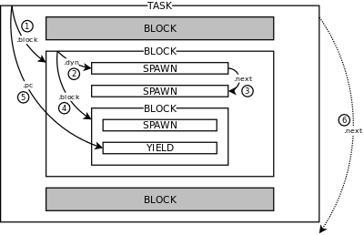

# The Programming Language Atmos

* DESIGN
    * Structured Deterministic Concurrency
    * Event Signaling Mechanisms
    * Hierarchical Tags
    * Integration with Lua
* EXECUTION
* LEXICON
    * Keywords
    * Symbols
    * Operators
        - `==` `!=` `===` `=!=` `??` `!?`
        - `>` `<` `>=` `<=`
        - `+` `-` `*` `/` `%`
        - `!` `||` `&&`
        - `#` `++` `?>` `!>`
    * Identifiers
        - `[A-Za-z_][A-Za-z0-9_]*`
    * Literals
        - `nil` `true` `false`
        - `:X` `10` `"hello"`
        - `@10:20.1` `` `lua` ``
    * Comments
        - `;; *` `;;; * ;;;`
* TYPES & VALUES
    * Clock
    * Vector
        - `#{ * }`
    * Table
        - `@{ * }` `:X @{ * }`
    * Function
        - `func (*) { * }` `\(*) { * }`
    * Task
        - `task` `pub`
    * Tasks
        - `tasks`
* EXPRESSIONS
    * Chunks
        - `;` `do` `escape` `defer` `test`
    * Declarations and Assignments
        - `val` `var` `pin` `where`
        - `func` `return`
        - `set`
    * Operations
        - `??` `!?`
        - `#` `++`
        - `?>` `!>`
    * Indexing
        - `t[*]` `t.x` `t[=]` `t[+]` `t[-]`
    * Calls
        - `f(*)` `-->` `->` `<-` `<--`
    * Conditionals
        - `if` `ifs` `match`
    * Loop
        - `loop` `break` `until` `while`
    * Exceptions
        - `error` `catch`
    * Task Operations
        - `spawn` `await` `emit` `toggle`
        - `every` `watching` `par` `par_and` `par_or`
* STANDARD LIBRARIES
    - `TODO`
* SYNTAX

<!-- CONTENTS -->

# DESIGN

Atmos is a programming language reconciles *[Structured Concurrency][sc]* with
*[Event-Driven Programming][events]*, extending classical structured
programming with two main functionalities:

- Structured Deterministic Concurrency:
    - A `task` primitive with deterministic scheduling provides predictable
      behavior and safe abortion.
    - A `tasks` container primitive holds attached tasks and control their
      lifecycle.
    - A `pin` declaration attaches a task or tasks to its enclosing lexical
      scope.
    - Structured primitives compose concurrent tasks with lexical scope (e.g.,
      `watching`, `every`, `par_or`).
- Event Signaling Mechanisms:
    - An `await` primitive suspends a task and wait for events.
    - An `emit` primitive broadcasts events and awake awaiting tasks.
<!--
- Lexical Memory Management *(experimental)*:
    - A lexical policy to manage dynamic allocation automatically.
    - A set of strict escaping rules to preserve structured reasoning.
    - A reference-counter collector for deterministic reclamation.
-->

Atmos is inspired by [synchronous programming languages][sync] like [Ceu][ceu]
and [Esterel][esterel].

Follows an extended list of functionalities in Atmos:

- Dynamic typing
- Statements as expressions
- Dynamic collections (tables and vectors)
- Deferred statements for finalization
- Exception handling (throw & catch)
- Seamless integration with Lua

Atmos is tightly connected with [Lua][lua]:
It mimics most of the semantics of Lua with respect to values, types,
declarations, and expressions.
In addition, it compiles to [Lua][lua] and relies on [lua-atmos][lua-atmos]
for its concurrency runtime.

Atmos is in **experimental stage**.

In the rest of this section, we introduce key aspects of Atmos:
*Structured Deterministic Concurrency*, *Event Signaling Mechanisms*,
*Hierarchical Tags*, and *Integration with Lua*.

[sc]:           https://en.wikipedia.org/wiki/Structured_concurrency
[events]:       https://en.wikipedia.org/wiki/Event-driven_programming
[sync]:         https://fsantanna.github.io/sc.html
[ceu]:          http://www.ceu-lang.org/
[esterel]:      https://en.wikipedia.org/wiki/Esterel
[lua]:          https://www.lua.org/
[lua-atmos]:    https://github.com/lua-atmos/atmos/
[syms]:         https://en.wikipedia.org/wiki/Symbol_(programming)

## Structured Deterministic Concurrency

In structured concurrency, the life cycle of processes or tasks respect the
structure of the source code as hierarchical blocks.
In this sense, tasks in Atmos are treated in the same way as local variables of
structured programming:
When a [block](#blocks) of code terminates or goes out of scope, all of its
[local variables](#local-variables) become inaccessible to enclosing blocks.
In addition, all of its [pinned tasks](#local-variables) are aborted and
properly finalized by [deferred statements](#defer).

Tasks in Atmos are built on top of [Lua coroutines](#lua-coroutines), which
adhere to a predictable "run-to-completion" semantics:
Unlike OS threads, tasks execute uninterruptedly up to explicit [await](#await)
operations.

The next example illustrates structured concurrency, abortion of tasks, and
deterministic scheduling.
The example uses a `par_or` to spawn two concurrent tasks:
    one that terminates after 10 seconds, and
    another one that increments `n` every second, showing its value on
    termination:

<!-- exs/01-counter.atm -->

```
par_or {
    await @10
} with {
    var n = 0
    defer {
        print("I counted ", n)    ;; invariably outputs 9
    }
    every @1 {
        set n = n + 1
    }
}
```

The [par_or](parallel-blocks) is a structured mechanism that combines tasks
in nested blocks and rejoins as a whole when one of them terminates,
automatically aborting the others.

The [every](every-block) loop in the second task iterates exactly 9 times
before the first task awakes and terminates the composition.
For this reason, the second task is aborted before it has the opportunity to
awake for the 10th time, but its `defer` statement still executes and outputs
`"I counted 9"`.

Since they are based on coroutines, tasks are expected to yield control
explicitly, which makes scheduling entirely deterministic.
In addition, tasks awake in the order they appear in the source code, which
makes the scheduling order predictable.
This rule allows us to infer that the example invariably outputs `9`, no matter
how many times we re-execute it.
Likewise, if the order of the two tasks inside the `par_or` were inverted, the
example would always output `10`.

[lua-coroutines]: https://www.lua.org/manual/5.4/manual.html#2.6

## Event Signaling Mechanisms

Tasks can communicate through events as follows:

- The [await](#await) statement suspends a task until it matches an event
  condition.
- The [emit](#emit) statement broadcasts an event to all awaiting
  tasks.



Tasks form a dynamic tree representing the structure of the program, as
illustrated in the figure.
This tree is traversed on every `emit` in a predictable way, since it
respects the lexical structure of the program:
A task has exactly one active block at a time, which is first traversed `(1)`.
The active block has a list of active tasks, which are traversed in sequence
`(2,3)`, and exactly one nested block, which is traversed after the nested
tasks `(4)`.
After the nested blocks and tasks are traversed, the outer task itself is
traversed at its single yielded execution point `(5)`.
Finally, the task next to the outer task is traversed in the same way `(6)`.
An `emit` statement traversal runs to completion before proceeding to the next
statement, just like a function call.

The next example illustrates event broadcasts and tasks traversal.
The example uses a `watching` statement to observe an event condition while
executing a nested task.
When the condition is satisfied, the nested task is aborted:

<!-- exs/02-ticks.atm -->

```
spawn {
    watching :done {
        par {
            every :tick {
                print "tick A"  ;; always awakes first
            }
        } with {
            every :tick {
                print "tick B"  ;; always awakes last
            }
        }
    }
    print "done"
}
emit(:tick)     ;; --> "tick A", "tick B"
emit(:tick)     ;; --> "tick A", "tick B"
emit(:done)     ;; --> "done"
print "end"     ;; --> "end"
```

The main body has an outermost `spawn` task, which awaits `:done`, and has two
nested tasks awaiting `:tick` events.
Then, the main body broadcasts three events in sequence.
The first two `:tick` events awake the nested tasks respecting the structure of
the program, printing `tick A` and `tick B` in this order.
The last event aborts the `watching` composition and prints `done`, before
terminating the main body.

### Bidimensional Stack Traces

`TODO`

## Hierarchical Tags

Tags represent unique human-readable values, and are similar to Lua strings or
[*symbols* or *atoms*][syms] in other programming languages.
Any identifier prefixed with a colon (`:`) is a valid tag, which is guaranteed
to be unique in comparison to others (i.e., `:x == :x` and `:x != :y`).

Tags are syntactic values that only exist at compile time.
During runtime, they are converted to strings and become indistinguishable from
them (i.e., `:x == 'x'`).

Tags are typically used as keys in table (e.g., `:x`, `:y`), or as enumerations
representing states (e.g., `:pending`, `:done`).

<!-- exs/03-tags.atm -->

The next example uses tags as table keys:

```
val pos = @{}           ;; a new table
set pos[:x] = 10
set pos.y   = 20        ;; equivalent to pos[:y]=20
print(pos.x, pos[:y])   ;; -> 10, 20
```

Tags can also be used to "tag" tables, introducing the notion of lightweight
user types in Atmos.
The constructor `:Pos @{x=10,y=20}` is equivalent to `@{tag=:Pos,x=10,y=20}`.

Tags can describe type hierarchies by splitting identifiers with (`.`).
For instance, a tag such as `:T.A.x` is a subtype of `:T`, `:T.A`, and
`:T.A.x` at the same time, as verified by the
[equivalence operator](#equivalence) `??`:

```
print(:T.A.x ?? :T)         ;; --> true  (:T.A.x is a subtype of :T)
print(:T.A.x ?? :T.A)       ;; --> true
print(:T.A.x ?? :T.A.x)     ;; --> true
print(:T     ?? :T.A.x)     ;; --> false (:T is not a subtype of :T.A.x)
print(:T.A   ?? :T.B)       ;; --> false
```

The operator `??` also works with tagged tables.
Therefore, tags, tables, and `??` can be combined as follows:

```
val t = :T.A @{ a=10 }      ;; @{ tag=:T.A, a=10 }
print(t ?? :T)              ;; --> true
```

## Integration with Lua

`TODO`

- all types, libraries, coroutines, meta mechanisms
- except syntax for statements
- mix code, think of alternative syntax with available quotes

### Lua vs Atmos Subtleties

While most differences between Lua and Atmos are clear, some subtleties are
worth mentioning:

- Statements `return` and `break`:
    - Lua: `return 10`, `break` (no parenthesis)
    - Atmos: `return (10)`, `break()` (parenthesis)
        - Atmos uses the same call syntax with parenthesis in all expressions
          that resemble statements or calls (`await`, `break`, `do`, `emit`,
          `escape`, `return`, `task`, `tasks`, `throw`, `until`, and `while`).
        - The reason is to enforce an uniform syntax across all expressions.
        - Some workarounds: `return 'ok'`, `return <- 10`
- Method call:
    - Lua: `o:f()` (single colon)
    - Atmos: `o::f()` (double colon)
        - The reason is to avoid ambiguity with the syntax of tags:
            - `f () :x ()` is `f():x()` or `f() ; :x()`?
- List of expressions:
    - Lua: `e1,e2,...` (no parenthesis)
    - Atmos: `(e1,e2,...)` (parenthesis)
        - A list of expressions in Atmos is an expression.
        - The reason is to simplify the grammar and to support lists in
          contexts such as `f <-- (1,2)`.
    - Nevertheless, Atmos does not use parenthesis for variables in the left of
      declarations and assignments.
- Table constructor:
    - Lua: `{ ... }` (no `@` prefix)
    - Atmos: `@{ ... }` (`@` prefix)
        - The reason is to avoid ambiguity with vectors and blocks:
            - `{...}` is a table or a vector?
            - `if f { ... }` is `if f{...} ...` or `if (f) { ... }`?
- Operators:
    - Lua: `~=` `and` `or` `not` `..`
    - Atmos: `!=`, `&&`, `||`, `!`, `++`
        - The reason is to avoid identifiers as operators and to use familiar
          and consistent alternatives.

<!--
The compiler of Atmos converts an input program into an output in C, which is
further compiled to a final executable file.
For this reason, Atmos has source-level compatibility with C, allowing it to
embed native expressions in programs.

- gcc
- :pre
- $x.Tag
- tag,char,boolean,number C types
- C errors
-->

# EXECUTION

To execute Atmos, simply pass the program filename and arguments to the
interpreter, e.g.:

```
$ atmos hello.atm 1000
```

The arguments are passed to the [program main chunk](#chunks).

The `--help` flag shows all execution options:

```
$ atmos --help

Usage: atmos [-h] [-t] [-v] <input> [<args>] ...

The Programming Language Atmos.

Arguments:
   input                 Input program.
   args                  Program arguments.

Options:
   -h, --help            Show this help message and exit.
   -t, --test            Enable test blocks.
   -v, --version         Show version.

For more information, please visit our website:

    https://github.com/atmos-lang/atmos/

```

# LEXICON

## Keywords

The following keywords are reserved in Atmos:

```
    await               ;; await event
    break               ;; loop break
    catch               ;; catch exception
    defer               ;; defer block
    do                  ;; do block                         (10)
    else                ;; else block
    emit                ;; emit event
    escape              ;; escape block
    every               ;; every block
    false               ;; false value
    func                ;; function
    if                  ;; if block                         (20)
    ifs                 ;; ifs block
    in                  ;; in iterator
    it                  ;; implicit parameter
    loop                ;; loop block
    match               ;; match block
    nil                 ;; nil value                        (30)
    par                 ;; par block
    par_and             ;; par-and block
    par_or              ;; par-or block
    pin                 ;; pin declaration
    pub                 ;; public variable
    return              ;; escape prototype
    set                 ;; assign expression                (40)
    spawn               ;; spawn coroutine
    task                ;; task prototype
    tasks               ;; task pool
    throw               ;; throw error
    toggle              ;; toggle task
    true                ;; true value
    until               ;; until loop condition
    val                 ;; constant declaration             (50)
    var                 ;; variable declaration
    watching            ;; watching block
    where               ;; where block
    while               ;; while loop condition
    with                ;; with block
```

<!--
    skip                ;; loop skip
    test                ;; test block
-->

## Symbols

The following symbols are designated in Atmos:

```
    {   }           ;; block/operators delimeters
    (   )           ;; expression delimeters
    [   ]           ;; index delimeters
    #{              ;; vector constructor delimeter
    @{              ;; dictionary constructor delimeter
    \               ;; lambda declaration
    =               ;; assignment separator
    =>              ;; if/ifs/match clauses
    <-- <- -> -->   ;; pipe calls
    ;               ;; sequence separator
    '   "   `       ;; string/native delimiters
    ,               ;; argument/constructor separator
    :               ;; tag prefix
    ::              ;; method call
    .               ;; field discriminator
    ...             ;; variadic parameters/arguments
```

## Operators

The following operators are supported in Atmos:

```
    ==   !=   ===  =!=  ??   !?     ;; comparison
    >    <    >=   <=               ;; relational
    +    -    *    /    %           ;; arithmetic
    !    ||   &&                    ;; logical
    #                               ;; length
    ++                              ;; concatenation
    ?>   !>                         ;; membership
```

Operators are used in [operation](#operations) expressions.

## Identifiers

Atmos uses identifiers to refer to [variables](#declarations-and-assignments),
[functions](#function), and [fields](#table):

A variable identifier starts with a letter or underscore (`_`) and is followed
by letters, digits, or underscores:

```
ID : [A-Za-z_][A-Za-z0-9_]*     ;; letter/underscore/digit
```

Examples:

```
x
my_value
y10
```

## Literals

Atmos provides literals for all [value types](#types--values):
    `nil`, `boolean`, `number`, `string`, and `clock`.

It also provides literals for [tag](#TODO) and [native](#TODO) expressions,
which only exist at compile time.

```
NIL  : nil
BOOL : true | false
TAG  : :[A-Za-z0-9_\.]+     ;; colon + leter/digit/under/dot
NUM  : [0-9][0-9A-Za-z\.]*  ;; digit/letter/dot
STR  : '.*' | ".*"          ;; string expression
CLK  : (.*):(.*):(.*)\.(.*) ;; clock expression
NAT  : `.*`                 ;; native expression
```

The literals for `nil`, `boolean` and `number` follow the same
[lexical conventions of Lua](lua-lexical).

The literal `nil` is the single value of the `nil` type.

The literals `true` and `false` are the only values of the `boolean` type.

A `tag` literal starts with a colon (`:`) and is followed by letters,
digits, and dots (`.`).

A `number` literal starts with a digit and is followed by digits, letters, and
dots (`.`).

A `string` literal is a sequence of characters enclosed by an odd number
of matching double (`"`) or single (`'`) quotes.
Atmos supports multi-line strings when using multiple quote delimiters.

A `clock` literal starts with an *at sign* (`@`) and is followed by the format
`HH:MM:SS.sss` representing hours, minutes, seconds, and milliseconds.
Each time segment accepts numbers or embedded identifiers as expressions.
At runtime, identifiers evaluate to the corresponding variable value.
Clock literals are interpreted as a table in the format
`@{h=HH,min=MM,s=SS,ms=sss}`.

A `native` literal is a sequence of characters enclosed by an odd number
of matching back quotes (`` ` ``).
Atmos supports multi-line native literals when using multiple quote delimiters.
Native literals are used in expressions and are interpreted as plain Lua
expressions.

Examples:

<!-- exs/lex-01-literals.atm -->

```
nil                 ;; nil literal
false               ;; boolean literal
:X.Y                ;; tag literal
"""Hello!"""        ;; string literal
1.25                ;; number literal
`x:f {"lua"}`       ;; native literal
```

[lua-lexical]: https://www.lua.org/manual/5.4/manual.html#3.1

## Comments

Atmos provides single-line and multi-line comments.

Single-line comments start with double semi-colons (`;;`) and run until the end
of the line.

Multi-line comments are enclosed by three of more matching semi-colons.

Examples:

<!-- exs/lex-02-comments.atm -->

```
;; a comment        ;; single-line comment

;;;                 ;; multi-line comment
;; a
;; comment
;;;
```

# TYPES & VALUES

Atmos supports and mimics the semantics of the standard [Lua types](lua-types):
    `nil`, `boolean`, `number`, `string`,
    `function`, `userdata`, `thread`, and `table`.

In addition, Atmos also supports the types as follows:
    `clock`, `vector`, `task`, and `tasks`.
Although these types are internally represented as Lua tables, they receive
special treatment from the language.

Atmos differentiates between *value* and *reference* types:

- Value types are built from the [basic literals](#literals):
    `nil`, `boolean`, `number`, `string`, and `clock`.
- Reference types are built from constructors:
    `function`, `userdata`, `thread`, `table`, `vector`, `task`, and `tasks`.

[lua-types]: https://www.lua.org/manual/5.4/manual.html#2.1

## Clock

The `clock` value type represents clock tables in the [format](#literals)
`@{h=HH,min=MM,s=SS,ms=sss}`.

Examples:

<!-- exs/val-01-clock.atm -->

```
val clk = @1:15:40.2    ;; a clock declaration
print(clk.s)            ;; --> 40
print(clk ?? :clock)    ;; --> true
```

## Vector

The `vector` reference type represents tables with numerical indexes starting
at `0`.

A vector constructor `#{ * }` receives a list of expressions and assigns each
expression to incrementing indexes:

```
Vector : `#{´ Expr* `}´
```

The [length](#operations) `#` of a vector `v` can only be modified as a stack,
i.e, only pushes and pops are allowed:

- push: `set v[#v] = x`
- pop:  `set v[#v-1] = nil`

Therefore, an insertion must be exactly at index `#v`, while removal must be
exactly at index `#v-1`.

Note that internally, a vector is represented as a table with a custom
[Lua metatable][lua-metatables].

[lua-metatables]: https://www.lua.org/manual/5.4/manual.html#2.4

Examples:

<!-- exs/val-02-vector.atm -->

```
val vs = #{1, 2, 3}     ;; a vector of numbers (similar to @{ [0]=1, [1]=2, [2]=3 })
print(vs[1])            ;; --> 2
print(vs ?? :vector)    ;; --> true
set vs[#vs] = 4         ;; #{1, 2, 3}
set vs[2] = nil         ;; ERR: out of bounds
```

## Table

The `table` reference type represents [Lua tables](lua-types) with indexes of any
type.

A table constructor `@{ * }` receives a list `*` of key-value assignments:

```
Table : `@{´ Key_Val* `}´
Key_Val : `[` Expr `]´ `=´ Expr
        | ID `=´ Expr
        | Expr
```

Like [table constructors in Lua](lua-table), it accepts assignments in three
formats:

- `[e1]=e2` maps `e1` to `e2`
- `id=e` maps string `id` to `e` (same as `["id"]=e`)
- `e` maps numeric index `i` to `e` (same as `[i]=e`), where `i` starts at `1`
  and increments after each assignment

Examples:

<!-- exs/val-03-table.atm -->

```
val k = "idx"
val t = @{      ;; all 3 formats:
    [k] = 10,   ;; same as @{ [k]=10, ["v"]="x", [1]=20, [2]=30 }
    v = "x",
    20, 30
}
print(t ?? :table)          ;; --> true
print(t.idx, t["v"], t[2])  ;; --> 10, x, 30
```

[lua-table]: https://www.lua.org/manual/5.4/manual.html#3.4.9

### User Types

A table constructor may also be prefixed with a [tag](#literals) to represent
an user type:

```
User : TAG Table
```

The tag is assigned to key `"tag"`, i.e., `:X @{ * }` is equivalent to
`@{ tag=:X, * }`

Examples:

<!-- exs/val-04-users.atm -->

```
val p = :Pos @{         ;; a tagged table:
    x = 10,             ;; same as @{ ["tag"]="Pos", ["x"]=10, ["y"]=20 }
    y = 20,
}
print(p ?? :table)      ;; --> true
print(p ?? :Pos)        ;; --> true
```

## Function

The `function` reference type represents [Lua functions](lua-function).

The basic constructor creates an anonymous function with a list of parameters
and an execution block:

```
Func : `func´ `(´ ID* [`...´] `)´ Block
```

The parameters is a list of [identifiers](#identifiers) with an optional
variadic symbol `...` at the end.
The parameters are immutable as if they were `val`
[declarations](#local-variables).
The [block](#blocks) is a sequence of expressions.

Examples:

<!-- exs/val-05-function.atm -->

```
val f = func (x, y) {     ;; function to add arguments
    x + y
}
print(f(1,2))       ;; --> 3
```

### Lambda

Atmos also supports an alternative lambda notation to create functions:

```
Lambda : `\` [ID | `(` ID* `)´] Block
```

There are three variations of lambdas:

- `\(<ids>) { <body> }`:
    equivalent to `func (<ids>) { <body> }`
- `\<id> { <body> }`:
    equivalent to `\(<id>) { <body> }`
- `\{ <body> }`:
    equivalent to `\(it) { <body> }`

Note that the lambda notation is also used in
    [conditionals](#conditionals) and [every statements](#every)
to communicate values across blocks.

Examples:

<!-- exs/val-05-function.atm -->

```
val g = \{ it + 1 }     ;; function to increment argument
print(g(f(1,2)))        ;; --> 4
```

[lua-function]: https://www.lua.org/manual/5.4/manual.html#3.4.11

## Task

The `task` reference type represents [tasks](#task).

A task constructor `task(f)` receives a [function](#function) and instantiates
a task:

```
Task : `task´ `(´ Expr `)´
```

The given function becomes the body of the task.

Although the task is instantiated, it is only started by a subsequent
[spawn](#spawn) operation.

A task must be first assigned to a `pin` [declaration](#local-variables) and
becomes attached to the enclosing block.
Therefore, when the block terminates or aborts, the task also aborts
automatically.

Examples:

<!-- exs/val-06-task.atm -->

```
func T (...) { ... }    ;; a task prototype
print(T ?? :function)   ;; --> true
pin t = task(T)         ;; an instantiated task
print(t ?? :task)       ;; --> true
val x = t               ;; OK: second assignment
val y = task(T)         ;; ERR: first assignment requires `pin`
```

```
func T () {
    defer {
        print "aborted"
    }
    await(false)
}

do {
    pin t = task(T)
    spawn t()
}               ;; --> aborted
print "end"     ;; --> end
```

### Pub

A task has a single public field `pub`, which can be accessed both internally
and externally:

```
Pub : `pub`
    | Expr `.´ `pub´
```

Internally, it can be accessed through the special variable `pub`.
Externally, it can be accessed through `t.pub`, where `t` is a reference to the
task.

Examples:

<!-- exs/val-06-pub.atm -->

```
func T (n) {
    set pub = n
}
val t = spawn T(10)
print(t.pub)        ;; --> 10
```

### Transparent Task

Atmos support some structured constructs that create transparent tasks:
    [spawn {}](#spawn),
    [watching](#watching), and
    [par, par_and, par_or](#parallels).

A transparent task is implicitly pinned to its enclosing lexical block and
cannot be assigned.
In addition, it delegates [pub](#pub) and [emit](#emit) operations to its
enclosing lexical task.

Examples:

<!-- exs/val-06-transparent.atm -->

```
func T () {
    set pub = 10
    spawn {
        set pub = 20
    }
    print(pub)  ;; --> 20
}
spawn T()
```

## Tasks

The `tasks` reference type represents a pool of tasks, which groups related
tasks as a collection.

A task pool constructor `tasks(n)` creates a pool that holds at most `n`
tasks:

```
Tasks : `tasks´ `(´ [Expr] `)´
```

If the limit is omitted, the pool is unbounded.
If the pool becomes full, further spawns fail and return `nil`.

A pool must be first assigned to a `pin` [declaration](#local-variables) and
becomes attached to the enclosing block.
Therefore, when the block terminates or aborts, all tasks living in the pool
also aborts automatically.


Examples:

<!-- exs/val-07-tasks.atm -->

```
do {
    pin ts = tasks()        ;; a pool of tasks
    print(ts ?? :tasks)     ;; --> true
    val t1 = spawn [ts] T()
    val t2 = spawn [ts] T()
    <...>
}                           ;; aborts t1, t2, ...
```

```
pin ts = tasks(1)           ;; bounded pool
val t1 = spawn [ts] T()     ;; success
val t2 = spawn [ts] T()     ;; failure
print(t1, t2)               ;; --> t1, nil
```

# EXPRESSIONS

Atmos is an expression-based language in which all statements are expressions
that evaluate to a final value.
Therefore, we use the terms statement and expression interchangeably.

All [identifiers](#identifiers), [literals](#literals) and
[values](#types--values) are also valid expressions.

## Chunks

Like in Lua, a sequence of expressions in Atmos is called a
[chunk][lua-chunks], which is their unit of compilation.
A program in Atmos is a chunk, and a block is also a chunk but enclosed by
braces (`{` and `}`):

```
Chunk : { Expr [`;´] }
Prog  : Chunk
Block : `{´ Chunk `}´
```

Each expression in a sequence may be separated by an optional semicolon (`;`).
A sequence of expressions evaluate to its last expression.

A program collects all command-line arguments into the variadic symbol
[`...`](#TODO).

<!-- exs/exp-01-program.atm -->

```
print(1) ; print(2)     ;; --> 1 \n 2
print(...)              ;; --> a, b, c
print(3)                ;; --> 3
```

`TODO: program as a task`

[lua-chunks]: https://www.lua.org/manual/5.4/manual.html#3.3.2

### Blocks

A block delimits a lexical scope for
[local variable declarations](#local-variables).

When a block aborts or terminates, all [defer statements](#defer) execute, and
all [pin declarations](#local-variables) abort.

Blocks appear in compound statements, such as [if](#if), [loop](#loop), and
many others.

A block can also be created through an explicitly `do`:

```
Do : `do´ [TAG] Block
   | `do´ `(´ Expr `)´
```

The optional [tag](#literals) identifies the block such that it can match
[escape](#escape) statements.

The `do` keyword may also be used as a call to execute a simple expression as a
statement.

Examples:

<!-- exs/exp-02-blocks.atm -->

```
val v = do {            ;; block prints `:ok` and evals to `1`
    print(:ok)
    1                   ;; `v` receives 1
}

do {
    val a = 1           ;; `a` is only visible in the block
    <...>
}
a                       ;; `a` is now a global

do {
    pin t = spawn T()   ;; attaches task T to enclosing block
    <...>
}                       ;; aborts t

do(10)                  ;; innocuous `10`
```

#### Escape

An `escape` immediately aborts the deepest enclosing block matching the given
tag:

```
Escape : `escape´ `(´ Expr* `)´
```

The first argument to escape is the [tag](#literals) or
[tagged table](#user-types) to check.
The whole block being escaped evaluates to the other arguments.
If there is only a single argument, then the block evaluates to it.

The block tags are checked with the [equivalence operator](#equivalence) `??`,
which also allows to compare them with tagged tables.

The program raises an error if no enclosing blocks match the escape expression.

Examples:

<!-- exs/exp-03-escape.atm -->

```
val v = do :X {
    escape(:X @{x=10})
    print('never executes')
}
print(v.x)  ;; --> 10
```

```
val a,b =
    do :X {
        do :Y {
            escape(:X, 'a', 'b')
        }
    }
print(a, b) ;; --> a, b
```

```
do :X {
    do :Y {
        escape(:Z)  ;; error: no matching :Z block
    }
}
```

- `TODO`
    - may cross ... , but not function bodies
    - bug as "dynamic scope" (also return, break/until/while)

### Defer

A `defer` block executes when its enclosing block terminates or aborts:

```
Defer : `defer´ Block
```

Deferred blocks execute in reverse order in which they appear in the source
code.

Examples:

<!-- exs/exp-04-defer.atm -->

```
do {
    print(1)
    defer {
        print(2)    ;; last to execute
    }
    defer {
        print(3)
    }
    print(4)
}                   ;; --> 1, 4, 3, 2
```

### Test

A `test` block behaves like a normal block, but is only included in the program
when [executing](#executions) it with the flag `--test`:

```
Test : `test´ Block
```

Examples:

<!-- exs/exp-05-test.atm -->

```
func add (x,y) {
    x + y
}
test {
    assert(add(10,20) == 30)
    assert(add(-10,10) == 0)
    print("All tests passed...")
}
```

## Declarations and Assignments

Atmos mimics the semantics of Lua [global](lua-globals) and [local](lua-locals)
variables.

[lua-globals]: https://www.lua.org/manual/5.4/manual.html#2.2
[lua-locals]: https://www.lua.org/manual/5.4/manual.html#3.3.7

### Local Variables

Locals in Atmos must be declared before use, and are only visible inside the
[block](#blocks) in which they are declared:

```
Local : (`val´ | `var` | `pin`) ID* [`=´ Expr]
```

A declaration first specifies one of `val`, `var` or `pin` variable modifier.
A `val` is immutable, while a `var` is mutable.
A `pin` variable only applies to tasks or pools, which are automatically
aborted when the enclosing block terminates or aborts.

A declaration may specify a list of identifiers, which supports multiple
declarations with the same modifier.

The optional initialization expression, which may evaluate to multiple values,
assigns an initial value to the variable(s).

Note that the `val` immutable modifier rejects re-assignments to its name, but
does not prevent assignments to fields of
[reference types](#types--values).

Examples:

<!-- exs/exp-05-locals.atm -->

```
do {
    val a, b, c = (1, 2, 3)
    print(a, b, c)      ;; 1, 2, 3
}

do {
    var x = 10
    set x = 20
    print(x)            ;; --> 20
}
print(x)                ;; --> nil (`x` is global)

do {
    pin t = task(T)
}                       ;; `t` is aborted

do {
    val y = 10
    set y = 20          ;; ERROR: `y` is immutable
}
```

#### Where

An expression can be suffixed with a `where` clause to define contextual
locals:

```
Expr : Expr `where´ `{´ Decl* `}´
Decl : ID* `=´ Expr
```

A `where` initializes a list of immutable locals, which are only visible within
the prefix expression and the clause itself.

Examples:

```
val x = (2 * z) where {
    y = 10
    z = y+1
}
print(x)    ;; --> 22
```

### Functions

Atmos supports global declarations for [functions](#function):

```
Func : `func´ ID {`.´ ID} [`::´ ID] `(´ ID* [`...´] `)´ Block
```

<!--
For local declarations, it is possible to assign anonymous
[function](#function) constructors to a local variable.
-->

There are three variations of declarations, which are based on
[Lua functions](lua-functions):

- `func f (<pars>) { <body> }`:
    equivalent to `set f = func (<pars>) { <body> }`
- `func t.x.y.f (<pars>) { <body> }`:
    equivalent to `set t.x.y.f = func (<pars>) { <body> }`
- `func o::f (<pars>) { <body> }`:
    equivalent to `set o.f = func (self, <pars>) { <body> }`

Examples:

<!-- exs/exp-06-function.atm -->

```
func add (x, y) {
    x + y
}
print(add(1,2))     ;; --> 3
```

```
val o = @{ v=1 }
func o::inc () {
    set self.v = self.v + 1
}
o::inc()
print(o.v)          ;; --> 2
```

#### Return

A `return` immediately terminates the enclosing function, aborting all active
blocks:

```
Return : `return´ `(´ Expr* `)´
```

The list of return expressions becomes the final result of the corresponding
call.

Examples:

<!-- exs/exp-07-return.atm -->

```
func f () {
    print(1)    ;; --> 1
    return(2)
    print(3)    ;; never executes
}
print(f())      ;; --> 2
```

### Set

The `set` statement assigns, to the list of locations in the left of `=`, the
expression in the right of `=`:

```
Set : `set´ Expr* `=´ Expr
```

The only valid locations are
    [mutable `var` variables](#declarations),
    [indexes](#indexing), and
    [native expressions](#native-expressions).

Examples:

<!-- exs/exp-08-set.atm -->

```
var x
set x = 20              ;; OK

val y = #{10}
set y[0] = 20           ;; OK
set y = 0               ;; ERROR: cannot reassign `y`

set `z` = 10            ;; OK
```

## Operations

Atmos provides the [operators](#operators) as follows:

- comparison: `==` `!=` `===` `=!=` `??` `!?`
- relational: `>` `<` `>=` `<=`
- arithmetic: `+` `-` `*` `/` `%`
- logical: `!` `||` `&&`
- length: `#`
- concatenation: `++`
- membership: `?>` `!>`

Unary operators (`-`, `!` and `#`) use prefix notation, while binary operators
(all others, including binary `-`) use infix notation:

```
Expr : OP Expr          ;; unary operation
     | Expr OP Expr     ;; binary operation
```

For binary operations, the first operand and operator must be at the same line.

Atmos supports and mimics the semantics of standard
[Lua operators](lua-operators):
    (`==` `!=`),
    (`>` `<` `>=` `<=`),
    (`+` `-` `*` `/` `%`),
    (`!` `||` `&&`),
    (`#`), and
    (`++`).
Note that some operators have a [different syntax](#lua-vs-atmos-subtleties) in
Lua.

Next, we decribe the operations that Atmos modifies or introduces:
    (`===` `=!=`), (`??` `!?`), (`#`), (`++`), and (`?>` `!>`).

Examples:

<!-- exs/exp-08-operations.atm -->

```
-(1 + 10)           ;; --> -11
!(true && false)    ;; --> true
#(#{1,2,3})         ;; --> 3
x                   ;; ERR: `x`,`+` not at same line
 + y
```

[lua-operations]: https://www.lua.org/manual/5.4/manual.html#3.4

### Deep Equality

The operators `===` and `=!=` ("deep equal" and "not deep equal") check if
their operands have or not structural equality.
Therefore, tables are not only compared by reference, but also by their stored
values.
The check if `a === b` is true, the following tests are made in order:

1. if `a == b`, then `a === b` is `true` (e.g., `'x' === 'x')
2. if `type(a) != type(b)`, then `a === b` is `false` (e.g, `10 === 'x'`)
3. if `a` and `b` are not tables, then `a === b` is `false` (e.g., functions `f === g`)
4. if all key-value pairs `ka=va` in `a` are equal to all `kb=vb` in `b` (and vice-versa), then `a === b` is `true`
    - the keys are compared with `==`
    - the values are compares with `===`

Note that the [Lua metatables](#lua-metatables) of the values being compared
must also be equal.

The operator `=!=` is the negation of `===`.

Examples:

<!-- exs/exp-09-deep-equality.atm -->

```
#{1,2,3} === #{1,2,3}       ;; --> true
#{} === @{}                 ;; --> false (different metatables)
@{v=#{}} === @{v=#{}}       ;; --> true
@{[#{}]=1} === @{[#{}]=1}   ;; --> false (keys are not `==`)
\{} === \{}                 ;; --> false (functions are not `==`)
```

### Equivalence

The operators `??` and `!?` ("is" and "is not") check the equivalence between
their operands.
If any of the following conditions are met, then `a ?? b` is true:

- `a === b` (e.g., `'x' ?? 'x'`)
- `type(a) === b` (e.g, `10 ?? :number`)
- `a.tag === b` (e.g, `:X @{} ?? :X`)
- `b` is "dot" prefix of `a` (e.g., `'x.y.z' ?? 'x.y'`)

Note that the comparisons use [deep equality](#deep-equality).

The operator `!?` is the negation of `??`.

Examples:

<!-- exs/exp-09-equivalence.atm -->

```
@{} ?? @{}          ;; --> false
task(\{}) ?? :task  ;; --> true
10 ?? nil           ;; --> false
:X.Y @{} ?? :X      ;; --> true
```

### Length

The operator `#` ("length") evaluates the number of elements in the given
collection.

Atmos preserves the semantics of the [Lua length operator](lua-length), and
adds support for the [types](#types--values) `vector` and `tasks`.

[lua-length]: https://www.lua.org/manual/5.4/manual.html#3.4.7

Examples:

<!-- exs/exp-11-length.atm -->

```
#(#{1,2,3})     ;; --> 3

pin ts = tasks()
spawn [ts] T(...)
spawn [ts] T(...)
print(#ts)      ;; --> 2
```

### Concatenation

The operator `++` ("concat") concatenates its operands into a new value.
The operands must be collections of the same type.

Follows the expected result of `a ++ b` for the supported types:

- `string`: string with the characters of `a` followed by the characters of `b`
            (same as `a .. b` in Lua)
- `vector`: vector with the values of `a` followed by the values of `b`
- `table`:  table with the key-values of `a` and `b`, favoring `b` in case of
            duplicate keys
- otherwise: vector with values of `iter(a)` and `iter(b)`

For the last case, each value is extracted from an iteration of `iter`, taking
the *second* return if present, or the first otherwise.

Examples:

<!-- exs/exp-11-concatenation.atm -->

```
'abc' ++ 'def'      ;; abcdef
#{1,2} ++ #{3,4}    ;; #{1,2,3,4}
@{x=1} ++ @{y=2}    ;; @{x=1, y=2}
```

```
func T () { await(false) }
pin xs = tasks()
pin ys = tasks()
val x = spawn [xs] T()
val y = spawn [ys] T()
val ts = xs ++ ys           ;; #{x, y}
print(#ts, y?>ts, 10?>ts)   ;; 2, true, false
```

### Membership

The operators `?>` and `!>` ("in" and "not in") check the membership of the
left operand in the right operand.
If any of the following conditions are met, then `a ?> b` is true:

- `b` is a [vector](#vector) and `a` is equal to any of its values
- `b` is a [table](#table) and `a` is equal to any of its keys or values
- `a` is equal to any of the results of `iter(b)`

The operator `!>` is the negation of `?>`.

Examples:

<!-- exs/exp-10-membership.atm -->

```
10 ?> #{10,20,30}       ;; true
 1 ?> #{10,20,30}       ;; false
10 ?> @{10,20,30}       ;; true
 1 ?> @{10,20,30}       ;; true
```

## Indexing

Atmos uses brackets (`[` and `]`) or a dot (`.`) to index [tables](#table) and
[vectors](#vector):

```
Expr : Expr `[´ Expr `]´
     | Expr `.´ ID
```

The dot notation only applies to tables and is a syntactic sugar to index
string keys: `t.x` expands to `t["x"]`.

Atmos mimics the semantics of [Lua indexing](lua-indexing) for tables.
For vectors, the index must be in the range `[0,#[` for reading, and `[0,#]`
for writing, where `#` is its length.

Examples:

<!-- exs/exp-12-indexing.atm -->

```
val t = @{ x=1 }
print(t['x'])       ;; --> 1
print(t[:x])        ;; --> 1
print(t.x)          ;; --> 1
print(t.y)          ;; --> nil

val v = #{ 1 }
set v[0] = 10       ;; #{ 10 }
set v[#v] = 20      ;; #{ 10, 20 }
print(v[0])         ;; --> 10
print(v[#v-1])      ;; --> 20
print(v[#v])        ;; ERR: out of bounds
```

[lua-indexing]: https://www.lua.org/manual/5.4/manual.html#3.2

### Peek, Push, Pop

The *ppp operators* (peek, push, pop) manipulate vectors as stacks:

```
Expr : Expr `[´ (`=´|`+´|`-´) `]´
```

The peek operation `vec[=]` sets or gets the last element of a vector.
The push operation `vec[+]` adds a new element to the end of a vector.
The pop  operation `vec[-]` gets and removes the last element of a vector.

Examples:

<!-- exs/exp-13-ppp.atm -->

```
val stk = #{1,2,3}
print(stk[=])         ;; --> 3
set stk[=] = 30
print(stk)            ;; --> #{1, 2, 30}
print(stk[-])         ;; --> 30
print(stk)            ;; --> #{1, 2}
set stk[+] = 3
print(stk)            ;; --> #{1, 2, 3}
```

## Calls

Atmos supports many formats to call functions:

```
Expr : Expr `(´ Expr* `)´
     | Expr Expr ;; single constructor argument
```

A call expects an expression of type [func](#prototype-values) and an
optional list of expressions as arguments enclosed by parenthesis.

Like in [Lua calls](#lua-call), if there is a single
[constructor](#types--values) argument, then the parenthesis are optional.
This is valid for strings, tags, vectors, tables, clocks, and native literals.

The many call formats are also valid for the statements as follows:
`await`, `break`, `do`, `emit`, `escape`, `return`, `task`, `tasks`, `throw`,
`until`, and `while`.

Examples:

<!-- exs/exp-14-calls.atm -->

```
print(1,2,3)    ;; --> 1 2 3
print "Hello"   ;; --> Hello
print :ok       ;; --> ok
type @{}        ;; :table
```

[lua-call]: https://www.lua.org/manual/5.4/manual.html#3.4.10

### Pipes

Atmos supports yet another format for function calls:

```
Expr : Expr (`<--´ | `<-´ | `->´ | `-->´ ) Expr
```

The pipe operators `<-` and `<--` pass the argument in the right to the
function in the left.
The pipe operators `->` and `-->` pass the argument in the left  to the
function in the right.

Single pipe operators `<-` and `->` have higher
[precedence](@precedence-and-associativity) than double pipe operators
`<--` and `-->`.

If the receiving function is already a call, then the pipe operator inserts
the extra argument into the call either as first (`->` and `-->`) or last (`<-`
and `<--`).


Examples:

<!-- exs/exp-15-pipes.atm -->

```
f <-- 10 -> g   ;; equivalent to `f(g(10))`
t -> f(10)      ;; equivalent to `f(t,10)`
```

### Parenthesis

Expressions can be enclosed by parenthesis:

```
Expr : `(´ Expr+ `)´
```

In Atmos, parenthesis have three uses:

- group an operation to increase its precedence
- group comma-separated expressions to create a multi-valued expression
- revert a multi-valued expression into a single value

Examples:

<!-- exs/exp-16-parenthesis.atm -->

```
f ('1' ++ '2')      ;; instead of (f '1') ++ '2'
(1,2,3)             ;; multi-valued (1,2,3)
((1,2,3))           ;; single value 1
```

### Precedence and Associativity

Operations in Atmos can be combined in expressions with the following
precedence priority (from higher to lower):

1. primary:
    - literal:      `nil` `true` `...` `:X` `'x'` `@.x` (etc)
    - identifier:   `x`
    - constructor:  `#{}` `@{}` `\{}`
    - command:      `do` `set` `if` `await` (etc)
    - declaration:  `func` `val` (etc)
    - parenthesis:  `()`
2. suffix:
    - call:         `f()` `o::m()` `f ""` `f @{}` `f #{}`
    - index:        `t[]`
    - field:        `t.x`
    - tag:          `:X()` `:X @{}`
3. inner pipe:
    - single pipe:  `v->f` `f<-v`
4. prefix:
    - unary:        `-x` `!v` `#t`
5. infix:
    - binary        `x*y` `r++s` `a or b`
6. outer pipe:
    - double pipe:  `v-->f` `f<--v`
7. outer where:
    - where:        `v where {...}`

Prefix operations are right associative, all others are left associative.
Note that all binary operators at the same level have the same precedence.
Therefore, operators at the same level require parenthesis for disambiguation.

Examples:

<!-- exs/exp-17-precedence.atm -->

```
#f(10).x        ;; # ((f(10)) .x)
x + 10 - 1      ;; ERROR: requires parenthesis
- x + y         ;; (-x) + y
x || y || z     ;; (x || y) || z
f :X @{}        ;; ERROR: (f :X) @{}
```

## Conditionals

In a conditional context, [nil](#types--values) and [false](#types--values)
are interpreted as "falsy", and all other values from all other types as
"truthy".

### If

An `if` tests a condition expression and executes one of the two possible
branches:

```
If  : `if´ Expr (Block | Lambda) [`else´ (Block | Lambda)]
    | `if´ Expr `=>´ Expr `=>´ Expr
```

The branches can be either [blocks](#blocks) or simple expressions prefixed by
the arrow symbol `=>`.
When using blocks, the `else` branch is optional.
The blocks can also use the [lambda notation](#lambda) to capture the value
of the condition being tested.

If the condition is truthy, the `if` executes the first branch.
Otherwise, it executes the `else` branch, which defaults to `nil` if absent.

Examples:

<!-- exs/exp-18-if.atm -->

```
val max = if x>y => x => y      ;; max value between `x` and `y`

if f() \{                       ;; f() is assigned to it
    print("f() evaluates to " ++ it)
} else {
    print("f() evaluates to 'false'")
}
```

### Ifs

An `ifs` tests multiple conditions in sequence, until one is satisfied,
executing its associated branch:

```
Ifs : `ifs´ `{´ {Case} [Else] `}´
Case :  Expr  (`=>´ Expr | Block | Lambda)
Else : `else´ (`=>´ Expr | Block | Lambda)
```

If no condition is met, the `ifs` executes the optional `else` branch, which
defaults to `nil`.

Like in an [if](#if), branches can be blocks, simple `=>` expressions or
lambdas.

Examples:

<!-- exs/exp-19-ifs.atm -->

```
val max = ifs {     ;; exclusive max value between `x` and `y`
    x > y => x
    x < y => y
    else  => throw(:error, "values are equal")
}
```

### Match

A `match` tests a head expression against a series of values, until one is
satisfied, executing its associated branch:

```
Match : `match´ Expr `{´ {Case} [Else] `}´
Case :  (Lambda | Expr)  (`=>´ Expr | Block | Lambda)
Else : `else´ (`=>´ Expr | Block)
```

If no case succeeds, the `match` executes the optional `else` branch, which
defaults to `nil`.

The tests use `h ?? i`, where `h` is the head expression and `i` corresponds to
each case expression.
In addition, a case can be a [lambda constructor](#lambda), which receives the
head expression and returns the test result.

Like in an [if](#if), branches can be blocks, simple `=>` expressions or
lambdas.

Examples:

<!-- exs/exp-20-match.atm -->

```
match f() {
    :table   => print("f() is a table")
    "hello"  => print("f() == hello")
    \{it>10} => print("f() > 10")
    else     => \{ print("f() is", it) }
}
```

## Loop

Atmos supports loops and iterators as follows:

```
Loop : `loop´ Block                 ;; infinite
     | `loop´ ID Block              ;; numeric infinite
     | `loop´ ID+ `in´ Expr Block   ;; iterator
```

A `loop` executes a block of code continuously until a termination condition is
met.
Atmos supports three loop variations:

1. An *infinite loop* with an empty header, which only terminates from
   [break](#breaks) conditions.
2. A *numeric infinite loop* with a variable that ranges from `0` upwards.
3. An *iterator loop* with multiple variables that range according to an
   iterator expression.

The following iterator expression types with predefined behaviors are
supported:

- `:vector`: ranges over the indexes and values of a vector
- `:table`: ranges over the keys and values of a table
- `:tasks`: ranges over the indexes and tasks of a task pool
- `:function`: ranges over calls to the given function, until it returns `nil`
- `(:number,:number)`: ranges from the first number up to, but not including,
    the second number
- `:number`: equivalent to `(0,x)` where `x` is the given number

A loop evaluates to `nil` as a whole, unless a [break](#breaks) condition
occurs.

`TODO: __ipairs, __pairs, __call metamethods`

Examples:

<!-- exs/exp-21-loop.atm -->

```
loop {
    await @1
    print("1 more second elapsed...")
}
```

```
loop i {
    print(i)        ;; --> 0, 1, 2, ...
}
```

```
val x = loop i in (1,3) {
    print(i)        ;; --> 1, 2
}
print(x)            ;; --> false
```

```
loop i,v in #{10,20,30} {
    print(i,v)      ;; --> (0,10), (1,20), (2,30)
}
```

```
val f = func (s,e) {
    var nxt = s
    \{
        val cur = nxt
        set nxt = nxt + 1
        if cur>=e => nil => cur
    }
}
loop v in f(5,8) {
    print(v)        ;; --> 5, 6, 7
}
```

### Breaks

An `break` immediately escapes the deepest enclosing loop:

```
Break : `break´ `(´ Expr* `)´
      | `until´ `(´ Expr+ `)´
      | `while´ `(´ Expr+ `)´
```

<!--
Skip  : `skip´ `(´ `)´
The block may also contain a `skip()` statement to jump back to the next loop
step.
var i = 0
loop {                  ;; infinite loop
    set i = i + 1
    if (i % 2) == 0 {
        skip()          ;; jump back
    }
    print(i)          ;; --> 1,3,5,...
}
-->

The loop as a whole evaluates to the values passed to `break`.

In addition to `break`, Atmos provides `until` and `while` clauses to escape
loops on specific conditions:

1. A `break(...)` escapes the loop with the values `...`.
2. An `until(<cnd>,...)` is equivalent to `if <cnd> { break(... || <cnd>) }`.
3. A `while(<cnd>,...)` is equivalent to `if not <cnd> { break(...) }`.

Examples:

<!-- exs/exp-22-breaks.atm -->

```
var i = 0
loop {
    set i = i + 1
    print(i)        ;; --> 1,2,...,10
    if i == 10 {
        break()
    }
}
```

```
val x = loop {
    <...>
    until(f())      ;; escapes when f()
    <...>
}
print(x)            ;; value of f()
```

## Exceptions

An exception `throw` aborts all active enclosing blocks in the stack up to a
matching `catch` clause:

```
Throw : `throw´ `(´ Expr* `)´
Catch : `catch´ Expr Block
```

A `catch` executes its body as a normal block but tries to match an occurring
exception with the given expression.
If no exceptions occur, it evaluates to `true` plus the values of its body.
If it catches an exception, it evaluates to `false` plus the values of the
matching `throw`.
Otherwise, it propagates the exception upwards in the execution stack and never
returns.

A `catch` accepts the following exception matching expressions:

- `true`: catches any throw
- `false`: ignores any throw
- `:function`: passes the throw values to the function, which matches if
    returns `true`, replacing the throw values with additional arguments
- otherwise: catches if the first throw value matches with `??`

If a `throw` is not caught, the whole program aborts with a
[stack trace](#TODO) debug message.

Examples:

<!-- exs/exp-23-exceptions.atm -->

```
val ok, v = catch :X {
    42
}
print(ok, v)        ;; --> true, 42
```

```
val ok, x = catch :X {
    throw(:X @{v=10, msg="error"})
    print("unreachable")
}
print(ok, x.msg)    ;; --> false, error
```

```
func f () {
    throw :X.Y
}
val x =
    catch :X {
        catch :X.Z {
            defer {
                print "ok"
            }
            f()
        }
    }               ;; --> ok (from defer)
print(x)            ;; --> false
```

```
val ok, v = catch \{(true,42)} {    ;; catches any error, transforms into 42
    throw :X
}
print(ok, v)                        ;; --> false, 42
```

```
throw :X

;;; error stack trace
==> ERROR:
 |  atmos:9 (call)
 v  test.atm:1 (throw) <- atmos:9 (task)
==> X
;;;
```

## Task Operations

<!--
- [abort](#TODO): `TODO`
-->

### Spawn

A `spawn` receives a [task](#task), [function](#function), or [block](#blocks)
and starts it as a task:

```
Spawn : `spawn` [`[´ Expr `]´] Expr `(´ Expr* `)`
      | `spawn` Block
```

- The format `spawn [ts] T(...)` receives an optional [pool](#task-pool) to
  hold the task, a task or function, and a list of arguments to pass to the
  body about to start.
  The operation returns a reference to spawned task.
- The format `spawn { ... }` starts a [transparent task](#transparent-task)
  body.

Examples:

<!-- exs/exp-25-spawn.atm -->

```
func T (id) {
    print(id, 'started')
    set pub = id
}
pin ts = tasks()
val t1 = spawn [ts] T(:t1)  ;; --> t1, started
print(t1.pub)               ;; --> t1

spawn {
    print(:t2, 'started')   ;; t2, started
}

pin t = spawn {}            ;; ERR: cannot assign```


Examples:

```
task T (v, vs) {                ;; task prototype accepts 2 args
    <...>
}
val t = spawn T(10, [1,2,3])    ;; starts task passing args
print(t)                        ;; --> exe-task 0x...
```

### Await

An `await` suspends a [task](#task) until a matching [emit](#emit) occurs:

```
Await : `await´ `(´ Expr* `)´
      | `await´ ID `(´ Expr* `)´
```

The first format accepts any of the following expressions:

- `true` | matches any emit
- `false` | never matches an emit
- `c: clock` | matches a [clock](#clock) event (`c` decreases until expires)
- `t: task` | matches a terminating task `t`
- `ts: tasks` | matches any terminating task in `ts`
- `f: function` | `f` receives the occuring event, matches if `f` returns `true`
- `v | matches if `e ?? v`, where `e` is the `emit` argument
- `...` | each of the arguments must match each of the `emit` arguments

The `await` evaluates to the matching `emit` payloads.

The second format `await T(...)` [spawns](#spawn) and awaits the given task to
terminate.
In this case, the `await` evaluates to the task final value.

Examples:

<!-- exs/exp-26-await.atm -->

```
await(false)            ;; never awakes
await(:key, :escape)    ;; awakes on :key == :escape
await @1:10:30          ;; awakes after 1h 10min 30s
await(\{it>10})         ;; awakes if event > 10
```

```
spawn {
    val x,y = await(true)
    print(x, y)         ;; --> 10, 20
}
emit(10, 20)
```

```
func T (v) {
    v * 2
}
val v = await T(10)
print(v)                ;; --> 20
```

### Emit

An `emit` broadcasts an event that can awake [awaiting](#await) tasks:

```
Emit : `emit´ [`[´ Expr `]´] `(´ Expr* `)´
```

The optional target between brackets determines the scope of the broadcast:

- `:task` (default): current task
- `:parent`: parent task
- `:global`: all tasks
- `t: task`: the given task
- `n: number`: `n`th level up in the task hierarchy (`0` = current task)

The arguments to `emit` are the event payloads matched against await
operations.

Examples:

<!-- exs/exp-27-emit.atm -->

```
func T () {
    val x = spawn X()
    val e = <...>
    emit [:global] (e)  ;; global broadcast
    emit [:task] (e)    ;; restricted to `T`
    emit [x] (e)        ;; restricted to `x`
}
```

### Toggle

A `toggle` configures a task to either consider or disregard further
[emit](#emit) operations:

```
Toggle : `toggle´ Expr `(´ Expr `)´
       | `toggle´ TAG Block
```

In the first format, a toggle expects a task and a [boolean](#types--values),
which is handled as follows:

- `true`: the task considers further broadcasts
- `false`: the task disregards further emits and never awakes

By default, all tasks consider events.

In the second format, a toggle spawns and awaits a block as a
[transparent task](#transparent-task).
It also specifies a [tag](#literals) to toggle the block when matching an
[emit](#emit).
The emit must be in the format `emit(<tag>, <boolean>)` to set the toggle
state.

Examples:

<!-- exs/exp-28-toggle.atm -->

```
val T = func () {
    await :X
    print :ok
}
pin t = spawn T()
toggle t(false)
emit :X         ;; event ignored
toggle t(true)
emit :X         ;; --> ok
```

```
spawn {
    toggle :T {
        loop {
            val _,v = await(:E)
            print(v)            ;; --> 1 3
        }
    }
}
emit(:E, 1)
emit(:T, false)
emit(:E, 2)
emit(:T, true)
emit(:E, 3)
```

### Every

An `every` is a [loop](#loop) that makes an iteration whenever an
[await](#await) condition is satisfied:

```
Every : `every´ Expr* (Block | Lambda)
```

The block can also use the [lambda notation](#lambda) to capture the value
of the occurring event.

Examples:

<!-- exs/exp-29-every.atm -->

```
every @1 {
    print("1 more second has elapsed")
}
```

```
every :X \{         ;; <-- (`emit :X @{v=10}`)
    print(it.v)     ;; --> 10
}
```

#### Watching

A `watching` spawns and awaits a block as a
[transparent task](#transparent-task) until an [await](#await) condition is
satisfied, which aborts the block:

```
Watching : `watching´ Expr* Block
```

Examples:

<!-- exs/exp-30-watching.atm -->

```
watching @1 {
    every :X {
        print("one more :X occurred before 1 second")
    }
}
```

### Parallels

A parallel statement spawns multiple [transparent tasks](#transparent-tasks):

```
Par : `par´     Block { `with´ Block }
And : `par_and´ Block { `with´ Block }
Or  : `par_or´  Block { `with´ Block }
```

A `par` never rejoins, even if all tasks terminate.

A `par_and` rejoins only after all tasks terminate.
It evaluates to a [table](#table) with the returns of the `n` tasks from `1` to
`n`.

A `par_or` rejoins as soon as any task terminates, aborting the others.
It evaluates to the terminating task value.

Examples:

<!-- exs/exp-31-parallels.atm -->

```
par {
    every @1 {
        print("1 second has elapsed")
    }
} with {
    every @1:0 {
        print("1 minute has elapsed")
    }
} with {
    every @1:0:0 {
        print("1 hour has elapsed")
    }
}
print("never reached")
```

```
val v = par_or {
    await @1
} with {
    await :X
    print(":X occurred before 1 second")
    :ok
}
print(v)        ;; --> ok
```

```
val x,y = par_and {
    await :X
} with {
    await :Y
}
print(x, y)     ;; --> X, Y
```

# STANDARD LIBRARIES

In addition to the [standard Lua libraries](lua-libraries), Atmos also provides
the following functions:

`TODO: between, to*, remove/insert (vector)`

- `xtostring`
- `xprint`
- `xcopy`

[lua-libraries]: https://www.lua.org/manual/5.4/manual.html#6

# SYNTAX

We use a BNF-like notation to describe the syntax of expressions in Atmos.
As an extension, we use `X*` to mean `{ X ',' }`, but with the leading `,`
being optional; and a `X+` variation with at least one `X`.

```
Prog  : { Expr [`;´] }
Block : `{´ Prog `}´
Expr  : `do´[TAG]  Block                            ;; explicit block
      | `do´ `(´ Expr `)´                           ;; expression as statement
      | `escape´ `(´ Expr* `)´                      ;; escape from block
      | `defer´ Block                               ;; defer statements

      | (`val´ | `var` | `pin`) ID* [`=´ Expr]      ;; local declarations
      | Expr `where´ `{´ (ID* `=´ Expr)* `}´        ;; where clause
      | `func´ ID {`.´ ID} [`::´ ID]                ;; function declaration
               `(´ ID* [`...´] `)´
               Block
      | `return´ `(´ Expr* `)´                      ;; return from function

      | `set´ Expr* `=´ Expr                        ;; assignment

      | `nil´ | `false´ | `true´                    ;; literals
      | TAG | NUM | STR | CLK | NAT
      | ID | `pub´                                  ;;  identifiers

      | `#{´ Expr* `}´                              ;; vector
      | [TAG] `@{´ Key_Val* `}´                     ;; table
            Key_Val : `[` Expr `]´ `=´ Expr
                    | ID `=´ Expr
                    | Expr

      | `func´ `(´ ID* [`...´] `)´ Block            ;; anon function
      | `\` [ID | `(` ID* `)´] Block                ;; lambda notation

      | `task´ `(´ Expr `)´                         ;; task
      | `task´ `(´ [Expr] `)´                       ;; tasks pool

      | OP Expr                                     ;; pre ops
      | Expr OP Expr                                ;; bin ops
      | `(´ Expr+ `)´                               ;; parenthesis

      | Expr `.´ ID                                 ;; table field
      | Expr `[´ Expr `]´                           ;; index
      | Expr `[´ (`=´|`+´|`-´) `]´                  ;; ppp operations

      | Expr `(´ Expr* `)´                          ;; call
      | Expr Expr                                   ;; single-constructor call
      | Expr (`<--` | `<-` | `->` | `-->` ) Expr    ;; pipe calls

      | `if´ Expr (Block | Lambda)                  ;; if block
            [`else´ (Block | Lambda)]
      | `if´ Expr `=>´ Expr `=>´ Expr               ;; if expr

      | `ifs´ `{´ {Case} [Else] `}´                 ;; ifs
            Case :  Expr  (`=>´ Expr | Block | Lambda)
            Else : `else´ (`=>´ Expr | Block | Lambda)

      | `match´ Expr `{´ {Case} [Else] `}´          ;; match
            Case :  (Lambda | Expr)  (`=>´ Expr | Block | Lambda)
            Else : `else´ (`=>´ Expr | Block)

      | `loop´ Block                                ;; infinite loop
      | `loop´ ID Block                             ;; numeric infinite loop
      | `loop´ ID+ `in´ Expr Block                  ;; iterator loop

      | `break´ `(´ Expr* `)´                       ;; loop break
      | `until´ `(´ Expr+ `)´
      | `while´ `(´ Expr+ `)´

      | `throw´ `(´ Expr* `)´                       ;; throw exception
      | `catch´ Expr Block                          ;; catch exception

      | `spawn` [`[´ Expr `]´] Expr `(´ Expr* `)`   ;; spawn task
      | `spawn´ Block                               ;; spawn block

      | `await´ `(´ Expr* `)´                       ;; await event
      | `await´ ID `(´ Expr* `)´                    ;; await task
      | `emit´ [`[´ Expr `]´] `(´ Expr* `)´         ;; emit event

      | `toggle´ Expr `(´ Expr `)´                  ;; toggle task
      | `toggle´ TAG Block                          ;; toggle block

      | `every´ Expr* (Block | Lambda)              ;; every event loop
      | `watching´ Expr* Block                      ;; watching event block

      | `par´     Block { `with´ Block }            ;; parallels
      | `par_and´ Block { `with´ Block }
      | `par_or´  Block { `with´ Block }

ID    : [A-Za-z_][A-Za-z0-9_]*      ;; variable identifier
TAG   : :[A-Za-z0-9_\.]+            ;; tag
NUM   : [0-9][0-9A-Za-z\.]*         ;; number
STR   : '.*' | ".*"                 ;; string
CLK   : (.*):(.*):(.*)\.(.*)        ;; clock
NAT   : `.*`                        ;; native expression
```
